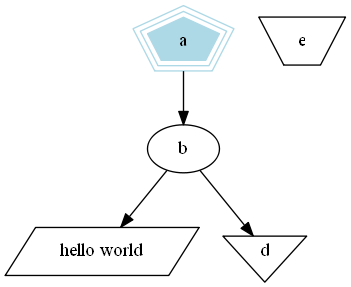
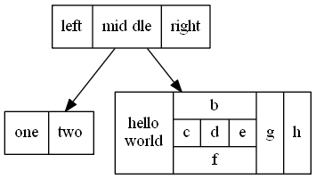

# 使用dot语言画图


## 1 基本图形绘制

dot语言绘制有向图。 它读取带属性的图形文本文件并绘制图形，然后生成图形文件或图片（例如GIF，PNG，SVG，PDF或PostScript）。dot语言画图分4个阶段，知道这一点可以帮助您了解dot语言的的布局类型以及如何控制它们。dot语言使用的布局过程依赖于非循环图。因此，第一步是通过反转某些循环边的内部方向来打破输入图中出现的任何循环。下一步将节点分配给离散的等级或级别。 在从上到下的图中，等级确定Y坐标。跨越一个以上等级的边缘被分成“虚拟”节点和单位长度边缘的链。第三步对等级内的节点进行排序，以避免交叉。第四步设置节点的X坐标以保持边较短，最后一步路由边缘曲线。这是与大多数基于Warfield[War77]、Carpano[Car80]和Sugiyama[STT81]工作的分层图形绘制程序相同的通用方法。我们建议读者参考[GKNV93]，以获得有关点的算法的详细解释。

dot接受DOT语言的输入(参见附录D)。 该语言描述了三种主要的对象：图形、节点和边。 主(最外层)图可以是有向的(有向图)或无向图。 因为dot的布局是有向的，所以下面的所有示例都使用有向图。 (单独的布局实用程序neato可绘制无向图形[Nor92])。 在主图中，子图定义节点和边的子集。

下面是一个使用DOT语言画图的代码示例。 

==代码1==

```c
digraph G {
	main -> parse -> execute;
	main -> init;
	main -> cleanup;
	execute -> make_string;
	execute -> printf
	init -> make_string;
	main -> printf;
	execute -> compare;
}
```

第1行给出了图形名称和类型。 后面的代码将创建节点、边或子图，并设置属性。 所有这些对象的名称可以是C标识符、数字或带引号的C字符串。 引号保护标点符号和空格。

当节点名称首次出现在文件中时，将创建该节点。 当节点通过边运算符->连接时，就会创建一条边。 在本例中，第2行中的边从main节点到parse节点，再到execute节点。 在此文件上运行dot命令(将其命名为graph1.gv)

`$ dot -Tps graph1.gv -o graph1.ps `

windows中运行命令为：

`dot graph1.gv -T ps -o graph1.ps`

将生成图1的图形。命令行选项-tps指明按PostScript格式(EPSF)输出。 可以打印、由PostScript查看器显示或嵌入到另一个文档中。


图1

调整布局中节点和边的表示或位置通常很有用。 这是通过在输入文件中设置节点、边或子图的属性来实现的。 属性是字符串格式的名称-值对。 代码2和图2说明了一些布局属性。 代码2清单中，第2行将图形的大小设置为4，4(英寸)。 此属性控制绘图的大小；如果绘制的图太大，则会根据需要统一缩放。

节点或边属性在方括号中设置。 在第3行中，为节点main指定了形状box。 第4行中的边设置了权重(默认值为1)。第6行中的边绘制为虚线。 第8行生成从executr到make string和printf的两条变。 在第10行中，默认边颜色被设置为红色。 这会影响此后创建的任何边。 第11行生成标签为"100 times"的粗体边缘。 在第12行中，节点make_string被赋予了一个多行标签。 第13行将默认节点更改为用蓝色阴影填充的框。 节点compare继承这些属性。

==代码2==

```c
digraph G {
	size ="4,4";
	main [shape=box]; /* this is a comment */
	main -> parse [weight=8];
	parse -> execute;
	main -> init [style=dotted];
	main -> cleanup;
	execute -> { make_string; printf}
	init -> make_string;
	edge [color=red]; // so is this
	main -> printf [style=bold,label="100 times"];
	make_string [label="make a\nstring"];
	node [shape=box,style=filled,color=".7 .3 1.0"];
	execute -> compare;
}
```

图2

## 2 图形属性

附录A、B和C中总结了影响图表绘制的主要属性。有关更多属性和更完整的属性说明，请访问Graphviz网站，特别是下面这个网页<https://www.graphviz.org/doc/info/attrs.html>

### 2.1 节点形状

默认情况下，使用Shape=椭圆、Width=.75、Height=.5绘制节点，并使用节点名称进行标记。 其他常见的形状包括方框、圆形、矩形和plaintext。 附录H中给出了主要节点形状的列表。
plaintext节点特别令人感兴趣，因为它绘制没有任何轮廓的节点，这在某些类型的图中是一个重要的约定。 在主要关注图形结构的情况下，特别是当图形中等大时，point形状会缩小节点尺寸以显示最小的内容。 绘制时，节点的实际大小是代码中设置大小和其文本标签所需的区域中较大的一个，除非设置了FixedSize=true，在这种情况下，将强制使用设定宽度和高度值。

节点形状分为两大类：基于多边形的和基于记录的[^1]。除record和Mrecord之外的所有节点形状都被视为多边形，并按边数(椭圆和圆是特例)以及其他一些几何属性建模。 其中一些属性可以在图形中指定。 如果Regular=true，则强制节点为规则的。参数peripheries设置绘制的边界曲线的数量。 例如，双圆的peripheries=2。orientation属性指定多边形的顺时针旋转(以度为单位)。

图形polygon显示所有多边形参数，并且对于创建许多未预定义的图形非常有用。 除了上面提到的regular,参数、peripheries参数和orientation,参数外，多边形还通过sides,、skew和distortion几个参数进行控制。 skew是一个浮点数(通常在-1.0和1.0之间)，它通过从上到下倾斜形状来扭曲形状，正值会将多边形的顶部向右移动。 因此，skew可以用来将长方体变成平行四边形。 distortion会从上到下缩小多边形，负值会导致底部大于顶部。distortion会将长方体变成梯形。 代码3和图3说明了这些多边形属性的各种情况。

==代码3==

```c
digraph G {
	a -> b -> c;
	b -> d;
	a [shape=polygon,sides=5,peripheries=3,color=lightblue,style=filled];
	c [shape=polygon,sides=4,skew=.4,label="hello world"]
	d [shape=invtriangle];
	e [shape=polygon,sides=4,distortion=.7];
}
```



图3

基于记录的节点形成另一类节点形状。 其中包括record和Mrecord.两种形状参数。 除了后者有圆角之外，两者是相同的。 这些节点表示域的递归列表，这些域被绘制为交替的水平和垂直方框行。 递归结构由节点的标签确定，该标签具有以下架构：

> rlabel → field ( ’|’ field )*
> field → boxLabel | ’’ rlabel ’’
> boxLabel → [ ’<’ string ’>’ ] [ string ]

文字花括号、竖线和尖括号必须转义。 空格被解释为标记之间的分隔符，因此如果它们要逐字出现在文本中，则必须对它们进行转义。 BoxLabel中的第一个字符串为该域指定名称，并用作该框的端口名称(参见。 第3.1节)。 第二个字符串用作域的标签；它可以包含与多行标签相同的转义序列(参见。 第2.2节)。 图7和图8的示例说明了记录的使用和一些属性。

==代码4==

```
digraph structs {
	node [shape=record];
	struct1 [shape=record,label="<f0> left|<f1> mid\ dle|<f2> right"];
	struct2 [shape=record,label="<f0> one|<f1> two"];
	struct3 [shape=record,label="hello\nworld |{ b |{c|<here> d|e}| f}| g | h"];
	struct1 -> struct2;
	struct1 -> struct3;
}
```


图4


### 2.2 标签

如上所述，默认节点标签是其名称。 默认情况下，边未标记。 可以使用label属性显式设置节点和边标签，如图2所示。

虽然按名称标记节点可能很方便，但有时必须显式设置标签。 例如，在绘制文件目录树时，可能有几个名为src的目录，但每个目录都必须有唯一的节点标识符。索引号或完整路径名是合适的唯一标识符。 则可以将每个节点的标签设置为其目录内的文件名。

可以使用转义序列\n、\l、\r来终止居中、左对齐或右对齐的行，从而创建多行标签[^2]。

图和集群子图也可以有标签。 默认情况下，图形标签在图形下方居中显示。 设置labelloc=t使标签在图形上方居中。 集群标签显示在左上角的封闭矩形内。 值labelloc=b将标签移动到矩形的底部。 设置labelust=r会将标签向右移动。

默认字体为14磅Times-Roman，黑色。 可以使用属性fontname、fontSize和fontcolor选择其他字体风格、大小和颜色。 字体名称应与目标解释器兼容。 最好只使用标准字体系列Times、Helvetica、Courier或Symbol，因为这些字体可以保证与任何目标图形语言一起使用。 例如，Times-Italic、Times-Bold和Courier是便携的，而AvanteGardeDemiOblique不是便携的。

对于位图输出(如GIF或JPG)，dot依赖于在布局期间提供这些字体。 大多数预编译的Graphviz安装都使用fontconfig库将字体名称与可用的字体文件进行匹配。 Fontconfig附带了一组用于显示匹配项和安装字体的实用程序。 有关详细信息，请参阅字体配置文档或外部Graphviz FontFAQ。 如果Graphviz是在没有fontconfig的情况下构建的(这通常意味着您自己从源代码编译它)，则fontpath属性可以指定应该搜索字体文件的目录列表[^3]。 如果未设置，则dot将使用DOTFONTPATH环境变量，如果DOTFONTPATH环境变量也未设置，则使用GDFONTPATH环境变量。 如果这些都未设置，则dot使用内置列表。

边缘标签位于边缘中心附近。 通常，要注意防止边标签与边和节点重叠。 在复杂的图形中，仍然很难确定标签属于哪条边。 如果将Decorate属性设置为true，则会绘制一条将标签与其边缘连接起来的线。 有时，避免边标签和边之间的冲突会强制图形大于预期大小。 如果labelFloat=true，则点不会尝试防止此类重叠，从而使绘图更紧凑。

边还可以使用放置在边末端附近的headlabel和taillabel来指定附加标签。 使用属性labelfontname、labelfontsize和labelfontcolor指定这些标签的特征。 这些标签放置在边和节点的交点附近，因此可能会干扰它们。 要调整图形，用户可以设置labelangle和labeldistance属性。 前者设置标签从边与节点的入射角度旋转的角度(以度为单位)。 后者设置相乘的比例因子以调整标签到节点的距离。

### 2.3 类HTML标签

为了在更细的粒度上提供更丰富的属性集合，dot使用HTML语法接受类似HTML的标签。 这些是使用< . . . >分隔的字符串而不是双引号指定的。 在这些分隔符中，字符串必须遵循HTML的词汇、引号和语法约定。

通过使用\<table\>元素，可以将这些标签视为Shape=Record的扩展和替换。 有了这些，用户可以在合级别更改颜色和字体，并包括图像。 \<td\>元素的Port属性提供单元的端口名称(参见。 第3.1节)。

尽管类似HTML的标签只是一种特殊类型的标签属性，但人们经常使用它们，就好像它们是一种类似于记录的新类型的节点形状。
 因此，当使用这些参数时，通常会看到shape=none和march=0。 还要注意，作为标签，它们可以与边、图以及节点一起使用。

代码5和图5给出了一个使用类HTML的标签的示例。

==代码5==

```html
digraph html {
	abc [shape=none, margin=0, label=<
	<TABLE BORDER="0" CELLBORDER="1" CELLSPACING="0" CELLPADDING="4">
	<TR><TD ROWSPAN="3"><FONT COLOR="red">hello</FONT><BR/>world</TD>
	<TD COLSPAN="3">b</TD>
	<TD ROWSPAN="3" BGCOLOR="lightgrey">g</TD>
	<TD ROWSPAN="3">h</TD>
	</TR>
	<TR><TD>c</TD>
	<TD PORT="here">d</TD>
	<TD>e</TD>
	</TR>
	<TR><TD COLSPAN="3">f</TD>
	</TR>
	</TABLE>>];
}
```


图5

### 2.4 图形样式

节点和边可以指定颜色属性，默认颜色为黑色。 这是用于绘制节点形状或边的颜色。 颜色值可以是色彩饱和亮度三元组(0和1之间的三个浮点数，用逗号分隔)；附录J中列出的颜色名称之一(借用自X Window系统的某些版本)；或红绿蓝(RGB)三元组[^4] (00和FF之间的三个十六进制数，前面有字符'#')。 因此，值“orchid”、“0.8396、0.4862、0.8549”和“#DA70D6”是指定相同颜色的三种方式。 数字形式便于自动生成颜色的脚本或工具。 颜色名称查找不区分大小写，并忽略非字母数字字符，因此WORM_GREY和WORM_GREY是等效的。

我们可以就图表中颜色的使用提供一些提示。 首先，避免使用太多鲜艳的颜色。 “彩虹效应”令人困惑。 最好选择较窄的颜色范围，或者随色调改变饱和度。 其次，当节点用深色或饱和度很高的颜色填充时，使用fontcolor=white和fontname=Helvetica的标签似乎更具可读性。 (我们还有用于dot的PostScript函数，可以从普通字体创建轮廓字体。)。 第三，在某些输出格式中，您可以定义自己的颜色空间。 例如，如果使用PostScript进行输出，则可以在库文件中重新定义nodecolor、edgecolor或raphcolor。 因此，要使用RGB颜色，请在文件lib.ps中放置以下行。

`/nodecolor {setrgbcolor} bind def`

使用-l命令行选项加载此文件。

`dot -Tps -l lib.ps file.gv -o file.ps`

style属性控制节点和边的各种图形功能。 此属性是具有可选参数列表的原语列表(以逗号分隔)。 预定义的图元包括solid, dashed, dotted, bold和invis。 前四条控制线绘制在节点边界和边上都有明显的意义。 值Invis会导致节点或边保持未绘制状态。 节点的样式还可以包括filled,diagonals和rounded.。 使用颜色fillcolor填充节点内部的着色。 如果未设置，则使用color值。 如果也未设置此选项，则使用浅灰色[^5] 作为默认值。diagonals样式导致在顶点附近的一对边之间绘制短对角线。rounded样式环绕多边形角。

用户定义的样式基元可以实现为自定义PostScript过程。
 在绘制图形、节点或边的任何标记之前，此类原语在gsave上下文中执行。 参数列表被转换为PostScript表示法。 例如，style=“setlinewidth(8)”的节点用粗轮廓绘制。 在这里，setlinewidth是一个内置的PostScript，但是用户定义的PostScript过程的调用方式是相同的。 这些过程的定义可以在使用-l加载的库文件中给出，如上所示。

边具有用于设置箭头的dir属性。 目录可以是forward(默认值)、back、both或none。 这仅指绘制箭头的位置，不会更改基础图形。 例如，设置dir=back会导致在尾部绘制箭头，而在头部不绘制箭头，但不会交换边的端点。 属性arrohead和arrowTail指定在边的头部和尾部使用的箭头样式(如果有的话)。 允许值为normal, inv, dot, invdot, odot, invodot和none(参见附录I)。 属性arrowsize指定影响边上绘制的任何箭头大小的乘性因子。 例如，arrowsize=2.0会使箭头的长度和宽度分别增加一倍和两倍。

就样式和颜色而言，群集的作用有点像大型方框状节点，因为群集边界是使用群集的颜色属性绘制的，通常，群集的外观受样式、颜色和填充颜色属性的影响。

如果根图形指定了bgcolor属性，则此颜色用作整个绘图的背景，也用作默认填充颜色。

### 2.5 绘图方向、大小和间距

在决定dot画大小方面起重要作用的两个属性是nodesep和ranksep。 第一个参数指定相同等级上的两个相邻节点之间的最小距离(以英寸为单位)。 第二种是等级分离，它是一个等级中节点的底部和下一个等级中的节点顶部之间的最小垂直空间。 Ranksep属性以英寸为单位设置等级分隔。 或者，可以将ranksep=相等。 这保证了从相邻排列上的节点中心测量，所有排列是相等间隔的。 在这种情况下，两个等级之间的等级分离至少是默认的等级分离。 由于ranksep的两个用法是独立的，因此可以同时设置这两个用法。 例如，ranksep=“1.0相等”会导致等距排列，最小排列间隔为1英寸。


[^1]:1有一种方法可以实现自定义节点形状，使用shape=epsf和shapefile属性，并依赖于PostScript输出。详细信息超出了本用户指南的范围。有关更多信息，请联系作者。
[^2]:转义序列\\N是节点名称的内部符号。
[^3]:对于基于Unix的系统，这是用冒号分隔的路径名串接列表。对于基于Windows的系统，路径名用分号分隔。
[^4]:还支持第四种形式，即RGBA，它具有与RGB相同的格式，并附加了指定Alpha通道或透明度信息的第四个十六进制数。
[^5]: 如果输出格式为MIF或点状，则默认值为黑色。

