# 使用dot语言画图

## 0 Graphviz的下载安装

下载地址：<https://www.graphviz.org/download/>

Windows最好选择下载 Stable Windows install packages

/Packages/stable/windows/10/cmake/Release/x64/下面的安装包(当前最新版本为 [graphviz-install-2.44.1-win64.exe](https://www2.graphviz.org/Packages/stable/windows/10/cmake/Release/x64/graphviz-install-2.44.1-win64.exe) )安装后没有图形界面，而且功能较少，比如没有gvpr。

另外，<https://www.graphviz.org/documentation/> 有很详细的Graphviz和dot语言的使用说明。


## 1 基本图形绘制

dot语言绘制有向图。 它读取带属性的图形文本文件并绘制图形，然后生成图形文件或图片（例如GIF，PNG，SVG，PDF或PostScript）。dot语言画图分4个阶段，知道这一点可以帮助您了解dot语言的的布局类型以及如何控制它们。dot语言使用的布局过程依赖于非循环图。因此，第一步是通过反转某些循环边的内部方向来打破输入图中出现的任何循环。下一步将节点分配给离散的等级或级别。 在从上到下的图中，等级确定Y坐标。跨越一个以上等级的边缘被分成“虚拟”节点和单位长度边缘的链。第三步对等级内的节点进行排序，以避免交叉。第四步设置节点的X坐标以保持边较短，最后一步路由边缘曲线。这是与大多数基于Warfield[War77]、Carpano[Car80]和Sugiyama[STT81]工作的分层图形绘制程序相同的通用方法。我们建议读者参考[GKNV93]，以获得有关点的算法的详细解释。

dot接受DOT语言的输入(参见附录D)。 该语言描述了三种主要的对象：图形、节点和边。 主(最外层)图可以是有向的(有向图)或无向图。 因为dot的布局是有向的，所以下面的所有示例都使用有向图。 (单独的布局实用程序neato可绘制无向图形[Nor92])。 在主图中，子图定义节点和边的子集。

下面是一个使用DOT语言画图的代码示例。 

==代码1==

```c
digraph G {
	main -> parse -> execute;
	main -> init;
	main -> cleanup;
	execute -> make_string;
	execute -> printf
	init -> make_string;
	main -> printf;
	execute -> compare;
}
```

第1行给出了图形名称和类型。 后面的代码将创建节点、边或子图，并设置属性。 所有这些对象的名称可以是C标识符、数字或带引号的C字符串。 引号保护标点符号和空格。

当节点名称首次出现在文件中时，将创建该节点。 当节点通过边运算符->连接时，就会创建一条边。 在本例中，第2行中的边从main节点到parse节点，再到execute节点。 在此文件上运行dot命令(将其命名为graph1.gv)

`$ dot -Tps graph1.gv -o graph1.ps `

windows中运行命令为：

`dot graph1.gv -T ps -o graph1.ps`

将生成图1的图形。命令行选项-tps指明按PostScript格式(EPSF)输出。 可以打印、由PostScript查看器显示或嵌入到另一个文档中。

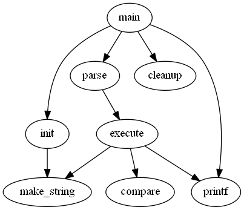
图1

调整布局中节点和边的表示或位置通常很有用。 这是通过在输入文件中设置节点、边或子图的属性来实现的。 属性是字符串格式的名称-值对。 代码2和图2说明了一些布局属性。 代码2清单中，第2行将图形的大小设置为4，4(英寸)。 此属性控制绘图的大小；如果绘制的图太大，则会根据需要统一缩放。

节点或边属性在方括号中设置。 在第3行中，为节点main指定了形状box。 第4行中的边设置了权重(默认值为1)。第6行中的边绘制为虚线。 第8行生成从executr到make string和printf的两条边。 在第10行中，默认边颜色被设置为红色。 这会影响此后创建的任何边。 第11行生成标签为"100 times"的粗体边缘。 在第12行中，节点make_string被赋予了一个多行标签。 第13行将默认节点更改为用蓝色阴影填充的框。 节点compare继承这些属性。

==代码2==

```c
digraph G {
	size ="4,4";
	main [shape=box]; /* this is a comment */
	main -> parse [weight=8];
	parse -> execute;
	main -> init [style=dotted];
	main -> cleanup;
	execute -> { make_string; printf}
	init -> make_string;
	edge [color=red]; // so is this
	main -> printf [style=bold,label="100 times"];
	make_string [label="make a\nstring"];
	node [shape=box,style=filled,color=".7 .3 1.0"];
	execute -> compare;
}
```
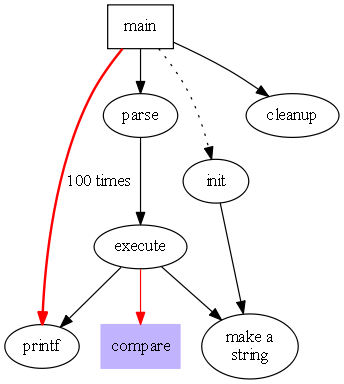
图2

## 2 图形属性

附录A、B和C中总结了影响图表绘制的主要属性。有关更多属性和更完整的属性说明，请访问Graphviz网站，特别是下面这个网页<https://www.graphviz.org/doc/info/attrs.html>

### 2.1 节点形状

默认情况下，使用Shape=椭圆、Width=.75、Height=.5绘制节点，并使用节点名称进行标记。 其他常见的形状包括方框、圆形、矩形和plaintext。 附录H中给出了主要节点形状的列表。
plaintext节点特别令人感兴趣，因为它绘制没有任何轮廓的节点，这在某些类型的图中是一个重要的约定。 在主要关注图形结构的情况下，特别是当图形中等大时，point形状会缩小节点尺寸以显示最小的内容。 绘制时，节点的实际大小是代码中设置大小和其文本标签所需的区域中较大的一个，除非设置了FixedSize=true，在这种情况下，将强制使用设定宽度和高度值。

节点形状分为两大类：基于多边形的和基于记录的[^1]。除record和Mrecord之外的所有节点形状都被视为多边形，并按边数(椭圆和圆是特例)以及其他一些几何属性建模。 其中一些属性可以在图形中指定。 如果Regular=true，则强制节点为规则的。参数peripheries设置绘制的边界曲线的数量。 例如，双圆的peripheries=2。orientation属性指定多边形的顺时针旋转(以度为单位)。

图形polygon显示所有多边形参数，并且对于创建许多未预定义的图形非常有用。 除了上面提到的regular,参数、peripheries参数和orientation,参数外，多边形还通过sides,、skew和distortion几个参数进行控制。 skew是一个浮点数(通常在-1.0和1.0之间)，它通过从上到下倾斜形状来扭曲形状，正值会将多边形的顶部向右移动。 因此，skew可以用来将长方体变成平行四边形。 distortion会从上到下缩小多边形，负值会导致底部大于顶部。distortion会将长方体变成梯形。 代码3和图3说明了这些多边形属性的各种情况。

==代码3==

```c
digraph G {
	a -> b -> c;
	b -> d;
	a [shape=polygon,sides=5,peripheries=3,color=lightblue,style=filled];
	c [shape=polygon,sides=4,skew=.4,label="hello world"]
	d [shape=invtriangle];
	e [shape=polygon,sides=4,distortion=.7];
}
```


图3

基于记录的节点形成另一类节点形状。 其中包括record和Mrecord.两种形状参数。 除了后者有圆角之外，两者是相同的。 这些节点表示域的递归列表，这些域被绘制为交替的水平和垂直方框行。 递归结构由节点的标签确定，该标签具有以下架构：

```
rlabel → field ( ’|’ field )*
field → boxLabel | ’’ rlabel ’’
boxLabel → [ ’<’ string ’>’ ] [ string ]
```

文字花括号、竖线和尖括号必须转义。 空格被解释为标记之间的分隔符，因此如果它们要逐字出现在文本中，则必须对它们进行转义。 BoxLabel中的第一个字符串为该域指定名称，并用作该框的端口名称(参见。 第3.1节)。 第二个字符串用作域的标签；它可以包含与多行标签相同的转义序列(参见。 第2.2节)。 图7和图8的示例说明了记录的使用和一些属性。

==代码4==

```
digraph structs {
	node [shape=record];
	struct1 [shape=record,label="<f0> left|<f1> mid\ dle|<f2> right"];
	struct2 [shape=record,label="<f0> one|<f1> two"];
	struct3 [shape=record,label="hello\nworld |{ b |{c|<here> d|e}| f}| g | h"];
	struct1 -> struct2;
	struct1 -> struct3;
}
```


图4


### 2.2 标签

如上所述，默认节点标签是其名称。 默认情况下，边未标记。 可以使用label属性显式设置节点和边标签，如图2所示。

虽然按名称标记节点可能很方便，但有时必须显式设置标签。 例如，在绘制文件目录树时，可能有几个名为src的目录，但每个目录都必须有唯一的节点标识符。索引号或完整路径名是合适的唯一标识符。 则可以将每个节点的标签设置为其目录内的文件名。

可以使用转义序列\n、\l、\r来终止居中、左对齐或右对齐的行，从而创建多行标签[^2]。

图和集群子图也可以有标签。 默认情况下，图形标签在图形下方居中显示。 设置labelloc=t使标签在图形上方居中。 集群标签显示在左上角的封闭矩形内。 值labelloc=b将标签移动到矩形的底部。 设置labelust=r会将标签向右移动。

默认字体为14磅Times-Roman，黑色。 可以使用属性fontname、fontSize和fontcolor选择其他字体风格、大小和颜色。 字体名称应与目标解释器兼容。 最好只使用标准字体系列Times、Helvetica、Courier或Symbol，因为这些字体可以保证与任何目标图形语言一起使用。 例如，Times-Italic、Times-Bold和Courier是便携的，而AvanteGardeDemiOblique不是便携的。

对于位图输出(如GIF或JPG)，dot依赖于在布局期间提供这些字体。 大多数预编译的Graphviz安装都使用fontconfig库将字体名称与可用的字体文件进行匹配。 Fontconfig附带了一组用于显示匹配项和安装字体的实用程序。 有关详细信息，请参阅字体配置文档或外部Graphviz FontFAQ。 如果Graphviz是在没有fontconfig的情况下构建的(这通常意味着您自己从源代码编译它)，则fontpath属性可以指定应该搜索字体文件的目录列表[^3]。 如果未设置，则dot将使用DOTFONTPATH环境变量，如果DOTFONTPATH环境变量也未设置，则使用GDFONTPATH环境变量。 如果这些都未设置，则dot使用内置列表。

边缘标签位于边缘中心附近。 通常，要注意防止边标签与边和节点重叠。 在复杂的图形中，仍然很难确定标签属于哪条边。 如果将Decorate属性设置为true，则会绘制一条将标签与其边缘连接起来的线。 有时，避免边标签和边之间的冲突会强制图形大于预期大小。 如果labelFloat=true，则点不会尝试防止此类重叠，从而使绘图更紧凑。

边还可以使用放置在边末端附近的headlabel和taillabel来指定附加标签。 使用属性labelfontname、labelfontsize和labelfontcolor指定这些标签的特征。 这些标签放置在边和节点的交点附近，因此可能会干扰它们。 要调整图形，用户可以设置labelangle和labeldistance属性。 前者设置标签从边与节点的入射角度旋转的角度(以度为单位)。 后者设置相乘的比例因子以调整标签到节点的距离。

### 2.3 类HTML标签

为了在更细的粒度上提供更丰富的属性集合，dot使用HTML语法接受类似HTML的标签。 这些是使用< . . . >分隔的字符串而不是双引号指定的。 在这些分隔符中，字符串必须遵循HTML的词汇、引号和语法约定。

通过使用\<table\>元素，可以将这些标签视为Shape=Record的扩展和替换。 有了这些，用户可以在合级别更改颜色和字体，并包括图像。 \<td\>元素的Port属性提供单元的端口名称(参见。 第3.1节)。

尽管类似HTML的标签只是一种特殊类型的标签属性，但人们经常使用它们，就好像它们是一种类似于记录的新类型的节点形状。
 因此，当使用这些参数时，通常会看到shape=none和march=0。 还要注意，作为标签，它们可以与边、图以及节点一起使用。

代码5和图5给出了一个使用类HTML的标签的示例。

==代码5==

```html
digraph html {
	abc [shape=none, margin=0, label=<
	<TABLE BORDER="0" CELLBORDER="1" CELLSPACING="0" CELLPADDING="4">
	<TR><TD ROWSPAN="3"><FONT COLOR="red">hello</FONT><BR/>world</TD>
	<TD COLSPAN="3">b</TD>
	<TD ROWSPAN="3" BGCOLOR="lightgrey">g</TD>
	<TD ROWSPAN="3">h</TD>
	</TR>
	<TR><TD>c</TD>
	<TD PORT="here">d</TD>
	<TD>e</TD>
	</TR>
	<TR><TD COLSPAN="3">f</TD>
	</TR>
	</TABLE>>];
}
```


图5

### 2.4 图形样式

节点和边可以指定颜色属性，默认颜色为黑色。 这是用于绘制节点形状或边的颜色。 颜色值可以是色彩饱和亮度三元组(0和1之间的三个浮点数，用逗号分隔)；附录J中列出的颜色名称之一(借用自X Window系统的某些版本)；或红绿蓝(RGB)三元组[^4] (00和FF之间的三个十六进制数，前面有字符'#')。 因此，值“orchid”、“0.8396、0.4862、0.8549”和“#DA70D6”是指定相同颜色的三种方式。 数字形式便于自动生成颜色的脚本或工具。 颜色名称查找不区分大小写，并忽略非字母数字字符，因此WORM_GREY和WORM_GREY是等效的。

我们可以就图表中颜色的使用提供一些提示。 首先，避免使用太多鲜艳的颜色。 “彩虹效应”令人困惑。 最好选择较窄的颜色范围，或者随色调改变饱和度。 其次，当节点用深色或饱和度很高的颜色填充时，使用fontcolor=white和fontname=Helvetica的标签似乎更具可读性。 (我们还有用于dot的PostScript函数，可以从普通字体创建轮廓字体。)。 第三，在某些输出格式中，您可以定义自己的颜色空间。 例如，如果使用PostScript进行输出，则可以在库文件中重新定义nodecolor、edgecolor或raphcolor。 因此，要使用RGB颜色，请在文件lib.ps中放置以下行。

`/nodecolor {setrgbcolor} bind def`

使用-l命令行选项加载此文件。

`dot -Tps -l lib.ps file.gv -o file.ps`

style属性控制节点和边的各种图形功能。 此属性是具有可选参数列表的原语列表(以逗号分隔)。 预定义的图元包括solid, dashed, dotted, bold和invis。 前四条控制线绘制在节点边界和边上都有明显的意义。 值Invis会导致节点或边保持未绘制状态。 节点的样式还可以包括filled,diagonals和rounded.。 使用颜色fillcolor填充节点内部的着色。 如果未设置，则使用color值。 如果也未设置此选项，则使用浅灰色[^5] 作为默认值。diagonals样式导致在顶点附近的一对边之间绘制短对角线。rounded样式环绕多边形角。

用户定义的样式基元可以实现为自定义PostScript过程。
 在绘制图形、节点或边的任何标记之前，此类原语在gsave上下文中执行。 参数列表被转换为PostScript表示法。 例如，style=“setlinewidth(8)”的节点用粗轮廓绘制。 在这里，setlinewidth是一个内置的PostScript，但是用户定义的PostScript过程的调用方式是相同的。 这些过程的定义可以在使用-l加载的库文件中给出，如上所示。

边具有用于设置箭头的dir属性。 目录可以是forward(默认值)、back、both或none。 这仅指绘制箭头的位置，不会更改基础图形。 例如，设置dir=back会导致在尾部绘制箭头，而在头部不绘制箭头，但不会交换边的端点。 属性arrohead和arrowTail指定在边的头部和尾部使用的箭头样式(如果有的话)。 允许值为normal, inv, dot, invdot, odot, invodot和none(参见附录I)。 属性arrowsize指定影响边上绘制的任何箭头大小的乘性因子。 例如，arrowsize=2.0会使箭头的长度和宽度分别增加一倍和两倍。

就样式和颜色而言，群集的作用有点像大型方框状节点，因为群集边界是使用群集的颜色属性绘制的，通常，群集的外观受样式、颜色和填充颜色属性的影响。

如果根图形指定了bgcolor属性，则此颜色用作整个绘图的背景，也用作默认填充颜色。

### 2.5 绘图方向、大小和间距

在决定dot图形大小方面起重要作用的两个属性是nodesep和ranksep。 第一个参数指定相同等级上的两个相邻节点之间的最小距离(以英寸为单位)。 第二个参数处理等级分离，它是一个等级中节点的底部和下一个等级中的节点顶部之间的最小垂直空间。 ranksep属性以英寸为单位设置等级分隔。 或者，可以将ranksep=equally.。 这保证了从相邻排列上的节点中心测量，所有排列是相等间隔的。 在这种情况下，两个等级之间的等级分离至少是默认的等级分离。 由于ranksep的两个用法是独立的，因此可以同时设置这两个用法。 例如，ranksep=“1.0 equally.”会导致等距排列，最小排列间隔为1英寸。

通常，对于目标打印机或文档中允许的图形空间而言，使用默认节点大小和分隔创建的图形太大。 有几种方法可以尝试处理这个问题。 首先，我们将回顾点是如何计算最终布局大小的。

布局最初在内部使用默认设置(除非设置了ratio=compress，如下所述)的“自然”大小。 绘图的大小或纵横比没有限制，因此如果图形很大，布局也会很大。 如果不指定大小或比例，则打印自然大小布局。

控制图形输出大小的最简单方法是在dot代码中(或在命令行上使用-G)设置size=“x，y”。 这决定了最终布局的大小。 例如，无论初始布局有多大，size=“7.5，10”都适合8.5x11页面(假设默认页面方向)。

ratio参数也会影响布局大小。 根据size和ratio参数的设置，有多种情况。

1. 情况1.未设置ratio参数。 如果图形已经适合给定的大小，则不会执行任何操作。 否则，工程图将进行足够均匀的缩小，以使关键尺寸符合要求。

2. 如果设置了ratio参数，则有四个子情况。

   - 情况2a。 如果Ratio=x(其中x是浮点数)，则在一个维度上放大绘图，以获得所需的比例，表示为图形的高度/宽度。 例如，Ratio=2.0使图形的高度是宽度的两倍。 然后，如情况1所示，使用size参数缩放布局。

   - 情况2b。 如果设置了ratio=fill和size=x,y，则会在一个维度上放大绘图，以达到y/x的比例。然后按情况1执行缩放。效果是填充所有由size参数指定的边框。

   - 情况2c。 如果设置了ratio=compress和size=x,y，则会压缩初始布局以尝试使其适合给定的边框。 这在布局质量、平衡和对称性之间进行了权衡，以使布局更加紧凑。 然后像在情况1中一样执行缩放。

   - 案例2d。 如果ratio=auto并且设置了*page*属性，并且不能在单个页面上绘制图形，则忽略*size*参数，由 *dot* 计算“理想”大小。
      具体地说，给定维度中的大小将是该维度中页面大小的最小整数倍，其至少是当前大小的一半。 然后，这两个尺寸将独立缩放到新大小。

如果设置了 *route=90*，或 *orientation=landscape*，则图形将旋转90进入横向模式。 布局的X轴将沿着每页的Y轴。 这不会影响 *dot* 对 *size*、*raito* 或 *page* 的解释。
此时，如果未设置 *page* 属性，则最终布局将作为一个页面生成。
如果设置了page=x, y，则将布局打印为可平铺或组合成马赛克的页面序列。 常见设置为 page=“8.5，11”或page=“11，17”。 这些值指的是物理设备的完整大小；实际使用的区域将按边距设置减小。 (对于打印机输出，默认值为0.5英寸；对于位图输出，X和Y边距分别为10和2磅。)。 对于平铺布局，设置较小的边距可能会有所帮助。 这可以通过使用 margin 属性来完成。 这可以采用单个数字(用于设置两个边距)，也可以采用用逗号分隔的两个数字来分别设置x和y边距。 像往常一样，单位是英寸。 虽然可以将边距设置为0，但不幸的是，许多位图打印机具有无法覆盖的内部硬件边距。

打印页面的顺序可以由pagedir属性控制。
输出总是使用基于行或基于列的顺序来完成，并且 pageedir 被设置为指定主要方向和次要方向的两个字母的代码。 例如，默认值为BL，指定自下而上(B)主顺序和左(L)次顺序。 因此，最先发出页面的底部行，从左到右，然后向上第二行，从左到右，最后以顶行结束，从左到右。 从上到下的顺序由T表示，从右到左的顺序由R表示。

如果center=true，并且图形可以在一页上输出(如果未设置page，则使用默认页面大小8.5x11英寸)，则图形将重新定位为在该页居中。
 一个常见的问题是，以小尺寸绘制的大图会产生不可读的节点标签。 要制作更大的标签，必须付出一些代价。 一页可以容纳的可读文本的数量是有限制的。 通常，您可以通过在运行dot之前从原始图形中提取一段有趣的内容来绘制较小的图形。

我们有一些工具可以帮助你做到这一点。

- sccmap 将图形分解为强连接组件

- tred 计算传递约简(移除传递性隐含的边)

- gvpr 图形处理器选择节点或边，并收缩或移除图形的其余部分

- unflatlen 通过错开树叶边的长度来改善树的纵横比，这里有一些事情可以在给定的图形上尝试：

  1. 增加节点 fontsize 属性。
  2. 使用较小的 ranksep 和 nodesep。
  3. 使用 ratio=auto。
  4. 使 ratio=compress 并给出合理的 size 属性。
  5. 缩小后的无衬线字体(如Helvetica字体)可能比Times字体更具可读性。

### 2.6 节点和边的放置

dot 中的属性提供了许多方法来调整节点和边的大规模布局，以及微调绘图以满足用户的需要和口味。 本节讨论这些属性[^6] 。
有时，使边从左到右而不是从上到下是很自然的。 如果顶层图形中的rankdir=LR，则图形将以这种方式旋转。 TB(从上到下)是默认值。 模式rankdir=BT对于绘制向上有向图很有用。 为了完整性，还可以使用rankdir=RL。

在带有时间线的图形中，或者在强调源节点和汇节点的绘图中，您可能需要约束等级分配。 子图的 rank 属性可以设置为 same, min, source, max 或 sink。 取值 same 会导致子图中的所有节点出现在相同的等级上。 如果设置为min，则保证子图中的所有节点的等级至少与布局[^7] 中的任何其他节点一样小。 可以通过设置 rank=source 来严格执行此操作，这会强制子图中的节点的等级严格小于任何其他节点的等级( 被 min 或 source 指定的子图的节点除外)。 取值 max 或 sink 对于最大等级起着类似的作用。 请注意，这些约束导致节点的处在相同的等级上。 如果一个子图强制节点A和B在相同的等级上，而另一个子图强制节点C和B共享一个等级，则两个子图中的所有节点必须在相同的等级上绘制。 代码6和图6说明了使用子图来控制等级分配(这里的图片不是很清晰，但是能清晰的看到各个等级)。

==代码6==

```c++
digraph asde91 {
	ranksep=.75; size = "7.5,7.5";
	{
	node [shape=plaintext, fontsize=16];
	/* the time-line graph */
	past -> 1978 -> 1980 -> 1982 -> 1983 -> 1985 -> 1986 ->
	1987 -> 1988 -> 1989 -> 1990 -> "future";
	/* ancestor programs */
	"Bourne sh"; "make"; "SCCS"; "yacc"; "cron"; "Reiser cpp";
	"Cshell"; "emacs"; "build"; "vi"; "<curses>"; "RCS"; "C*";
	}
	{ rank = same;
	"Software IS"; "Configuration Mgt"; "Architecture & Libraries";
	"Process";
	};
	node [shape=box];
	{ rank = same; "past"; "SCCS"; "make"; "Bourne sh"; "yacc"; "cron"; }
	{ rank = same; 1978; "Reiser cpp"; "Cshell"; }
	{ rank = same; 1980; "build"; "emacs"; "vi"; }
	{ rank = same; 1982; "RCS"; "<curses>"; "IMX"; "SYNED"; }
	{ rank = same; 1983; "ksh"; "IFS"; "TTU"; }
	{ rank = same; 1985; "nmake"; "Peggy"; }
	{ rank = same; 1986; "C*"; "ncpp"; "ksh-i"; "<curses-i>"; "PG2"; }
	{ rank = same; 1987; "Ansi cpp"; "nmake 2.0"; "3D File System"; "fdelta";
	"DAG"; "CSAS";}
	{ rank = same; 1988; "CIA"; "SBCS"; "ksh-88"; "PEGASUS/PML"; "PAX";
	"backtalk"; }
	{ rank = same; 1989; "CIA++"; "APP"; "SHIP"; "DataShare"; "ryacc";
	"Mosaic"; }
	{ rank = same; 1990; "libft"; "CoShell"; "DIA"; "IFS-i"; "kyacc"; "sfio";
	"yeast"; "ML-X"; "DOT"; }
	{ rank = same; "future"; "Adv. Software Technology"; }
	"PEGASUS/PML" -> "ML-X";
	"SCCS" -> "nmake";
	"SCCS" -> "3D File System";
	"SCCS" -> "RCS";
	"make" -> "nmake";
	"make" -> "build";
	
	//省略后面的代码
}
```


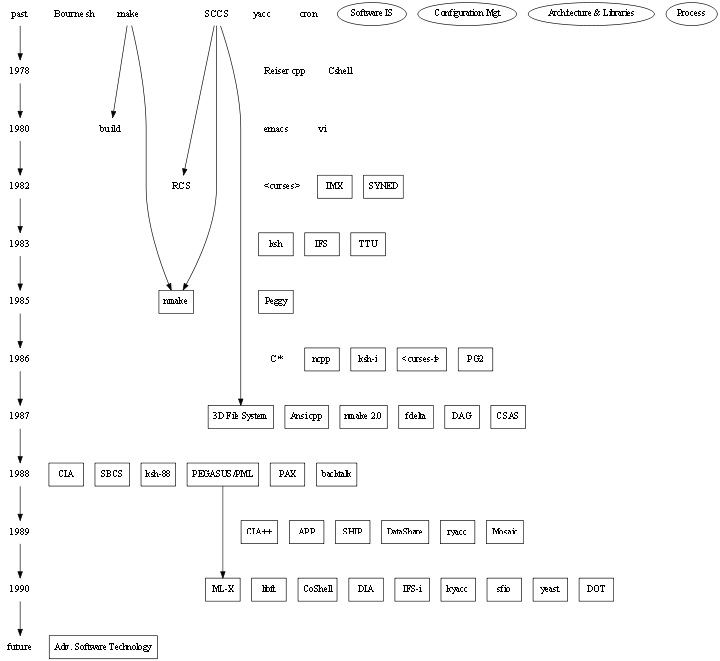
图6

 在某些图中，节点从左到右的顺序很重要。 如果子图设置了ordering=out，则子图中具有相同尾节点的外边将按照其创建顺序从左向右扇出。 (另请注意，涉及头部节点的平面边可能会干扰其排序)。 

有许多方法可以微调节点和边的布局。 例如，如果一条边的节点都具有相同的 group 属性，则dot会尝试保持边是直的，并避免其他边与其交叉。 边的  weight 属性提供了另一种保持边为直线的方法。 边的 weight 属性表示边的重要性的某种度量；因此，权重越重，其节点之间的距离就越近。 ==dot使权重较大的边绘制得更短、更直。==

当节点被约束到相同的等级时，边权重也起作用。这些节点之间具有非零权重的边尽可能以相同方向(在旋转图形中为从左到右或从上到下)指向整个等级。 可以通过将不可见边(style=“Invis”)放置在需要的位置，来调整节点排序。

可以使用 samhead 和 sametail 属性约束与同一节点相邻的边的端点。 具体地说，具有相同头部和相同 samehead 属性值的所有边都被约束在同一节点处并与头部节点相交。 类似的性质也适用于尾节点和sametail属性。

在等级分配期间，边的头部节点被约束为比尾节点处于更高的等级。 但是，如果设置了边的属性 constraint=false，则不会强制执行此要求。

在某些情况下，用户可能希望边的终点永远不要离起点太近。 这可以通过设置边的 minlen 属性来实现。这个属性这定义了头部和尾部之间的最少相差多少个等级。 例如，如果minlen=2，则在头部和尾部之间始终至少有一个中间等级。 请注意，这与两个节点之间的几何距离无关。

微调应谨慎对待。 当dot在放置单独的节点和边时，可以在没有太多“帮助”或干扰的情况下进行布局时，它工作得最好。 通过增加某些边的权重，或者使用 style=invis 创建不可见的边或节点，有时甚至可以重新排列文件中的节点和边的顺序，这些方法都可以在一定程度上调整布局。 但这可能会适得其反，因为布局对于输入图中的更改不一定是稳定的。 最后一次调整可能会使之前的所有更改无效，从而生成非常糟糕的图形。 我们考虑的一个未来项目是将 dot 的数学布局技术与允许用户定义提示和约束的交互式前端相结合。

## 3 高级特征

### 3.1 节点端口

节点端口是边可以附着到节点的一个位置。 (当边未附加到端口时，它指向节点的中心，边在节点的边界处被截断)。 

有两种类型的端口。 可以为任何节点指定基于8个罗盘方位(“n”、“ne”、“e”、“se”、“s”、“sw”、“w”或“nw”)的端口。 然后，边的末端将指向节点上的该位置。 因此，如果指定了se端口，边将连接到节点的东南角。

此外，shape属性值为 record 的节点可以使用记录结构来定义端口，而具有表的类HTML标签可以使用\<td\>元素的PORT属性使任何单元格成为端口。如果记录框或表格单元格定义了端口名称，则边可以使用该端口名称来指示它应该指向框的中心。 (默认情况下，边从节点框的边缘被截断)。 

还有两种指定端口的方式。 一种方法是使用边的 headport 和 tailport 属性，例如

`a -> b [tailport=se]`

或者，使用语法node_name:port_name，端口名称可以用来修改节点名称，将其作为边声明的一部分。 因此，处理上面给出的示例的另一种方法是

`a -> b:se`

因为记录框有自己的角，所以可以在记录名称端口上增加一个罗盘方位端口。 因此，下面的代码表示，该边将连接到端口名为f0的记录节点b中的框的东南角。

`a -> b:f0:se`

代码7说明了记录节点中端口名称的声明和使用，结果图如图7所示。

==代码7==

```c
digraph g {
	node [shape = record,height=.1];
	node0[label = "<f0> |<f1> G|<f2> "];
	node1[label = "<f0> |<f1> E|<f2> "];
	node2[label = "<f0> |<f1> B|<f2> "];
	node3[label = "<f0> |<f1> F|<f2> "];
	node4[label = "<f0> |<f1> R|<f2> "];
	node5[label = "<f0> |<f1> H|<f2> "];
	node6[label = "<f0> |<f1> Y|<f2> "];
	node7[label = "<f0> |<f1> A|<f2> "];
	node8[label = "<f0> |<f1> C|<f2> "];
	"node0":f2 -> "node4":f1;
	"node0":f0 -> "node1":f1;
	"node1":f0 -> "node2":f1;
	"node1":f2 -> "node3":f1;
	"node2":f2 -> "node8":f1;
	"node2":f0 -> "node7":f1;
	"node4":f2 -> "node6":f1;
	"node4":f0 -> "node5":f1;
}
```


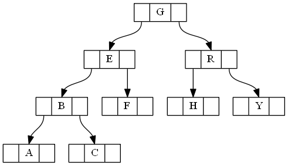
图7

代码8和图8给出了使用记录节点和端口的另一个示例。 这重复了代码4和图4的示例，但现在使用端口作为边的连接器。 请注意，如果将记录的输入高度设置为较小的值，则记录常常看起来会更好，这样文本标签会控制实际大小，如代码7所示。 否则，假定节点大小为默认尺寸(.75x.5)，如图8所示。代码9和图9的示例在哈希表的布局中使用从左到右的绘图。

==代码8==

```c
digraph structs {
	node [shape=record];
	struct1 [shape=record,label="<f0> left|<f1> middle|<f2> right"];
	struct2 [shape=record,label="<f0> one|<f1> two"];
	struct3 [shape=record,label="hello\nworld |{ b |{c|<here> d|e}| f}| g | h"];
	struct1:f1 -> struct2:f0;
	struct1:f2 -> struct3:here;
}
```


图8


==代码9==

```c
digraph G {
	nodesep=.05;
	rankdir=LR;
	node [shape=record,width=.1,height=.1];

	node0 [label = "<f0> |<f1> |<f2> |<f3> |<f4> |<f5> |<f6> | ",height=2.5];
	node [width = 1.5];
	node1 [label = "{<n> n14 | 719 |<p> }"];
	node2 [label = "{<n> a1 | 805 |<p> }"];
	node3 [label = "{<n> i9 | 718 |<p> }"];
	node4 [label = "{<n> e5 | 989 |<p> }"];
	node5 [label = "{<n> t20 | 959 |<p> }"] ;
	node6 [label = "{<n> o15 | 794 |<p> }"] ;
	node7 [label = "{<n> s19 | 659 |<p> }"] ;

	node0:f0 -> node1:n;
	node0:f1 -> node2:n;
	node0:f2 -> node3:n;
	node0:f5 -> node4:n;
	node0:f6 -> node5:n;
	node2:p -> node6:n;
	node4:p -> node7:n;
}
```


图9


### 3.2 聚簇

簇是放置在布局的不同矩形中的子图。 如果子图的名称具有前缀cluster，则将其识别为簇。 (如果顶级图形的 clusterrank=none，则关闭此特殊处理)。 标签、字体特征和labelloc属性可以像设置顶级图形一样进行设置，尽管默认情况下簇标签显示在图的上方。对于簇，默认情况下标签是左对齐的；如果labeljust=“r”，则标签是右对齐的。 color属性指定封闭矩形的颜色。此外，簇可以设置 style="filled"，在这种情况下，在绘制簇之前，矩形将填充由 fillcolor 属性指定的颜色。 (如果未指定 fillcolor属性，则使用簇的 color 属性。)。

簇是通过递归技术绘制的，该技术计算簇内节点的等级分配和内部排序。 代码10,11，图10,11展示一些簇布局的代码以及生产图片。

==代码10==

```c
digraph G {
	subgraph cluster0 {
		node [style=filled,color=white];
		style=filled;
		color=lightgrey;
		a0 -> a1 -> a2 -> a3;
		label = "process #1";
	}
	subgraph cluster1 {
		node [style=filled];
		b0 -> b1 -> b2 -> b3;
		label = "process #2";
		color=blue;
	}
	start -> a0;
	start -> b0;
	a1 -> b3;
	b2 -> a3;
	a3 -> a0;
	a3 -> end;
	b3 -> end;
	start [shape=Mdiamond];
	end [shape=Msquare];
}
```


图10


==代码11==

```c

digraph G {
	size="8,6"; ratio=fill; node[fontsize=24];
	
	ciafan->computefan; fan->increment; computefan->fan; stringdup->fatal;
	main->exit; main->interp_err; main->ciafan; main->fatal; main->malloc;
	main->strcpy; main->getopt; main->init_index; main->strlen; fan->fatal;
	fan->ref; fan->interp_err; ciafan->def; fan->free; computefan->stdprintf;
	computefan->get_sym_fields; fan->exit; fan->malloc; increment->strcmp;
	computefan->malloc; fan->stdsprintf; fan->strlen; computefan->strcmp;
	computefan->realloc; computefan->strlen; debug->sfprintf; debug->strcat;
	stringdup->malloc; fatal->sfprintf; stringdup->strcpy; stringdup->strlen;
	fatal->exit;
	
	subgraph "cluster_error.h" { label="error.h"; interp_err; }
	
	subgraph "cluster_sfio.h" { label="sfio.h"; sfprintf; }
	
	subgraph "cluster_ciafan.c" { label="ciafan.c"; ciafan; computefan;
	increment; }
	
	subgraph "cluster_util.c" { label="util.c"; stringdup; fatal; debug; }
	
	subgraph "cluster_query.h" { label="query.h"; ref; def; }
	
	subgraph "cluster_field.h" { get_sym_fields; }
	
	subgraph "cluster_stdio.h" { label="stdio.h"; stdprintf; stdsprintf; }
	
	subgraph "cluster_<libc.a>" { getopt; }
	
	subgraph "cluster_stdlib.h" { label="stdlib.h"; exit; malloc; free; realloc; }
	
	subgraph "cluster_main.c" { main; }
	
	subgraph "cluster_index.h" { init_index; }
	
	subgraph "cluster_string.h" { label="string.h"; strcpy; strlen; strcmp; strcat; }
}
```


图11

如果顶级图的 compound 属性设置为true，则 dot 将允许边连接节点和簇。 这是通过定义lhead或ltail属性的边来实现的。 这些属性的值必须分别是包含头节点或尾节点的簇的名称。 在这种情况下，边在簇边界处被截断。 所有其他边属性(如arrowhead或dir)都将应用于截断的边。 例如，代码12是一个使用了 compound 属性示例，图12是结果图。

==代码12==

```c
digraph G {
	compound=true;
	subgraph cluster0 {
		a -> b;
		a -> c;
		b -> d;
		c -> d;
	}
	subgraph cluster1 {
		e -> g;
		e -> f;
	}
	b -> f [lhead=cluster1];
	d -> e;
	c -> g [ltail=cluster0,
	lhead=cluster1];
	c -> e [ltail=cluster0];
	d -> h;
}
```


图12

### 3.3 集中器

在顶层图上设置 concentrate=true 可启用边合并技术，以减少密集布局中的混乱。 当边平行、具有公共端点且长度大于1时，将合并这些边。固定大小布局中的一个有益副作用是，删除这些边通常允许使用更大、更具可读性的标签。 虽然dot中的集中器看起来有点像Newberg的 [New89]，但它们是通过搜索布局中的边来找到的，而不是通过检测底层图中的完整二分图来找到的。 因此，dot方法的运行速度要快得多，但不会像Newberg的算法那样折叠那么多的边。

## 4 命令行选项

默认情况下，dot在筛选器模式下操作，从stdin读取图形，并以附加了布局属性的DOT格式将图形写入stdout。 dot支持各种命令行选项：-T加格式设置输出的格式。 格式的允许值为：

- bmp Windows位图格式。

- canon 预打印输入；不进行布局。

- dot 由DOT决定。 打印带有作为属性附加的布局信息的输入，参见附录F

- fig FIG输出。

- gd GD格式。 这是GD图形库使用的内部格式。 另一种格式是GD2。

- gif GIF输出。

- imap 为服务器端图像地图生成地图文件。 这可以与输出的图形形式相结合，例如在网页中使用-Tgif或-Tjpg来将链接附加到节点和边。

- cmapx 为客户端图像地图生成HTML地图文件。

- pdf 通过Cairo library 的Adobe PDF。 我们在嵌入到其他文档时发现了问题。 相反，可以使用-Tps2，如下所述。

- plain  简单明了的、基于行的ASCII格式。 附录E介绍了此输出。 另一种格式是plain-ext，它在边的头部和尾部节点上提供端口名称。

- png PNG(便携网络图形)输出。

- ps PostScript(EPSF)输出。

- ps2 带PDF批注的PostScript(EPSF)输出。 在包含到文档中之前，应该将此输出提取到PDF中，例如用于pdflatex。(使用ps2pdf；epstopdf不处理%%BoundingBox: (atend))

- svg SVG输出。 另一种形式svgz生成压缩的SVG。

- vrml VRML输出。

- wbmp 无线位图(WBMP)格式。

  

- *-G*name=value 设置图形属性默认值。 通常，在命令行而不是在图形文件中设置大小、分页和相关值更方便。 类似的标志-N或-E设置默认节点或边属性。 请注意，文件内容覆盖命令行参数。

- *-l*libfile 指定设备相关的图形库文件。 可以提供多个库。 这些名称在输出开始时传递给代码生成器。

- *-o*outfile 将输出写入文件outfile。
- -v 请求详细输出。 在处理大型布局时，冗长的消息可能会估计dot的进度。
- -V 打印版本号并退出。

## 5 其他

在顶级图标题中，图可以被声明为 strict digraph 或 strict graph。 这禁止创建多条边，即在有向情况下，最多只能有一条具有给定尾节点和头节点的边。 对于无向图，至多有一条边连接到相同的两个节点。使用相同两个节点的后续边语句将使用先前定义的边标识边，并应用边语句中给出的任何属性。

节点、边和图可以具有URL属性。 在某些输出格式(ps2、imap、cmapx或svg)中，此信息将集成在输出中，以便节点、边和簇在使用适当的工具显示时成为活动链接。 通常，附加到顶级图形的URL充当基本URL，支持组件上的相对URL。 当输出格式为imap或cmapx时，将对headURL和traURL属性进行类似的处理。

对于某些格式(ps、fig或svg)，comment 属性可用于在输出中嵌入人类可读的符号。

## 6 结论

dot 可生成赏心悦目的分层图形，并可应用许多设置。

由于dot的基本算法运行良好，为进一步研究大型图形的绘制方法和在线(动画)图形的绘制等问题奠定了良好的基础。


## 参考文献

[Car80]: M. Carpano. Automatic display of hierarchized graphs for computer aided decision analysis. IEEE Transactions on Software Engineering,SE-12(4):538–546, April 1980.

[GKNV93]: Emden R. Gansner, Eleftherios Koutsofios, Stephen C. North, and Kiem-Phong Vo. A Technique for Drawing Directed Graphs. IEEE Trans. Sofware Eng., 19(3):214–230, May 1993.

[New89]:Frances J. Newbery. Edge Concentration: A Method for Clustering Directed Graphs. In 2nd International Workshop on Software Configuration Management, pages 76–85, October 1989. Published as ACM SIGSOFT Software Engineering Notes, vol. 17, no. 7, November 1989.

[Nor92]: Stephen C. North. Neato User’s Guide. Technical Report 59113-921014-14TM, AT&T Bell Laboratories, Murray Hill, NJ, 1992.[STT81]: K. Sugiyama, S. Tagawa, and M. Toda. Methods for Visual Understanding of Hierarchical System Structures. IEEE Transactions on Systems, Man, and Cybernetics, SMC-11(2):109–125, February 1981.

[War77]: JohnWarfield. Crossing Theory and Hierarchy Mapping. IEEE Transactions on Systems, Man, and Cybernetics, SMC-7(7):505–523, July 1977.


## 附录

参见 [英文原版文档](Graphviz_dot_guide.pdf) 附录部分


### A 主要的节点属性

| Name         | Default         | Values                                                       |
| ------------ | --------------- | ------------------------------------------------------------ |
| color        | black           | node shape color                                             |
| colorscheme  | X11             | scheme for interpreting color names                          |
| comment      |                 | any string (format-dependent)                                |
| distortion   | 0.0             | node distortion for shape=polygon                            |
| fillcolor    | lightgrey/black | node fill color                                              |
| fixedsize    | false           | label text has no affect on node size                        |
| fontcolor    | black           | type face color                                              |
| fontname     | Times-Roman     | font family                                                  |
| fontsize     | 14              | point size of label                                          |
| group        |                 | name of node’s horizontal alignment group                    |
| height       | .5              | minimum height in inches                                     |
| id           |                 | any string (user-defined output object tags)                 |
| image        |                 | image file name                                              |
| imagescale   | false           | true, width, height, both                                    |
| label        | node name       | any string                                                   |
| labelloc     | c               | node label vertical alignment                                |
| layer        | overlay range   | all, id or id:id, or a comma-separated list of the former    |
| margin       | 0.11,0.55       | space around label                                           |
| nojustify    | false           | if true, justify to label, not node                          |
| orientation  | 0.0             | node rotation angle                                          |
| penwidth     | 1.0             | width of pen for drawing boundaries, in points               |
| peripheries  | shape-dependent | number of node boundaries                                    |
| regular      | false           | force polygon to be regular                                  |
| samplepoints | 8 or 20         | number vertices to convert circle or ellipse                 |
| shape        | ellipse         | node shape; see Section 2.1 and Appendix H                   |
| sides        | 4               | number of sides for shape=polygon                            |
| skew         | 0.0             | skewing of node for shape=polygon                            |
| style        |                 | graphics options, e.g. bold, dotted, filled; cf. Section 2.4 |
| target       |                 | if URL is set, determines browser window for URL             |
| tooltip      | label           | tooltip annotation                                           |
| URL          |                 | URL associated with node (format-dependent)                  |
| width        | .75             | minimum width in inches                                      |


### B 主要的边属性

| Name           | Default       | Values                                                       |
| -------------- | ------------- | ------------------------------------------------------------ |
| arrowhead      | normal        | style of arrowhead at head end                               |
| arrowsize      | 1.0           | scaling factor for arrowheads                                |
| arrowtail      | normal        | style of arrowhead at tail end                               |
| color          | black         | edge stroke color                                            |
| colorscheme    | X11           | scheme for interpreting color names                          |
| comment        |               | any string (format-dependent)                                |
| constraint     | true          | use edge to affect node ranking                              |
| decorate       |               | if set, draws a line connecting labels with their edges      |
| dir            | forward       | forward, back, both, or none                                 |
| edgeURL        |               | URL attached to non-label part of edge                       |
| edgehref       |               | synonym for edgeURL                                          |
| edgetarget     |               | if URL is set, determines browser window for URL             |
| edgetooltip    | label         | tooltip annotation for non-label part of edge                |
| fontcolor      | black         | type face color                                              |
| fontname       | Times-Roman   | font family                                                  |
| fontsize       | 14            | point size of label                                          |
| headclip       | true          | if false, edge is not clipped to head node boundary          |
| headhref       |               | synonym for headURL                                          |
| headlabel      |               | label placed near head of edge                               |
| headport       |               | n,ne,e,se,s,sw,w,nw                                          |
| headtarget     |               | if headURL is set, determines browser window for URL         |
| headtooltip    | label         | tooltip annotation near head of edge                         |
| headURL        |               | URL attached to head label                                   |
| href           |               | alias for URL                                                |
| id             |               | any string (user-defined output object tags)                 |
| label          |               | edge label                                                   |
| labelangle     | -25.0         | angle in degrees which head or tail label is rotated off edge |
| labeldistance  | 1.0           | scaling factor for distance of head or tail label from node  |
| labelfloat     | false         | lessen constraints on edge label placement                   |
| labelfontcolor | black         | type face color for head and tail labels                     |
| labelfontname  | Times-Roman   | font family for head and tail labels                         |
| labelfontsize  | 14            | point size for head and tail labels                          |
| labelhref      |               | synonym for labelURL                                         |
| labelURL       |               | URL for label, overrides edge URL                            |
| labeltarget    |               | if URL or labelURL is set, determines browser window for URL |
| labeltooltip   | label         | tooltip annotation near label                                |
| layer          | overlay range | all, id or id:id, or a comma-separated list of the former    |
| lhead          |               | name of cluster to use as head of edge                       |
| ltail          |               | name of cluster to use as tail of edge                       |
| minlen         | 1             | minimum rank distance between head and tail                  |
| penwidth       | 1.0           | width of pen for drawing edge stroke, in points              |
| samehead       |               | tag for head node; edge heads with the same tag are merged  onto the same port |
| sametail       |               | tag for tail node; edge tails with the same tag are merged  onto the same port |
| style          |               | graphics options, e.g. bold, dotted, filled; cf. Section 2.4 |
| tailclip       | true          | if false, edge is not clipped to tail node boundary          |
| tailhref       |               | synonym for tailURL                                          |
| taillabel      |               | label placed near tail of edge                               |
| tailport       |               | n,ne,e,se,s,sw,w,nw                                          |
| tailtarget     |               | if tailURL is set, determines browser window for URL         |
| tailtooltip    | label         | tooltip annotation near tail of edge                         |
| tailURL        |               | URL attached to tail label                                   |
| target         |               | if URL is set, determines browser window for URL             |
| tooltip        | label         | tooltip annotation                                           |
| weight         | 1             | integer cost of stretching an edge                           |


### C 主要的图形属性

| Name         | Default      | Values                                                       |
| ------------ | ------------ | ------------------------------------------------------------ |
| aspect       |              | controls aspect ratio adjustment                             |
| bgcolor      |              | background color for drawing, plus initial fill color        |
| center       | false        | center drawing on page                                       |
| clusterrank  | local        | may be global or none                                        |
| color        | black        | for clusters, outline color, and fill color if fillcolor not  defined |
| colorscheme  | X11          | scheme for interpreting color names                          |
| comment      |              | any string (format-dependent)                                |
| compound     | false        | allow edges between clusters                                 |
| concentrate  | false        | enables edge concentrators                                   |
| dpi          | 96           | dots per inch for image output                               |
| fillcolor    | black        | cluster fill color                                           |
| fontcolor    | black        | type face color                                              |
| fontname     | Times-Roman  | font family                                                  |
| fontnames    |              | svg, ps, gd (SVG only)                                       |
| fontpath     |              | list of directories to search for fonts                      |
| fontsize     | 14           | point size of label                                          |
| id           |              | any string (user-defined output object tags)                 |
| label        |              | any string                                                   |
| labeljust    | centered     | ”l” and ”r” for left- and right-justified cluster labels,  respectively |
| labelloc     | top          | ”t” and ”b” for top- and bottom-justified cluster labels,  respectively |
| landscape    |              | if true, means orientation=landscape                         |
| layers       |              | id​ : id : id . . .                                           |
| layersep     | :            | specifies separator character to split layers                |
| margin       | .5           | margin included in page, inches                              |
| mindist      | 1.0          | minimum separation between all nodes (not dot)               |
| nodesep      | .25          | separation between nodes, in inches.                         |
| nojustify    | false        | if true, justify to label, not graph                         |
| ordering     |              | if out out edge order is preserved                           |
| orientation  | portrait     | if rotate is not used and the value is landscape, use  landscape orientation |
| outputorder  | breadthfirst | or nodesfirst, edgesfirst                                    |
| page         |              | unit of pagination, e.g. "8.5,11"                            |
| pagedir      | BL           | traversal order of pages                                     |
| pencolor     | black        | color for drawing cluster boundaries                         |
| penwidth     | 1.0          | width of pen for drawing boundaries, in points               |
| peripheries  | 1            | number of cluster boundaries                                 |
| rank         |              | same, min, max, source or sink                               |
| rankdir      | TB           | LR (left to right) or TB (top to bottom)                     |
| ranksep      | .75          | separation between ranks, in inches.                         |
| ratio        |              | approximate aspect ratio desired, fill or auto minimization  |
| rotate       |              | If 90, set orientation to landscape                          |
| samplepoints | 8            | number of points used to represent ellipses and circles on  output (cf. Appendix F |
| searchsize   | 30           | maximum edges with negative cut values to check when looking  for a |
| minimum      |              | one during network simplex                                   |
| size         |              | maximum drawing size, in inches                              |
| splines      |              | draw edges as splines, polylines, lines                      |
| style        |              | graphics options, e.g. filled for clusters                   |
| stylesheet   |              | pathname or URL to XML style sheet for SVG                   |
| target       |              | if URL is set, determines browser window for URL             |
| tooltip      | label        | tooltip annotation for cluster                               |
| truecolor    |              | if set, force 24 bit or indexed color in image output        |
| viewport     |              | clipping window on output                                    |
| URL          |              | URL associated with graph (format-dependent)                 |


### D DOT语法

下图是DOT语言的抽象语法。 端子以粗体显示，非端子以斜体显示。 文字字符用单引号引起来。 圆括号 ( 和 ) 表示需要时分组。 方括号 [ 和 ] 包含可选项。 竖线 | 分开多个选项。


id是不以数字开头但可能包括下划线的任何字母数字字符串；或数字；或任何可能包含转义引号的带引号的字符串。

边在有向图中是 ->，在无向图中是 --。

该语言支持C++风格的注释：/**/和//。

分号有助于提高可读性，但不是必需的，除非在极少数情况下，没有正文的指名子图紧接在匿名子图之前，因为在优先规则下，该序列被解析为具有标题和正文的子图。

复杂属性值可能包含用于解析DOT语言的字符，如逗号和空格。 为了避免出现解析错误，需要用双引号将这些值引起来。


### E 明文输出文件格式 (-Tplain)

dot 的“明文”输出格式以简单的、面向线条的样式列出节点和边信息，前端组件很容易对其进行解析。 所有坐标和长度均未缩放，以英寸为单位。

第一行是：

> *graph* scalefactor width height

width 和 height 值提供绘图的宽度和高度；绘图的左下角位于原点。 比例因子指示在最终图形中缩放所有坐标的比例。

 下一组代码以以下格式列出节点：

> *node* name x y xsize ysize label style shape color fillcolor

name 是唯一标识符。 如果它包含空格或标点符号，则使用引号。 X和y值给出了节点中心的坐标；xsize 和 ysize 给出了宽度和高度。 其余参数分别提供节点的 label, style, shape, color 和 fillcolor 等属性。
 如果节点没有 style 属性，则使用 “solid” 。

下一组代码出边：

> *edge* tail head n x~1~ y~1~ x~2~ y~2~ . . . x~n~ y~n~ [ label lx ly ] style color

*n*是跟随为B-spline控制点的坐标对的数量。 如果为边添加了标签，则标签文本和坐标将列在下一个列表中。 边的描述信息由边的 style 和 color 完成。 与节点一样，如果未定义 style ，则使用 “solid” 。
 最后一行总是：

> *stop*


### F DOT参数格式

这是默认输出格式。 它会重新生成输入，以及图形的布局信息。 坐标值向上和向右增加。 位置由两个用逗号分隔的整数表示，表示以点(1/72英寸)指定位置的X和Y坐标。 位置指的是与其关联的对象的中心。 长度以英寸为单位。

bb属性附加到图形，指定图形的边框。 如果图形有标签，则其位置由lp属性指定。

每个节点都有 pos 、width 和 height 属性。 如果节点是记录，则在rects属性中给出记录矩形框。 如果节点是多边形，并且在输入图形中定义了 vertices 属性，则该属性包含节点的顶点。 为圆和椭圆生成的点数由samplepoints属性控制。

每条边都被赋予了一个 pos 属性，该属性由3n+1个位置的列表组成。 这些是 B-spline 控制点：点p0，p1，p2，p3是第一条Bezier样条，p3，p4，p5，p6是第二条Bezier样条，依此类推。当前，无论边的方向如何，边点都是从上到下(或从左到右)列出的。 这种情况可能会改变。

在 pos 属性中，控制点列表可以在起始点 ps 和/或 终点 pe 之前。 它们分别具有带有“s”或“e”前缀的普通位置表示。 如果 p0处有箭头，则表示起点。在本例中，箭头是从 p0 到 ps，其中ps实际上位于节点边界上。箭头的长度和方向由矢量(ps - p0)给出。 如果没有箭头，则p0在节点边界上。 同样，点pe在边的另一端指定一个箭头，连接到最后一个样条点。

如果边有标签，则标签位置以 lp 为单位给出。层层


### G 图层

dot 具有在一系列重叠的“层”上绘制单个图的各部分的功能。 通常，这些层是架空透明的。 要激活此功能，必须将顶级图形的 layers 属性设置为标识符列表。 然后，可以使用节点或边的 layer 属性将其指定给层列表。 层列表被指定为逗号分隔的范围列表，范围要么是单个层，要么具有id:id‘的形式，后者表示从id到id’的所有层。all 是所有图层的保留名称(可以在范围的两端使用，如 design:all 或 all:code)。 例如下面的代码片段：

```c
layers = "spec:design:code:debug:ship";
node90 [layer = "code"];
node91 [layer = "design:debug"];
node92 [layer = "all:code"];
node93 [layer = "spec:code,ship"];
node90 -> node91 [layer = "all"];
```

在该图中，node91 处于design，code和debug三个层次，而 node92 处于spec，design和code三个层次。 node93 处于spec，design，code 和 ship 四个层次。

在分层图中，如果节点或边没有指定层，但是关联边或节点指定了，那么它的层规范就是从关联边或节点中推断出来的。 要更改默认设置，使没有图层的节点和边显示在所有图层上，请在图形文件开头附近插入：

```c
node [layer=all];
edge [layer=all];
```

选择PostScript输出时，将在数组 layercolorseq 中设置图层的颜色序列。 该数组从1开始索引，每个元素都必须是一个可以解释为颜色坐标的3元素数组。 冒险家可以从 dot 的PostScript输出中学到更多东西。


### H 节点形状

下面是所有的节点形状以及对应代码。 有关节点形状的更完整描述，请访问网站

<www.graphviz.org/doc/info/shapes.html>

| 代码 | 图形 | 代码 | 图形 |      代码       |                             图形                             |
| :--: | :--: | :--: | :--: | :--: | :--: |
|box||polygon||ellipse||
|oval||circle||point|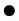|
|egg|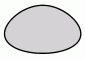|triangle||plaintext||
|plain||diamond||trapezium||
|parallelogram||house|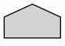|pentagon||
|hexagon||septagon||octagon||
|doublecircle|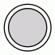|doubleoctagon||tripleoctagon||
|invtriangle||invtrapezium||invhouse||
|Mdiamond|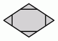|Msquare||Mcircle||
|rect||rectangle||square||
|star|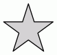|none|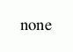|underline|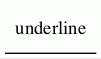|
|cylinder|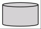|note||tab|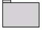|
|folder||box3d||component||
|promoter||cds||terminator||
|utr|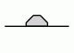|primersite||restrictionsite||
|fivepoverhang|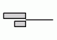|threepoverhang||noverhang||
|assembly||signature||insulator||
|ribosite||rnastab||proteasesite||
|proteinstab||rpromoter||rarrow||
|larrow||lpromoter|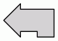|record||
|Mrecord||


### I 箭头类型

这些是一些主要的箭头类型。 有关这些形状的更完整描述，请访问网站

<www.graphviz.org/doc/info/arrows.html>


箭头描述支持简单的语法以允许更复杂的派生形状，如下例所示。


上面引用的网页详细描述了该语法。


### J 颜色名称

这里有一些基本的颜色名称。 有关颜色的更多信息，请访问

<www.graphviz.org/doc/info/colors.html>和<www.graphviz.org/doc/info/attrs.html#k:color>


[^1]:有一种方法可以实现自定义节点形状，使用shape=epsf和shapefile属性，并依赖于PostScript输出。详细信息超出了本用户指南的范围。有关更多信息，请联系作者。
[^2]:转义序列\\N是节点名称的内部符号。
[^3]:对于基于Unix的系统，这是用冒号分隔的路径名串接列表。对于基于Windows的系统，路径名用分号分隔。
[^4]:还支持第四种形式，即RGBA，它具有与RGB相同的格式，并附加了指定Alpha通道或透明度信息的第四个十六进制数。
[^5]: 如果输出格式为MIF或点状，则默认值为黑色。
[^6]: 为了完整性，我们注意到 dot 还提供对在布局算法中起技术作用的各种参数的访问。 其中包括mclimate it、nslimit、nslimit1、regercross和searchsize。
[^7]: 回想一下，最低等级位于绘图的顶部

