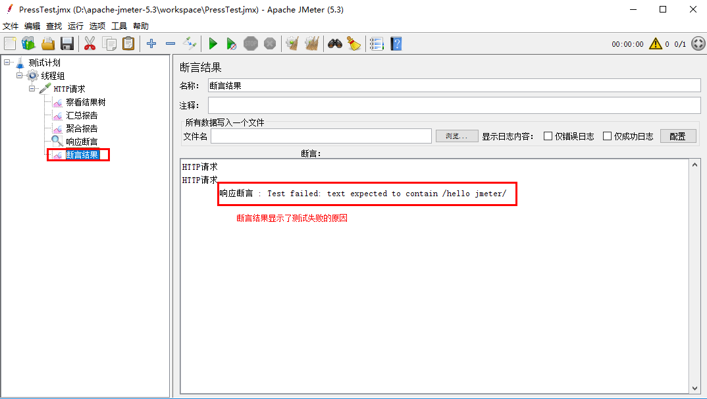
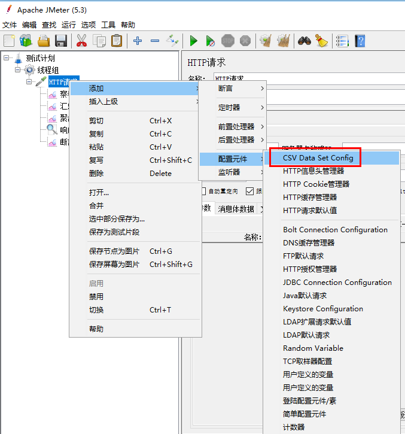

## 1 下载和安装

- 下载地址：<https://jmeter.apache.org/download_jmeter.cgi>

- 安装方式：解压压缩包，运行bin目录下的 jmeter.bat

  > 例如：D:/apache-jmeter-5.3/bin/jmeter.bat


## 2 设置中文语言

- 临时设置：在图形界面依次选择：选修 -> 选择语言

- 永久设置：修改bin目录下的 jmeter.properties 文件

  > 例如：打开 D:/apache-jmeter-5.3/bin/jmeter.properties
  >
  > 找到键 language，然后设置为：`language=zh_CN`


## 3 操作流程

### 3.1 基本流程


1. 新建测试计划：进入打开Jmeter时直接就是新建测试计划页面，连新建也不用点了


2. 添加线程组


3. 设置线程参数


4. 添加HTTP请求取样器


5. 设置HTTP请求参数：包括协议，IP，端口，请求方法以及请求参数


6. 为HTTP请求添加监听器，监听器有很多，如下图。这里用到了察看结果树，汇总报告，聚合报告和断言结果：**注意：要先添加监听器，再运行，如果运行后再添加监听器就看不到运行结果。**


7. 添加响应断言

   


8. 保存测试计划，测试计划基本创建完成，下面是测试计划目录树。


9. 运行测试


10. 查看运行结果，这里通过察看结果树来观察每笔交易的请求和响应数据


11. 查看汇总报告


12. 查看聚合报告


### 3.2 测试成功条件控制


1. 修改响应断言，可以控制交易成功的条件：下面是判断返回内容是否包含hello jmeter字符串，如果包含就表示测试成功


2. 再次启动测试，结果是测试失败，因为返回内容没有包含设置的字符串


3. 查看断言结果可以看到测试失败的原因




4. 再次修改响应断言为：返回内容包含hello


5. 再次启动测试，测试结果成功了，因为返回内容包含hello字符串


### 3.3 从外部CSV文件读取参数

1. 添加配置元件




2. 配置CSV文件：可以指定CSV文件中多个字段间的分隔符


3. 从CSV文件读取参数并放到HTTP请求参数中


CSV文件中的内容为：

```
AAAA|1111
BBBB|2222
CCCC|3333
```


4. 再次运行测试并查看结果树的请求参数，里面出现了CSV文件中的参数


5. CSV文件读取方式：循环读取，即如果总共要执行的线程数比CSV文件中的行数多，那么当CSV文件中的行全部读取完以后，会回到第1行重新开始读取。下面设置了需要执行10条线程，而CSV文件中只有3行，同样能正常执行完这10条线程。


3.4 TCP请求

1. 添加TCP请求取样器


2. 配置TCP请求信息：主要包括请求IP，端口和请求内容。另外，TCP取样器的运行，监听器添加，响应断言添加，CSV文件配置，结果树查看等操作都和HTTP请求取样器的操作一样。

