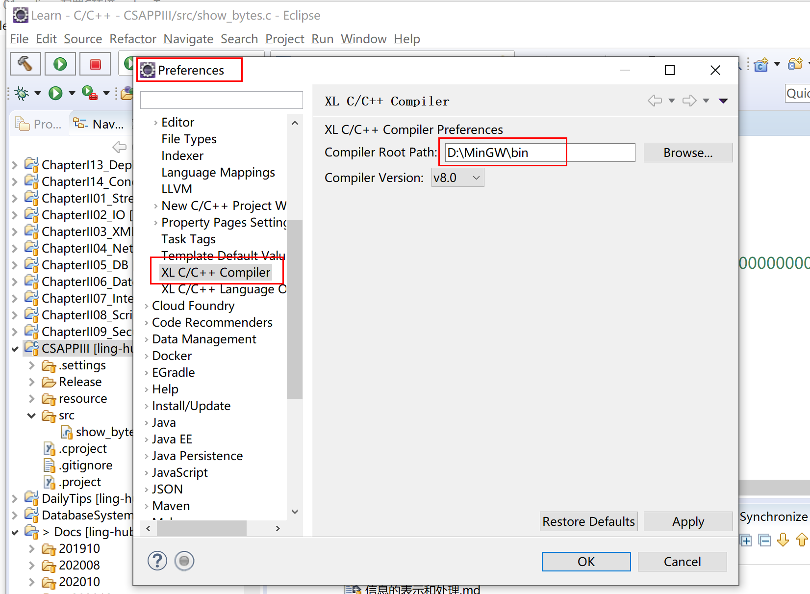
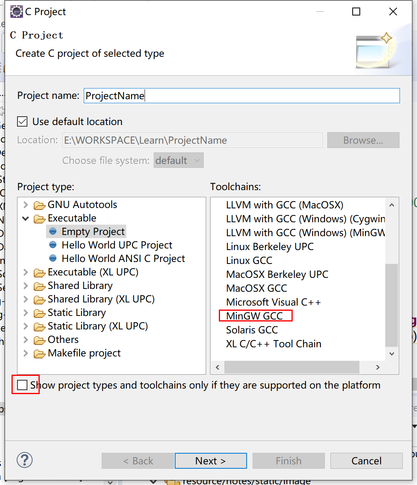
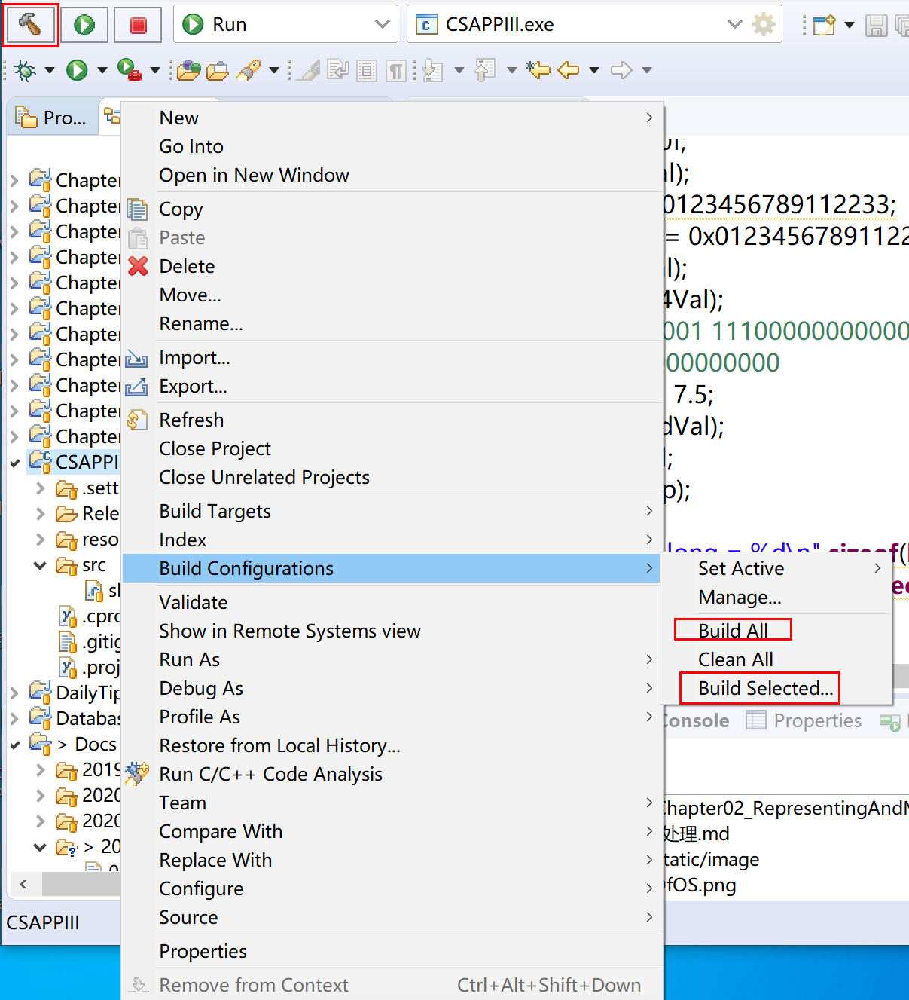
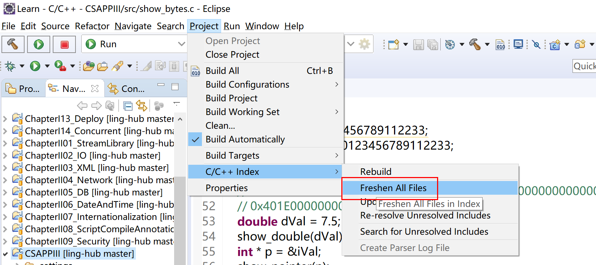

1. eclipse安装CDT插件，下载地址：https://www.eclipse.org/cdt/downloads.php。这一步本身简单，但是注意要安装对应 eclipse 版本的插件，否则总是安装失败。

2. 安装 MinGW，下载地址：https://sourceforge.net/projects/mingw/files/MinGW/。并配置环境变量。需要注意两点：

   > 1. 这个网址下载的安装文件在安装过程中还会下载外网文件，很慢，而且可能会下载失败，所以可以选择别人安装过的压缩包。
   > 2. 需要重启电脑，不然 eclipse 老是没法编译。

3. 在 eclipse 中设置 MinGW，如下图

   

4. 在 eclipse 中创建 C 工程，然后入下图所示：取消勾选，并选择 MinGW GCC。

5. 编写完代码后，需要进行构建，如下图所示，可以点左上角的锤子构建，也可以点工程右键进行构建。

5. 有时候有些 C 源文件中的报错去不掉，就按照下图的方式处理

   