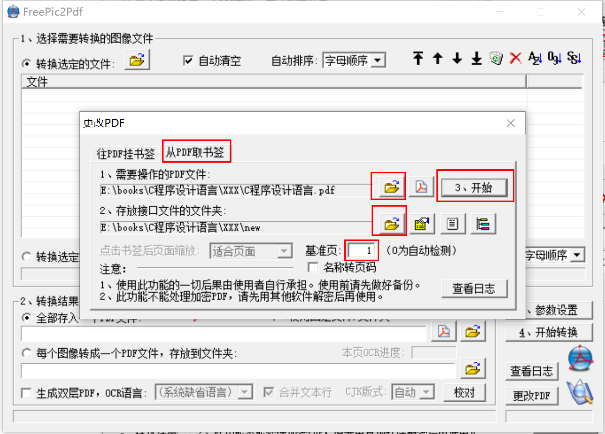

## 1 使用软件：FreePic2Pdf

## 2 书签导出

1. 点击 "更改PDF"

   

   

2. 导出书签，点击 "从PDF取书签"，选择 PDF 文件，和保存书签的位置，设置基准页，最后点 "开始" 导出书签。注意这里的基准页默认为 0，0 和 1 有相同效果，如果 PDF 中的书签 X 指向第 n 页，那么当基准页设置为 m 时，导出的书签 X 指向第 n-m+1 页。**注意这里的基准页只能输入整数**。

   

3. 查看导出结果

   导出结果包含两个文件：FreePic2Pdf.itf 和 FreePic2Pdf_bkmk.txt

   **FreePic2Pdf.itf**

   书签属性文件，主要关注 BasePage 那一行，这个属性即上一步设置的基准页，这个属性在导入书签是有用到。

   ```
   [Images]
   
   [Font]
   Language=GBK
   FontSize=7
   Margin=0.5
   
   [Bkmk]
   File=FreePic2Pdf_bkmk.txt
   AddAsText=0
   ShowBkmk=1
   ShowAll=1
   BasePage=1
   
   [Main]
   ContentsPage=
   TextPage=
   
   ```

   

   **FreePic2Pdf_bkmk.txt**

   书签内容文件，书签名和页码之间用 TAB 字符隔开；书签前面也用 TAB 字符表示目录层级，无 TAB 表示一级目录，1 个 TAB 表示二级目录，依次类推。

   ```
   第1章 导言	9
   	1.1 入门	9
   	1.2 变量与算术表达式	11
   	1.3 for语句	16
   	1.4 符号常量	17
   	1.5 字符输入/输出	17
   	1.6 数组	23
   	1.7 函数	25
   	1.8 参数—传值调用	27
   	1.9 字符数组	28
   	1.10 外部变量与作用域	30
   第2章 类型、运算符与表达式	35
   	2.1 变量名	35
   	2.2 数据类型及长度	35
   	2.3 常量	36
   	2.4 声明	39
   	2.5 算术运算符	40
   	2.6 关系运算符与逻辑运算符	40
   	2.7 类型转换	41
   	2.8 自增运算符与自减运算符	45
   	2.9 按位运算符	46
   	2.10 赋值运算答与表达式	48
   	2.11 条件表达式	49
   	2.12 运算符优先级与求值次序	50
   第3章 控制流	53
   	3.1 语句与程序块	53
   	3.2 if-else语句	53
   	3.3 else-if语句	54
   	3.4 switch语句	56
   	3.5 while循环与for循环	57
   	3.6 do-while循环	60
   	3.7 break语句与continue语句	61
   	3.8 goto语句与标号	62
   ```

   

## 3 书签导入

1. 第一步同书签导出步骤，也是点击 "更改PDF"

2. 书签导入

   导入时，选择存放接口文件和文件夹，即上一步中的书签导出结果文件夹，这个文件夹也是 FreePic2Pdf.itf 和 FreePic2Pdf_bkmk.txt，需要注意的是 FreePic2Pdf.itf 文件中的 BasePage 那一行，这个值其实就是书签导出中设置的基准页，**但是可以修改该值为负数、0 或正数**，以便能将页码往前或往后调，当书签文件中的书签 X 对应 第 n 页时，如果 BasePage=1，那么导入书签后的 PDF 文档中的书签 X 同样指向第 n 页，否则当 BasePage=m 时，PDF 文档中的书签 X 指向第 n+m-1 页。

   

3. FreePic2Pdf_bkmk.txt 编码问题

   这个文件被生成时不是 UTF-8 编码，所以如果要用程序修改该文件的页码时要注意。