## 1 下载

### 1.1下载地址：https://manjaro.org/download/

### 1.2 桌面版本选择

可以在下载地址后面加上桌面版本

- gnome：https://manjaro.org/download/#gnome

- kde：https://manjaro.org/download/#kde-plasma

- xfce：https://manjaro.org/download/#xfce

  本次选择的是kde版本，也可以在页面上选择，如下图
  
  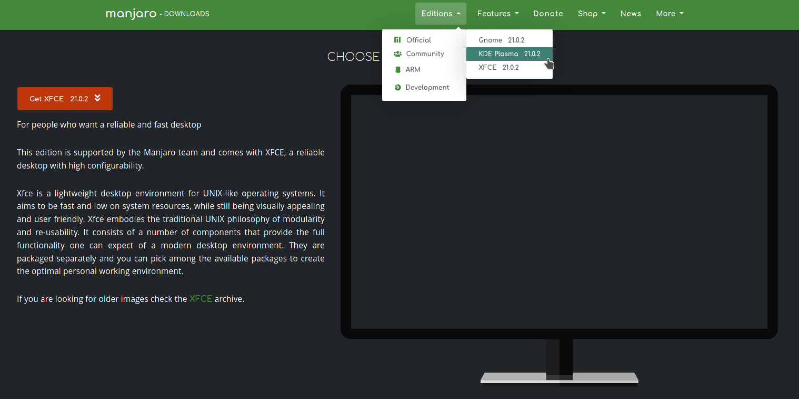

## 2 系统安装

### 2.1 将Manjaro写入U盘

使用Rufus工具将Manjaro系统的iso文件进行写入U盘，选择DD模式写入，如果没有这个选项就不用选，软件会进行智能选择。


### 2.2 重启系统选择U盘启动

进入Manjaro界面，选择一下地区和语言，然后选择驱动选择free/no free都行，看机器硬件，通常选free就行。然后就会进入Manjaro系统。

### 2.3 开始安装系统

经过步骤2.2进入Manjaro系统后，其实已经可以使用系统了，只不过每次要插U盘用，所以要安装到硬盘上。这时选运行安装器进入安装流程。

#### 2.3.1 选择地区语言等


#### 2.3.2 重点，一定要选择手动分区

- 安装前需要在硬盘上留出空闲空间。

- 只要分出下面分区就行

  - swap：8G
  - /boot：2G
  - /：占空闲空间的30%左右
  - /home：剩下的空闲空间

- 挂载引导分区

  选择原来安装win10时创建的引导分区(格式为FAT16或者FAT32的分区)，然后点"编辑"，按下图方式进行挂载，必须选择 **keep** ，否则原来的win10系统无法引导，挂载点选择 **/boot/efi** 然后一直下一步安装就完成了。

  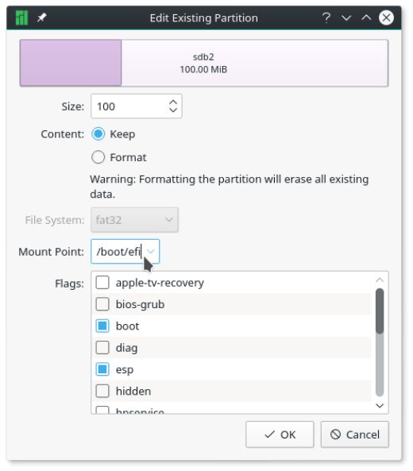

## 3 软件安装与配置

### 3.1 源配置

#### 3.1.1 添加国内源(配置/etc/pacman.d/mirrorlist文件)

- 先备份：

  ```shell
  cp mirrorlist mirrorlist.bak
  ```

  

- 在 mirrorlist 文件最前面添加如下内容(如果文件后面有重复内容就删除)：

  ```properties
  #### manjaro稳定源
  ## 中科大
  Server = https://mirrors.ustc.edu.cn/manjaro/stable/$repo/$arch
  
  ##  清华大学
  Server = https://mirrors.tuna.tsinghua.edu.cn/manjaro/stable/$repo/$arch
  
  ## 上海交通大学
  Server = https://mirrors.sjtug.sjtu.edu.cn/manjaro/stable/$repo/$arch
  
  ## 浙江大学
  Server = https://mirrors.zju.edu.cn/manjaro/stable/$repo/$arch
  
  #### archlinux源
  # 清华大学
  Server = https://mirrors.tuna.tsinghua.edu.cn/archlinux/$repo/os/$arch
  ## 163
  Server = http://mirrors.163.com/archlinux/$repo/os/$arch
  ## aliyun
  Server = http://mirrors.aliyun.com/archlinux/$repo/os/$arch
  
  
  ```

#### 3.1.2 添加中文社区仓库(配置/etc/pacman.conf 文件)

- 先备份：

  ```shell
  cp pacman.conf pacman.conf.bak
  ```

  

- 在 pacman.conf 文件末尾添加如下内容：

  ```properties
  [archlinuxcn]
  # The Chinese Arch Linux communities packages.
  # SigLevel = Optional TrustedOnly
  SigLevel = Optional TrustAll
  # 官方源
  #Server   = http://repo.archlinuxcn.org/$arch
  # 163源
  #Server = http://mirrors.163.com/archlinux-cn/$arch
  # 清华大学
  Server = https://mirrors.tuna.tsinghua.edu.cn/archlinuxcn/$arch
  
  ```

#### 3.1.3 手动更改源排名

```shell
sudo pacman-mirrors -i -c China -m rank
```


#### 3.1.4 更多参考下面链接

https://blog.csdn.net/weixin_43968923/article/details/86349914


### 3.2 安装软件的一般方法

#### 3.2.1 安装yay

- 使用pacman命令安装yay

```shell
sudo pacman -S yay
```

- 修改AURURL

```shell
yay --aururl "https://aur.tuna.tsinghua.edu.cn" --save
```

- yay 安装软件时遇到的问题

```shell
parse "“https://aur.tuna.tsinghua.edu.cn”/rpc.php?arg%5B%5D=deepin-wine-wechat&type=info&v=5": first path segment in URL cannot contain colon
```

原因是 “https://aur.tuna.tsinghua.edu.cn” 多了一层双引号，可以通过下面的命令看到

```shell
yay -P -g
```

或者直接查看下面的文件

```shell
~/.config/yay/config.json
```

可以看到yay配置如下，其中第一行的url多了一层双引号，修改config.json，去掉多的双引号就能解决问题

```json
{
        "aururl": "“https://aur.tuna.tsinghua.edu.cn”",
        "buildDir": "/home/lingang/.cache/yay",
        "absdir": "/home/lingang/.cache/yay/abs",
        "editor": "",
        "editorflags": "",
        "makepkgbin": "makepkg",
        "makepkgconf": "",
        "pacmanbin": "pacman",
        "pacmanconf": "/etc/pacman.conf",
        "redownload": "no",
        "rebuild": "no",
        "answerclean": "",
        "answerdiff": "",
        "answeredit": "",
        "answerupgrade": "",
        "gitbin": "git",
        "gpgbin": "gpg",
        "gpgflags": "",
        "mflags": "",
        "sortby": "votes",
        "searchby": "name-desc",
        "gitflags": "",
        "removemake": "ask",
        "sudobin": "sudo",
        "sudoflags": "",
        "requestsplitn": 150,
        "sortmode": 0,
        "completionrefreshtime": 7,
        "sudoloop": false,
        "timeupdate": false,
        "devel": false,
        "cleanAfter": false,
        "provides": true,
        "pgpfetch": true,
        "upgrademenu": true,
        "cleanmenu": true,
        "diffmenu": true,
        "editmenu": false,
        "combinedupgrade": false,
        "useask": false,
        "batchinstall": false
}

```

#### 3.2.2 到AUR官网搜索安装包

-  AUR官网地址：https://aur.archlinux.org/

在下图所示的搜索框输入要安装软件名称就可以搜索到相关安装包

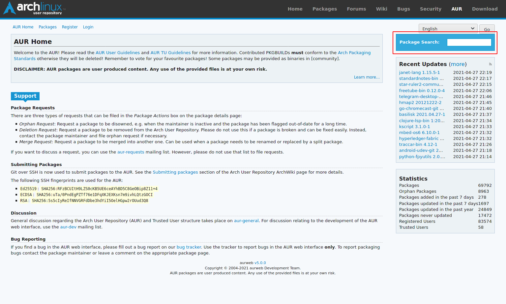

例如想要安装百度网盘，但又不知道完整的包名，可以尝试输入：baidu，然后在搜索结果中查找是否有合适的包

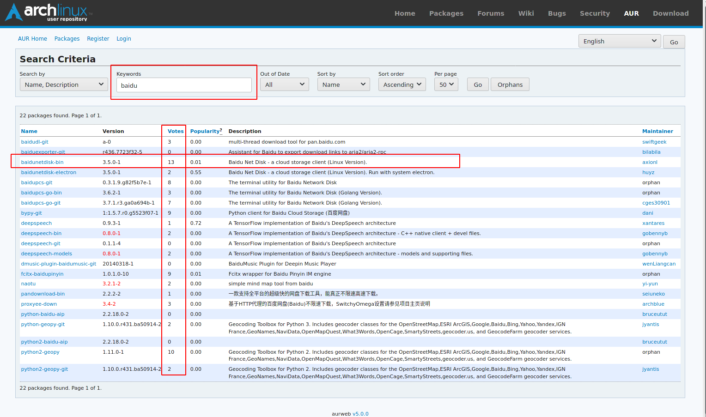

查找包时除了看Name这一列以外，如果有多个长得差不多的包名，那么Votes这一列也比较重要，表示投票数，通常投票数越多的包就是要找的包。

**注意：有时搜索不到相关的安装包不是因为 AUR上面没有，而是搜索关键字可能不对，这时应该在百度上查一下，看其他人安装这个包是否能用 yay 命令。**

#### 3.2.3 安装

以上面的 baidunetdisk-bin 包为例，使用下面的命令进行安装

```shell
yay -S baidunetdisk-bin
```

#### 3.2.4 其他安装方式

yay 安装命令依赖于 AUR ，如果有些包 AUR 没开发，那么就不能用 yay 命令进行安装，这是可以尝试用下面命令安装

```shell
sudo pacman -S 包名
```

或者直接下载 tar.gz 包进行安装

#### 3.2.5 安装错误解决

如果安装时遇到下面报错

```
错误：visual-studio-code-bin: 来自 "lilac (build machine) <lilac@build.archlinuxcn.org>" 的签名是未知信任的
:: 文件 /var/cache/pacman/pkg/visual-studio-code-bin-1.56.2-1-x86_64.pkg.tar.zst 已损坏 (无效或已损坏的软件包 (PGP 签名)).
打算删除吗？ [Y/n] n

```

运行下面命令后重新安装即可

```shell
sudo pacman -S archlinuxcn-keyring
```


### 3.3 安装搜狗输入法

#### 3.3.1 安装

```shell
yay -S fcitx-sogoupinyin
```

如果出现如下报错

```
错误： Cannot find the strip binary required for object file stripping.
```

则执行下面的命令，再执行安装命令

```shell
sudo pacman -S base-devel
```

#### 3.3.2 修改简繁切换快捷键

先进入 fctix 设置

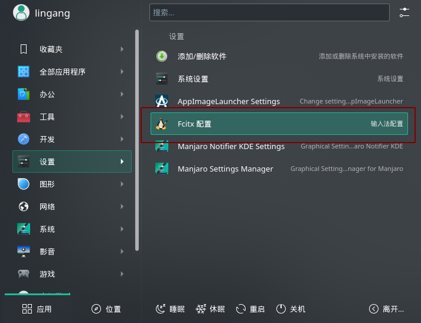

选择附加组件，在下面搜索框输入繁体，然后就能看到简繁转换那一项，然后选择进行快捷键更改

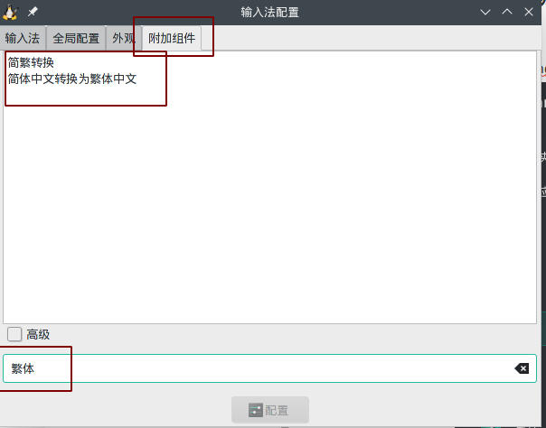

### 3.4 安装 Typora

`yay -S typora
 `


### 3.5 git配置

#### 3.5.1 初始化身份

```
 git config --global user.email "1544650023@qq.com"
 git config --global user.name "lingang-desk"
```


#### 3.5.2 解决 git 命令行中文文件名问题

```shell
git config --global core.quotepath false
```


#### 3.5.3 配置git凭证

```
git config --global credential.helper store
```

执行完上面的命令会创建文件 ~/.gitconfig，然后在 push 时输入一次用户密码就会创建 ~/.git-credentials 文件，里面保存了用户密码，下次 push 时就不用在输用户密码。

#### 3.4.4 解决github访问慢的问题

修改 /etc/hosts 文件，添加以下两行，如果有这两个域名，就修改前面的ip。

```host
140.82.112.3    github.com
199.232.69.194  github.global.ssl.fastly.net
```

上面的ip通过在 https://www.ipaddress.com/ 或 http://tool.chinaz.com/dns 上输入域名查询。

### 3.6 安装微信

```shell
yay -S deepin-wine-wechat
```


### 3.7 软件卸载

有时候安装命令使用的包名和卸载命令使用的包名不一样，例如安装使用下面命令能成功安装

```shell
yay -S eclipse
```

但是卸载使用下面命令就不能成功卸载

```shell
yay -R eclipse
```

原因是卸载需要完整包名，可以使用下面命令查看

```shell
$ yay -Q eclipse
eclipse-platform 4.20-1
```

然后使用完整包名进行卸载

```shell
yay -R eclipse-platform
```


### 3.8 安装时秘钥问题解决

如果安装时出现类似下面的报错

```
错误：所需的密钥不在密钥环中
错误：无法提交处理 (未预期的错误)
发生错误，没有软件包被更新。
安装软件库软件包时出错
```

执行下面命令再重新安装

```shell
sudo pacman -S archlinuxcn-keyring
```


### 3.9  为软件添加桌面快捷方式

在软件安装目录找到启动文件，例如eclipse启动文件路径为：/opt/eclipse/eclipse，快捷方式图标路径为：/opt/eclipse/icon.xpm；在桌面上新建一个文件 eclipse，用文本编辑器打开，然后将下面内容拷贝进去，然后将该文件的权限修改为能执行即可。

```
 [Desktop Entry]

Type=Application

Name=eclipse

Icon=/opt/eclipse/icon.xpm

Exec=/opt/eclipse/eclipse

Terminal=false
```

如果想要在打开软件时启动命令行终端，则设置 Terminal=true，下面是设置redis-server的快捷方式的配置

```
 
 [Desktop Entry]

Type=Application

Name=redis-server

Exec=/opt/redis-6.2.4/src/redis-server

Terminal=true
```


## 4 系统常用设置

### 4.1 关闭每次开机打开上次窗口

1. 进入：系统设置-开机与关机-桌面回话

2. 勾选以空回话启动，再点击应用，如下图所示

   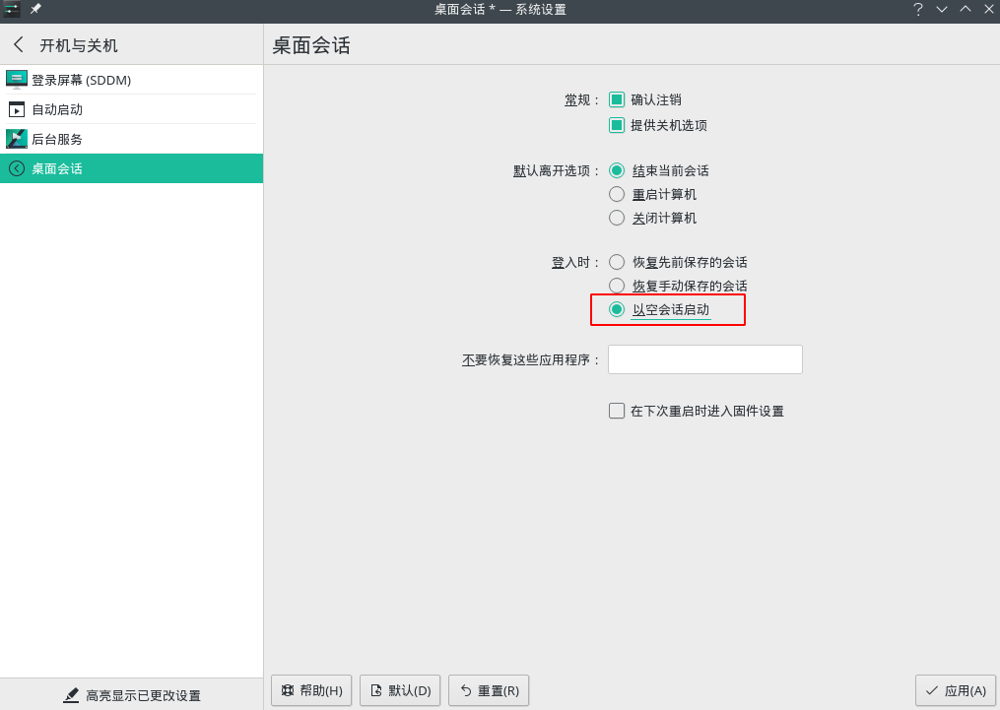

### 4.2  命令行显示全路径

修改 ~/.bashrc 文件，将其中所有的 \W修改为 \w，然后执行

```shell
source ~/.bashrc 
```


### 4.3 vscode 设置

#### 4.3.1 安装 C/C++ 插件

选择插件，在搜索框输入 C/C++，然后选择下图这一条进行安装


#### 4.3.2 安装中文语言包

在插件搜索框输入 language，选择中文(简体)那一条进行安装，如下图


#### 4.3.3 安装运行器，以在vscode中运行 C 程序

在插件搜索框中输入 Runner，选择下图这条进行安装

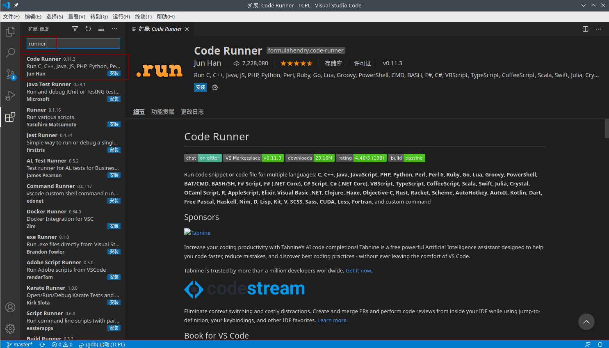

#### 4.3.4 修改快捷键

依次选择 文件-首选项-键盘快捷键 进行设置，如下图

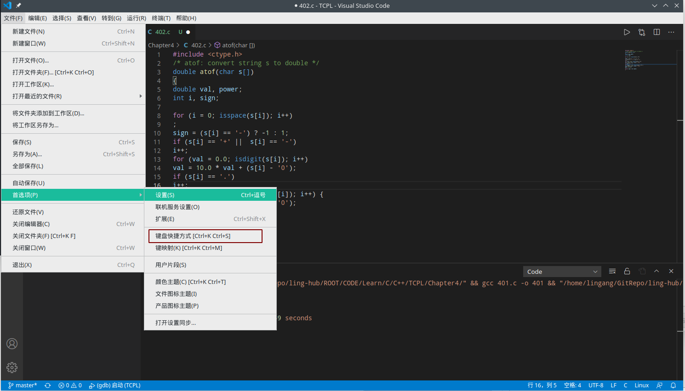

然后在搜索框搜索要修改快捷键的功能进行设置，如下图

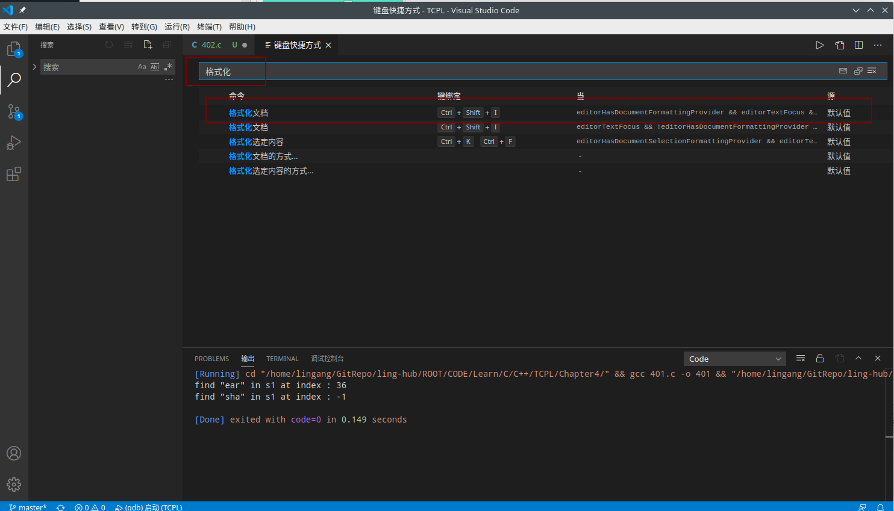


### 4.4 为flameshot设置快捷键

进入系统设置-快捷键-自定义快捷键

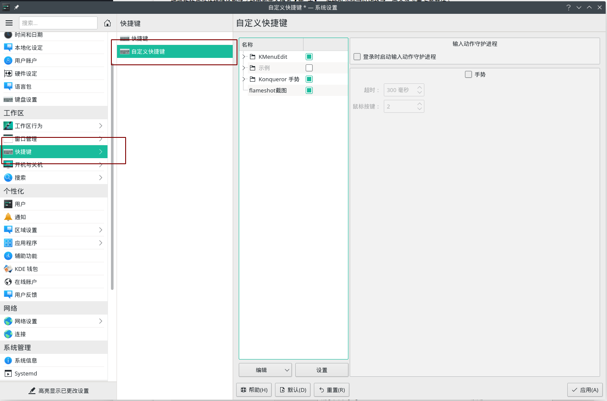

新建快捷键，并在触发器出设置快捷键

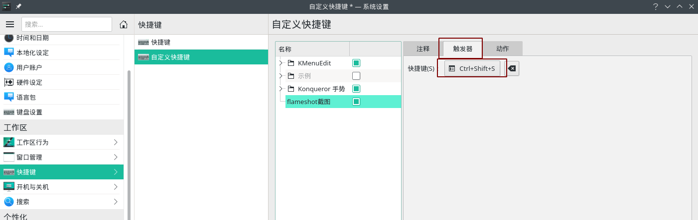

在动作处输入要执行的命令

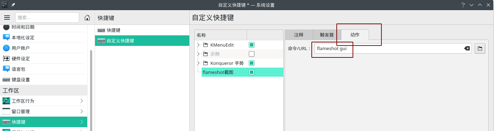

最后点击应用即可