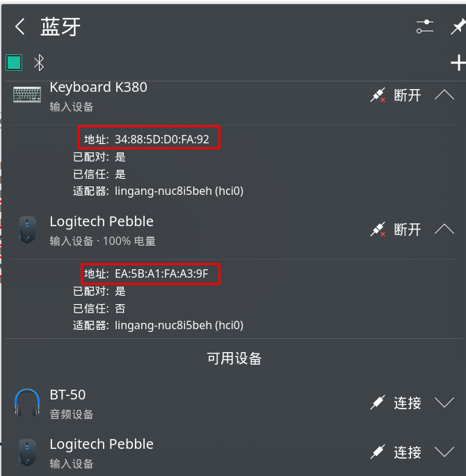
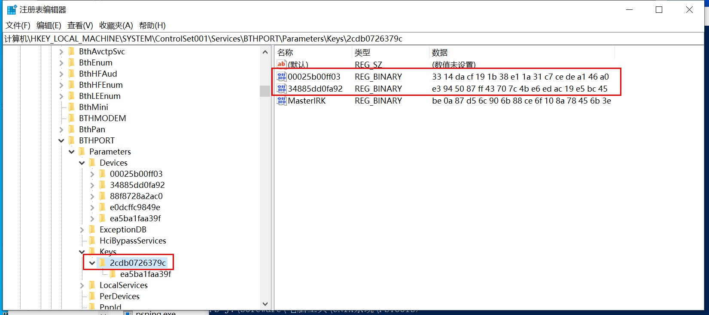
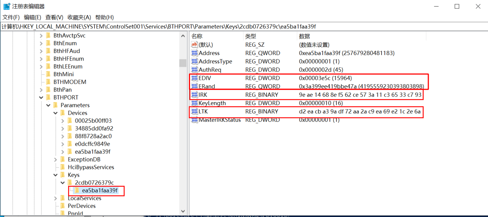

## 1 类型一：修改 LinkKey

### 1.1 在 Linux 系统中连接好蓝牙设备

记住蓝牙设备的地址，如图



### 1.2 切换到 windows 进行操作

- 下载 PsExec，http://technet.microsoft.com/en-us/sysinternals/bb897553.aspx。

- 解压后找到 PsExec.exe. 右键属性，在兼容性中勾选 "以管理员身份运行此程序"。

- 在解包含 PsExec.exe 的目录下运行命令行，并输入如下命令：

```shell
./PsExec.exe -s -i regedit.exe
```

这时会打开注册表，然后在注册表最上面的输入栏输入如下路径：

```
HKEY_LOCAL_MACHINE\SYSTEM\ControlSet001\services\BTHPORT\Parameters\Keys
```

然后在下图右边找到 Linux 中蓝牙设备的地址，并将后面的数据栏进行拍照或导出



### 1.3 在 Linux 中修改 LinkKey

切换到 Linux 系统，并切换为 root 用户，进入如下目录：

```
/var/lib/bluetooth/2C:DB:07:26:37:9C/
```

这里的 2C:DB:07:26:37:9C 表示本机蓝牙适配器地址，所以每台电脑不同，然后找到与蓝牙设备地址相同的目录，例如：34:88:5D:D0:FA:92，然后修改下面的 info 文件：

```
[General]
Name=Keyboard K380
Class=0x000540
SupportedTechnologies=BR/EDR;
Trusted=true
Blocked=false
WakeAllowed=true
Services=00001000-0000-1000-8000-00805f9b34fb;00001124-0000-1000-8000-00805f9b34fb;00001200-0000-1000-8000-00805f9b34fb;
Alias=Keyboard K380

[LinkKey]
Key=E3945087FF43707C4BE6EDAC19E5BC45
Type=5
PINLength=0

[DeviceID]
Source=2
Vendor=1133
Product=45890
Version=16897

```

找到 [LinkKey] 处，然后将 Key 的值改为 Windows 中看到的值，注意需要转大写。

最后使用下面命令重启蓝牙服务，或重启系统即可。

```shell
systemctl restart bluetooth
```


## 2 类型二：修改多个值

### 2.1 Linux 配置文件内容

有些蓝牙设备不适用上面介绍的方法，因为它们在 Linux 系统的 info 文件中没有 LinkKey 参数，而是有多个其他参数，如下面内容：

```
[General]
Name=Logitech Pebble
Appearance=0x03c2
AddressType=static
SupportedTechnologies=LE;
Trusted=false
Blocked=false
WakeAllowed=true
Services=00001800-0000-1000-8000-00805f9b34fb;00001801-0000-1000-8000-00805f9b34fb;0000180a-0000-1000-8000-00805f9b34fb;0000180f-0000-1000-8000-00805f9b34fb;00001812-0000-1000-8000-00805f9b34fb;00010000-0000-1000-8000-011f2000046d;

[IdentityResolvingKey]
Key=9EAE14688EF562CE573A11C36533C793

[LongTermKey]
Key=D2EACBA39ADF72AA2AC9EA69E21C2E6A
Authenticated=0
EncSize=16
EDiv=15964
Rand=4195559230393803898

[ConnectionParameters]
MinInterval=6
MaxInterval=9
Latency=44
Timeout=216

[DeviceID]
Source=2
Vendor=1133
Product=45089
Version=7

```


### 2.2 Windows 对应的配置内容

与类型一中使用同样方法打开注册表，可以看到这种蓝牙设备会在电脑蓝牙适配器目录下面再创建一个目录（该目录即蓝牙设备地址），这时点击这个目录，可以看到右边有很多属性，如下图：

 


### 2.3 属性对应关系

按照下表的方式修改 Linux 中的 info 文件即可。注意大小写，十进制和十六进制。对于一些机器，可能还要注意大端和小端问题。

| Windows | Linux                  |
| ------- | ---------------------- |
| EDIV    | EDiv                   |
| ERand   | Rand                   |
| IRK     | [IdentityResolvingKey] |
| LTK     | [LongTermKey]          |

### 2.4 修改 Linux 中设备地址文件名

注意观察这一类蓝牙设备地址目录是否和 Windows 中的一致，我就遇到不一样的，虽然只差了1个字符。

比如 2.2 的图中 Windows 注册表中的蓝牙设备地址是

```
ea5ba1faa39f
```

然而，在 Linux 中这个蓝牙设备的地址却是

```
EA:5B:A1:FA:A3:9E
```

只相差了最后一位，这时要将 Linux 中的这个目录名称改为

```
EA:5B:A1:FA:A3:9F
```

最后同类型一中一样，重启蓝牙服务或者重启系统以生效。