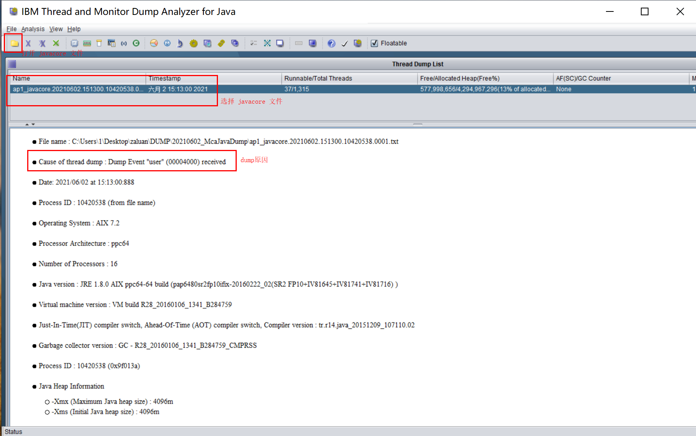

### 1 在 Linux/Unix 上生成javacore文件

#### 1.1 手动生成

使用下面命令，其中 pid 必须是 jvm 进程

```shell
kill -3 pid
```

#### 1.2 自动生成

让jvm进程崩溃，例如产生OOM异常

### 2 下载 IBM 分析工具(TMDA)

下载地址：https://www.ibm.com/support/pages/ibm-thread-and-monitor-dump-analyzer-java-tmda

下载内容：一个jar文件，jca*.jar，例如 jca469.jar


### 3 运行jar包

在包含该jar包的目录运行下面命令

```shell
java -jar ./jca469.jar
```


### 4 打开 javacore 文件




### 5 dump 原因

注意上图的第二行为

```
 Cause of thread dump : Dump Event "user" (00004000) received
```

表示产生这个 javacore 文件的原因是用户发起的，因为这个javacore文件是用过 kill -3 命令生成的，如果是进程崩溃，例如发生 OOM 异常时产生的，那么这一行会类似下面内容

```
Cause of thread dump : Dump Event "systhrow" (00040000) Detail "java/lang/OutOfMemoryError" "Java 堆空间" received
```

