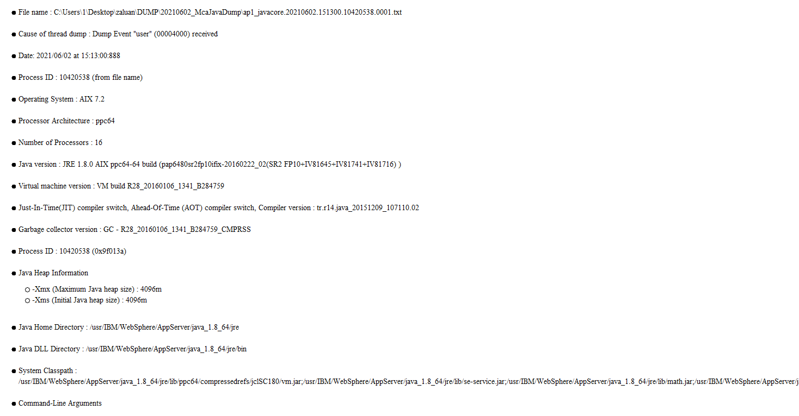
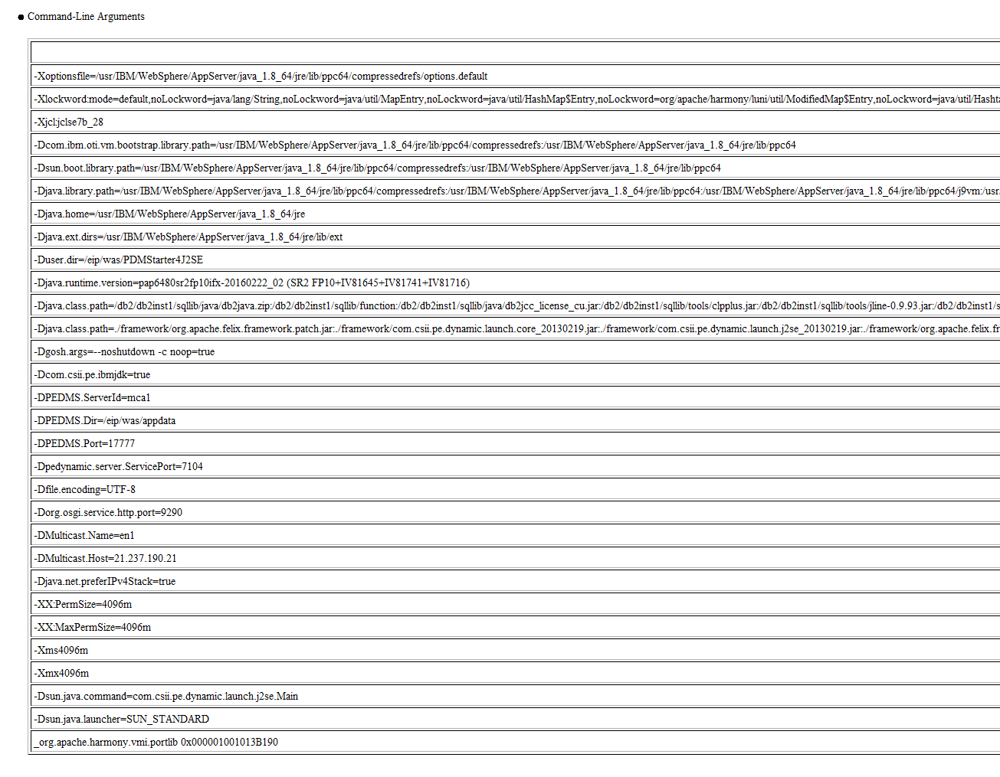
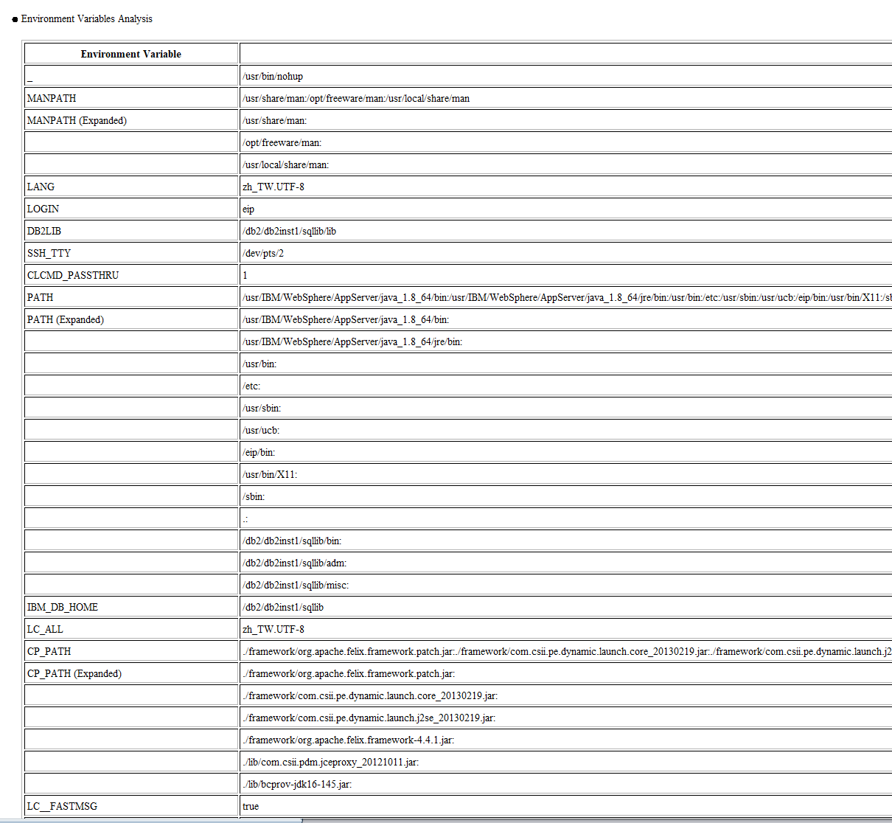
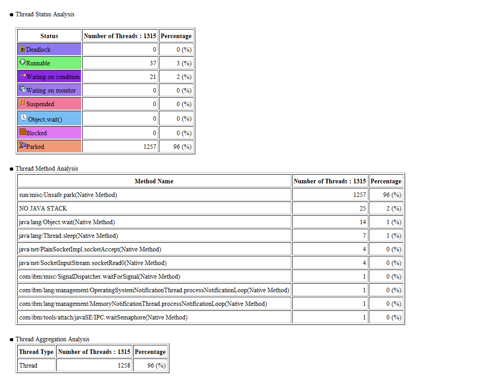
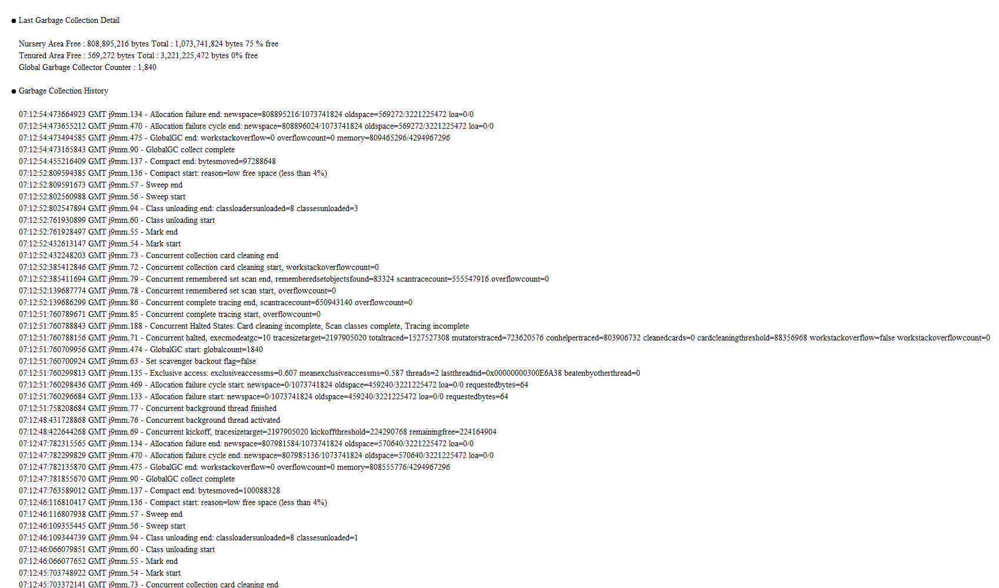
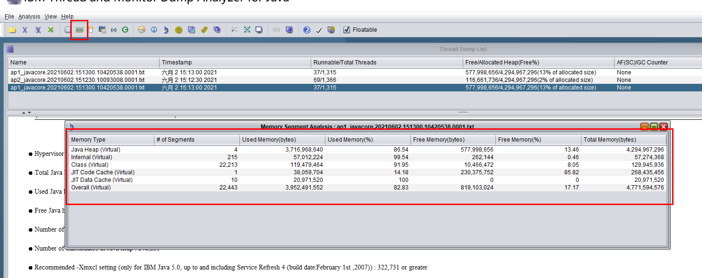
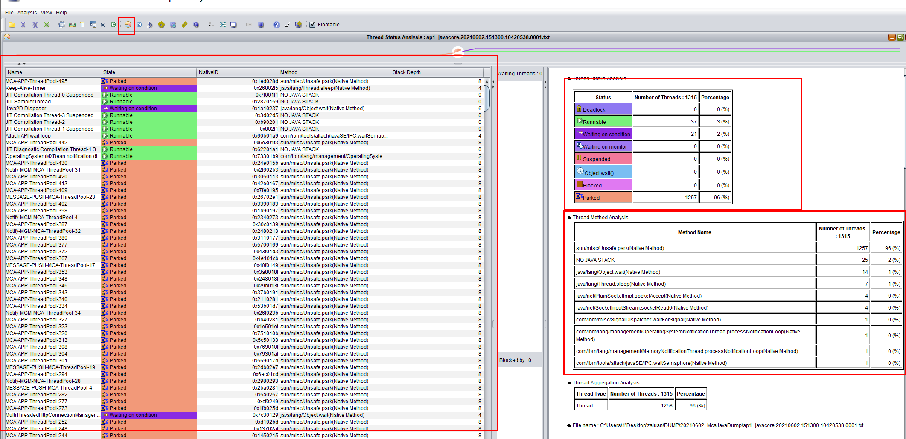

### 1 在 Linux/Unix 上生成javacore文件

**注意**：javacore 是 **IBM** 特有的，即 IBM jdk 才能产生

#### 1.1 手动生成

使用下面命令，其中 pid 必须是 jvm 进程

```shell
kill -3 pid
```

#### 1.2 自动生成

让jvm进程崩溃，例如产生OOM异常

### 2 下载 IBM 分析工具(TMDA)

下载地址：https://www.ibm.com/support/pages/ibm-thread-and-monitor-dump-analyzer-java-tmda

下载内容：一个jar文件，jca*.jar，例如 jca469.jar


### 3 运行jar包

在包含该jar包的目录运行下面命令

```shell
java -jar ./jca469.jar
```


### 4 打开 javacore 文件


### 5 dump 原因

注意上图的第二行为

```
 Cause of thread dump : Dump Event "user" (00004000) received
```

表示产生这个 javacore 文件的原因是用户发起的，因为这个javacore文件是用过 kill -3 命令生成的，如果是进程崩溃，例如发生 OOM 异常时产生的，那么这一行会类似下面内容

```
Cause of thread dump : Dump Event "systhrow" (00040000) Detail "java/lang/OutOfMemoryError" "Java 堆空间" received
```

### 6 其他概要信息

概要页面中有很多有用信息，包括下面这些

**进程基本信息，机器配置信息等**




**JVM命令行参数**



**环境变量**




**线程信息**


**垃圾收集信息**


### 7 重要内容-内存信息

可以看到堆内存占用率，已经非堆使用情况




### 8 重要内容-线程信息

- 右侧是当前 JVM 进程中线程概况，包括各种状态的线程数量，以及调用某个方法的线程的数量。

- 左边的信息比较有用，可以看到每条线程的名称，状态和调用的方法等信息，可以通过统计各个线程池的线程数量来判断是非超出了线程池的 coreSize 或达到了 maxSize，如果达到 maxSize 那就要注意，要根据饱和策略来判断程序会怎么走。
- 线程状态信息也很重要，如果有重点关注 Deadlock(死锁)，Blocked(阻塞)等状态。这里的 Parked(空闲)状态表示线程处于空闲状态，没有任务执行，maxSize - coreSize 个空闲线程即将在 keepAliveTime 时间后被释放。

