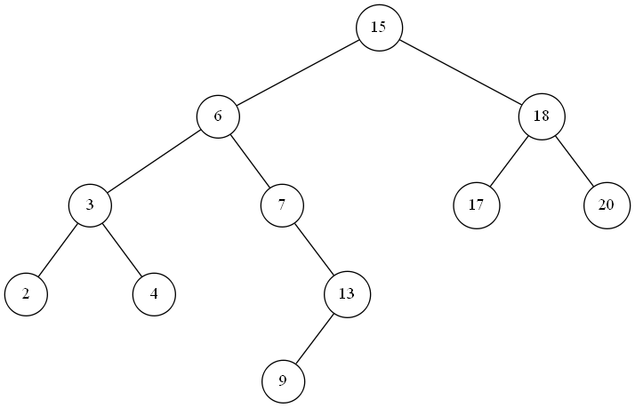
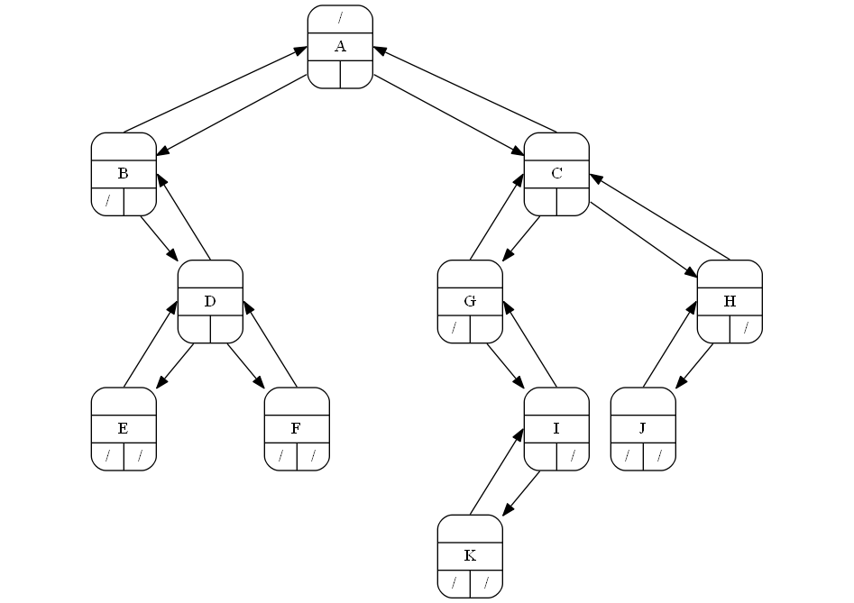
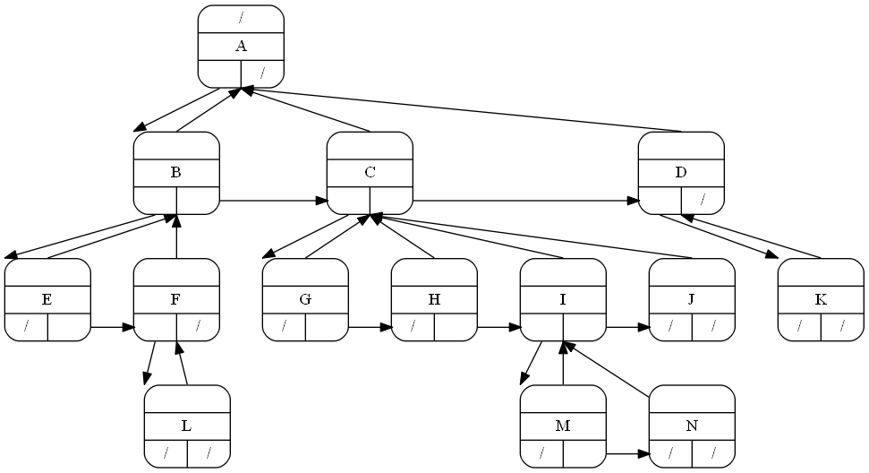

# 树结构的几种表示方法

## 1. 堆数组表示法
可以使用数组表示一个二叉堆，即一颗完全二叉树
数组**[16, 14, 10, 8, 7, 9, 3, 2, 4, 1]**可以表示下图的二叉树：

## 2. 使用指针实现二叉树
每个树结点有3个指针和1个数据域，3个指针如下：
1. parent：指向父结点
2. leftChild：指向左孩子
3. rightChild：指向右孩子
    如下图所示：

## 3. 使用指针的孩子兄弟表示法实现多叉树
对于多叉树的某个根结点，如果将其所有孩子的指针都存放在该节点中，那无法确定需要多少空间来存储，尽管限制了树多分叉数，也会浪费很多空间来存储孩子指针。使用孩子兄弟表示法能解决这个问题。
> 孩子兄弟表示法：结点的左指针指向自己的第一个孩子，右指针指向自己的兄弟结点，父指针指向自己的父结点。

如下图所示：
