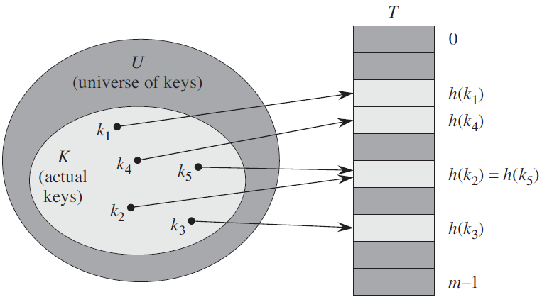

## 0 直接寻址表

寻址表必须能容纳全域U，即对每个可能的取值都要有一个单独的位置来存放，入下图所示：

由于直接寻址表中每个关键字都对应唯一一个位置，所有不会出现冲突，但是对关键字的取值范围很大的情况会浪费很多存储空间。

## 1 散列表

### 1.1 散列表寻址方式

散列表中，对每个关键字调用散列函数，得到在散列表中的位置，如下图所示：

由于散列函数可能会对不同的关键字计算出相同的散列值，所以散列表可能会发生冲突

### 1.2 解决冲突

#### 1.2.1 使用链表法解决冲突

链表法在散列表的每个位置设置一个指针，这个指针指向所有散列到该位置的关键字组成的链表，如下图：

注意：这里的链表用的是双向链表，因为这样删除操作更快。例如删除关键字为 k~2~ 的节点，如果使用双链表，那直接修改它的左右指针地址即可，如果使用单链表，还需要去查找它左边节点的指针并修改该指针为 k~2~ 指向的地址。

### 1.3 散列表操作时间复杂度

平均情况：增删查操作都为 $\Theta (1)$

最坏情况：查找操作为$\Theta(n)$（即所有关键字都被散列到同一个散列表的位置）；增删操作为$\Theta(1)$

## 3 散列函数

- 好的散列函数：散列函数应该将每个关键字尽量均匀的散列到散列表的每个位置上
- 关键字转换：如果关键字不是自然数，应该先转换为自然数在调用散列函数

### 3.1 除法散列法

将关键字[^1] 除以 m 取余数得到数字就是散列表中的位置(0 ~ m -1)，散列如下：

> $h(k) = k\space mod\space m$

注意：这里m的选取很重要，如果取值不当(例如2的幂)，很容易受到攻击，m的建议取值为：

> *一个不太接近2的整数次幂的素数*

例如下面这个散列函数：

> *例如：$h(k) = k\space mod\space 701$*

### 3.2 乘法散列发

分两步：

1. 用关键字 k 乘以常数 A (0<A<1)，取小数部分
2. 用 m 乘以这个值，再向下取整

散列函数如下：

> $h(k) = \lfloor m(kA\space mod\space 1)\rfloor$ 

A的选取，Knuth建议的取值如下：

> $A ≈ (\sqrt5 - 1)/2 = 0.6180339887...$

[^1]: 或者关键字转换得到的自然数