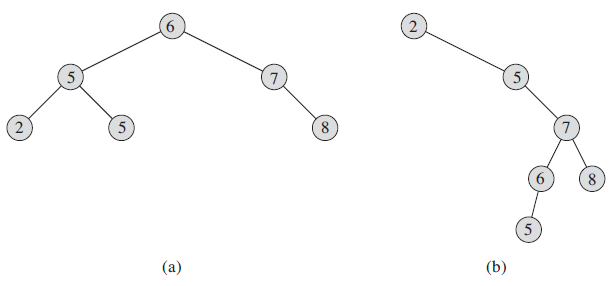
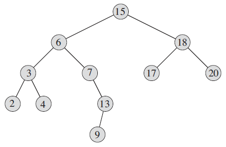
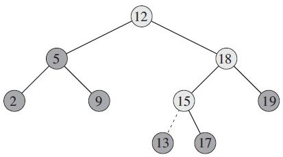
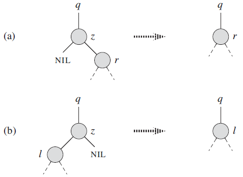
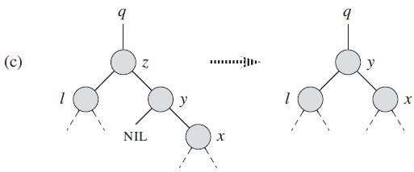
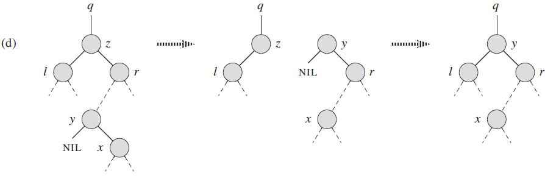

## 1 二叉搜索树的性质

**对于每一个二叉树结点x，其左子树包含的所有结点关键字都不大于结点x的关键字；其右子树包含的所有结点关键字都不小于结点x的关键字。** 

如下图所示：

- 图 a 是一颗高度为2的二叉搜索树，图 b 是一颗高度为4的二叉搜索树，但是他们包含的关键字集合都是一样的。

## 2 二叉搜索树的遍历

### 2.1 中序遍历

先遍历左子树，再遍历当前节点，再遍历右子树。

上一节图 a 的遍历顺序为：`2 - 5 - 5 - 6 - 7 - 8`；图 b 的遍历顺序同样为：`2 - 5 - 5 - 6 - 7 - 8`；这是因为对二叉搜索树进行中序遍历输出的关键字是有序的。

### 2.2 先序遍历

先遍历当前节点，再遍历左子树，再遍历右子树。

图 a 遍历顺序为：`6 - 5 - 2 - 5 - 7 - 8`

图 b 遍历顺序为：`2 - 5 - 7 - 6 - 5 - 8`

可以看出先序遍历输出结果不是有序的。

### 2.3 后续遍历

先遍历左子树，再遍历右子树，再遍历当前节点。

图 a 遍历顺序为：`2 - 5 - 5 - 8 - 7 - 6`

图 b 遍历顺序为：`5 - 6 - 8 - 7 - 5 - 2`

同样后续遍历输出结果也不是有序的。

**注意：先序遍历和后序遍历的输出结果不是互为倒序的。** 

### 总结

三种遍历方法的时间复杂度都为：$\Theta(n)$

## 3 二叉搜索树的查询

### 3.1 查找特定关键字

假设要查找的关键字为 k ，那从树根结点 x 开始，比较结点 x 的关键字 x.key 是否等于 k ，如果等于则返回该结点；否则如果 x.key > k，则递归地查找 x 的左子树；如果 x.key < k，则递归地查询 x 的右子树。

对于上图的二叉搜索树，如果要查找关键字13，则查找路径为：`15 - 6 - 7 - 13`。

可以看出，查找的次数不会超过树的高度，因此查找操作的时间复杂度为：$O(h)$，h为树高。

**注意：查找算法的常规版本是递归的，也可以改进为 while 循环或者 for 循环；在程序设计语言中，循环比递归的性能好很多。** 

### 3.2 查找最大最小值

- 最大值：从根节点开始，一直往下查找右孩子，直到查找到一个没有右孩子的节点就是最大值节点。
- 最小值：从根节点开始，一直往下查找左孩子，直到查找到一个没有左孩子的节点就是最小值节点。

同样最大最小值的查找次数也不会超过树高，所以时间复杂度也为：$O(h)$ 

### 3.3 前驱和后继

#### 3.3.1 后继

一个结点的后继是关键字该结点的最小结点(假设没有关键字相等的结点)。

查找结点 x 的后继的过程如下：

> 分两种情形：
>
> 1. 情形一：x 的右子树非空，那么 x 的后继恰好是 x 右子树的最左结点。例如：在 3.1 节的图中：结点15的后继是结点17
>
> 2. 情形二：x 的右子树为空，那么 x 的后继是从 x 开始沿树网上查找，直到找到一个其双亲有左孩子的结点。例如：在 3.1 节的图中：结点13的后继是结点15

#### 3.3.2 前驱

前驱与后继的查找操作是对称的，略。

### 总结

查找特定关键字、查找最大最小值和查找前驱和后继操作的时间复杂度有为：$O(h)$

## 4 插入和删除

### 4.1 插入

插入操作类似查找操作，通过对比插入关键字 k 和结点关键字 x.key，根据比较结果继续查找左子树或者右子树，直到找打一个指针为空的位置。

上图中是插入关键字 13 的过程，浅色结点是查找路径，虚线表示新增结点的位置。

### 4.2 删除

删除操作相对插入操作较复杂，因为涉及多种情况。

删除结点 z 分为以下三种情况

1. 情形一：z 没有孩子结点，那么只需简单的删除它，然后修改它的父结点中指向它的指针为空。
2. 情形二：z 只有一个孩子，那么将这个孩子提升到 z 所在位置，并修改 z 的父结点，用 z 的孩子来替换 z ，下图分别展示了 z 的孩子为右孩子和左孩子两种处理方式：

3. 情形三：z 有两个孩子，那么找 z 的后继 y (一定在 z 的右子树中)，并让 y 占据树中 z 的位置。z 的原来右子树部分称为 y 的新右子树，并且 z 的左子树称为 y 的新的左子树。这种情况还需要分两种自情况：

   - 子情况1：y 是 z 的右孩子，那么用 y 替换 z ，并留下 y 的右孩子，如下图所示：

     

   - 子情况2：y 位于 z 的右孩子中但不是 z 的右孩子，则先用 y 的右孩子替换 y ，然后再用 y 替换 z，如下图所示：

     

### 总结

插入和删除操作的时间复杂度为：$O(h)$ 

## 5 随机二叉树

在第1节中已经看到，相同的关键字集可以构造出不同高度的二叉搜索树。最坏情况下，一个包含 n 个关键字的集合构建的二叉树的高度为 n ，即是一条链表，这样的一颗二叉树的操作性能比链表还要差。为了构建尽量低的二叉树，应该将 n 个关键字以随机的序列插入，这样构建的二叉树的高度期望值为：$O(\lg n)$

