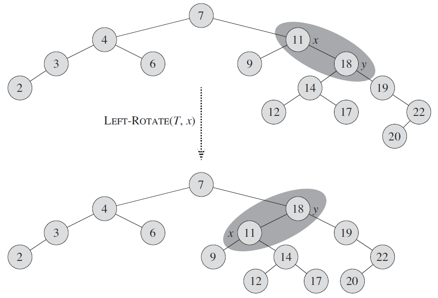
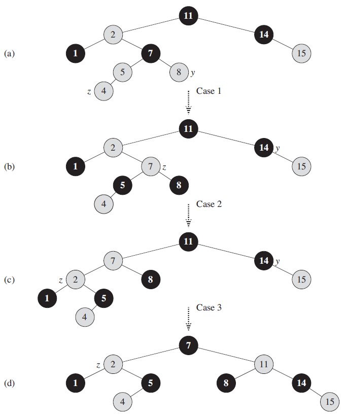
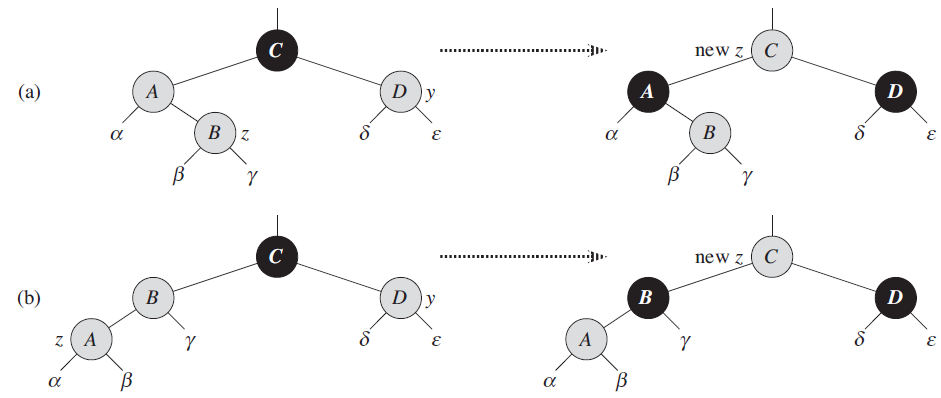
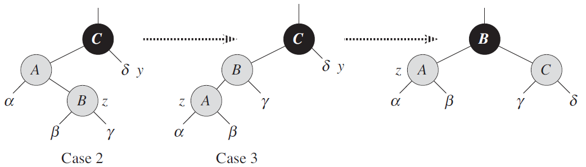
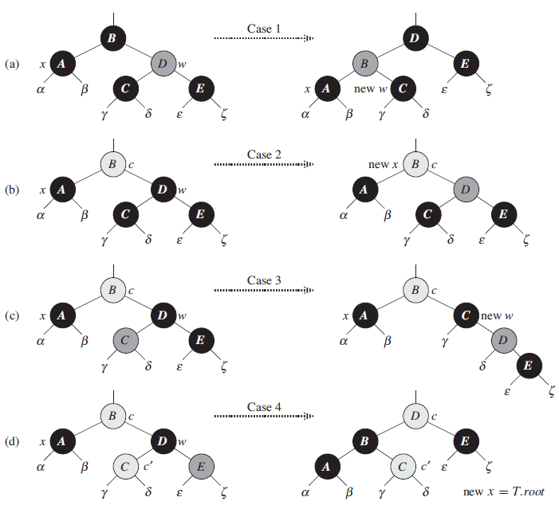

## 1 红黑树的性质

### 1.0 红黑树与普通二叉搜索树的区别

普通二叉搜索树对于极端的情况可能会很高，即很不平衡；虽然随机生成的二叉树会有不错的平衡性，但是如果需要对二叉树进行频繁的插入和删除操作，那么在极端情况可能又会使本来平衡的二叉搜索树变得很高(treat树可以解决这个问题，后面会有介绍)。

红黑树可以保证在极端情况下，进行频繁的插入和删除操作也会有不错的平衡性。

### 1.1 红黑树的平衡性

> 红黑树确保没有一条路径会比其他路径长出2倍，因而是近似于平衡的。

### 1.2 红黑树需要满足的红黑性质

下面是红黑树的5个必要性质，摘自第174页

> 1. 每个结点或是红色的，或是黑色的。
> 2. 根结点是黑色的。
> 3. 每个叶结点(NIL)是黑色的。
> 4. 如果一个结点是红色的，则它的两个子结点都是黑色的。
> 5. 对每个结点，从该结点到其所有后代叶结点的简单路径上，均包含相同数目的黑色结点。

红黑树的一个示例，如下图 a 所示

### 1.3 关于叶结点的说明

> 如果一个结点没有子结点或父结点，则该结点响相应的指针属性的值为NIL，我们可以把这些NIL视为指向二叉搜索树的叶结点(外部结点)的指针，而把带关键字的结点视为树的内部结点。

个人猜测，叶结点(NIL)的作用是为了方便表示黑高。例如上图 a 中，因为叶结点被设置为黑色的，所以黑色结点12的黑高为1，红色结点15的黑高为0；假如没有叶结点，那么结点12和结点15的黑高都为0，显然是不对的。

### 1.4 哨兵的使用

将所有叶结点都指向一个哨兵结点 T.nil，该结点和其他结点有相同的结构，只不过只使用了 color 属性，且为 BLACK，其他属性 p、left、right 和 key 可以为任意值。使用哨兵还可以节省空间，因为不必为每一个叶结点都新增一个哨兵结点。下图 b 为使用哨兵后的情况

为了将注意力放在红黑树的内部结点上，通常忽略叶结点，如下图 c 所示

### 1.5 黑高的定义

> 从某个节点 x 出发(不含该结点)到达一个叶结点的任意一条简单路径上的黑色结点个数成为该结点的**黑高**。

### 1.6 红黑树的性能

#### 1.6.1 关于树高(不是黑高)的引理

> 一棵有 n 个内部结点的红黑树的高度至多为 $2\lg(n+1)$

#### 1.6.2 动态集合操作的时间复杂度

> 关键字查找(SEARCH)、最小值查找(MININUM)、最大值查找(MAXINUM)、后继查找(SUCCESSOR)、前驱查找(PREDECESSOR)、插入(INSERT) 和删除(DELETE)操作的时间复杂度均为：$O(\lg n)$，因为这些操作在一棵高度为 h 的二叉搜索树上的运行时间为：$O(h)$

## 2 旋转操作

**注意：旋转操作是一种能保持二叉搜索树性质的搜索树局部操作，即旋转不是红黑树特有的操作，而是红黑树需要旋转操作来保持红黑性质(另外还需要改变结点颜色)**

### 2.1 旋转步骤

左旋和右旋为对称操作，如下图所示

注意：图中的 $α，β，γ$ 代表任意的子树，旋转操作后，仍保持二叉搜索树的性质。

### 2.2 旋转示例

从上图可以看出，旋转操作其实都是直接套用2.1节中的步骤就可以。

**值得注意的是：上图中的旋转操作改变了树的高度(树的高度从6变成了5)，所以旋转操作是控制红黑树高度的关键步骤。** 

### 2.3 旋转操作的时间复杂度

时间复杂度为：$O(1)$

正如2.2节中提到的，旋转操作总是按照固定的步骤进行，即改变常量数量的指针，然后需要常量数量的判断来处理边界情况(空子树和树根的情况)。所以选择操作可以在 $O(1)$ 时间内完成。

## 3 插入操作

### 3.1 和普通二叉搜索树的插入区别

红黑树插入操作和普通二叉搜索树的插入操作类似，只是为了维持红黑树的性质，有以下几处不同

> 1. 所有的 空指针(NIL) 被 T.nil 对象代替
> 2. 因为新插入的结点为最外层结点(没有孩子，为了不与哨兵 T.nil 混淆，不叫叶结点)，所以需要将新接的的左右孩子指针指向哨兵 T.nil
> 3. 新插入的结点被设置为**红色**
> 4. 新插入的结点可能会破坏红黑树的性质，所以需要对树进行调整，以让红黑树保持红黑性质

### 3.2 新结点插入后的调整示例

下面是调整过程的分析，其中指针 z 和 y 是辅助指针，且 y 总是 z 的叔结点(父结点的兄弟)

> - 图 a 展示新结点 4 刚被插入时的情形，这时结点 4 和结点 5 都是红色，违反了红黑性质(红结点的孩子都是黑的)。且由于 z 的叔结点是红色的，所以命中了 **情况1**，调整方式为：将违法性质的结点重新着色，然后将指针 z 和 y 沿树上移得到了图 b 的情形，指针 z 的上移说明它的下面部分已经满足红黑性质。
> - 图 b 中结点 7 和结点 2 又同时是红结点，违反了红黑性质。但和图 a 的情况不同的是，z 的叔结点是黑色的，且 z 是右孩子，所以命中了 **情况2** 这种情况需要对指针 z 的父结点做一次左旋，得到图 c 的情形，注意：这种情形不需要移动指针 z 和 y 。
> - 图 c 中结点 7 和结点 2 又同时是红结点，违反了红黑性质。且 z 的叔结点 y 也是黑的，但和图 b 的情况不同的是 z 是左孩子，所以命中了 **情况3** 这种情况需要重新着色，并对 指针 y 的父结点执行一次右旋得到图 d ，它是一颗合法的红黑树。

**下面分别介绍调整的3种情况**

#### 3.2.1 情况1

z 和其父结均为红色，且 z 的叔结点 y 是红色的

这种情况只需将 z 的父结点和 y 着黑色，且将 y 的父结点着红色，然后移动指针 z 到 y 的父结点位置。

上图的 a 和 b 展示了 z 为右孩子和左孩子的两种子情况，但是处理方式是一样的。

#### 3.2.2 情况2和情况3

- 情况2：z 的叔结点 y 是黑色的，且 z 是一个右孩子
- 情况3：z 的叔结点 y 是黑色的，且 z 是一个左孩子

**值得注意的是：这里的情况2和情况3是由联系的，情况2处理完后得到的就是情况3，但反过来情况3处理完就不一定能得到情况2。**

如上图所示，针对情况2，只需对 z 的父结点做一次左旋即可得到情况3。

针对情况3，需要先做一次类似情况1中的着色操作，再对 y 的父结点做一次右旋。

### 3.3 时间复杂度

$O(\lg n)$

## 4 删除操作

删除操作相对插入操作要复杂一些，这里只做简单介绍。

与插入查找类似，红黑树删除操作和普通二叉搜索树的删除操作也非常类似，只是为了维持红黑树的性质，有以下几处不同

> 1. 子树替换函数(TRANSPLANT)要改为适合红黑树使用的版本
> 2. 新增了一个指针用来记录一个位置，该位置可能导致红黑性质被破坏
> 3. 删除过程中，删除或移动节点之前，需要记住一些的颜色或踪迹
> 4. 删除结点后可能会破坏红黑树的性质，所以需要对树进行调整，以让红黑树保持红黑性质

下面直接介绍结点删除后进行的调整的4中情况

**1. 情况1：x 的兄弟结点 w 是红色的**

这种情况需要改变 w 和 x.p 的颜色，然后对 x.p 做一次左旋；这样情况1会转换为情况2、3或4中的一种

**2. 情况2：x 的兄弟结点 w 是黑色的，而且 w 的两个子结点都是黑色的**

这种情况需要将 w 改为红色，且将指针 x 移动到其父结点位置

**3. 情况3：x 的兄弟结点 w 是黑色的，而且 w 的左孩子是红色，右孩子是黑色**

这种情况需要交换 w 和其左孩子的颜色，然后对 w 进行一次右旋，然后将指针 w 移动到 x 的父结点的右孩子位置

**4. 情况4：x 的兄弟结点 w 是黑色的，且 w 的右孩子是红色的**

这种情况先将 w 的颜色着为 x 的父结点的颜色，然后将 x 的父结点的颜色着为黑色，再对 w 的右孩子的颜色着为黑色，再对 x 的父结点做一次左旋，最后将指针 x 移动到根结点 T.root 位置

最后，虽然删除查找比较复杂，但是时间复杂度同样是：$O(\lg n)$

## 5 其他二叉搜索树

### 5.1 AVL 树

> AVL 树是一种**高度平衡的**二叉搜索树：对每一个结点 x，x 的左子树与右子树的高度差至多为1。

可以看出，这是一种比红黑树的平衡度更高的数，查找操作会更快，但是插入和删除操作会更慢。

### 5.2 treap 树

也被称为**树堆**，这种树结合了**二叉搜索树**和**堆**的性质。

正如在1.0节中提到的：因为随机版本的二叉搜索树虽然有不错的查找性能，但是如果需要对二叉树进行频繁的插入和删除操作，那么在极端情况可能又会使本来平衡的二叉搜索树变得很高；所以需要设法让插入和删除操作后也能使二叉搜索树继续是随机的。

通过为二叉搜索树的结点添加一个额外的属性  priority(优先级) 来作为堆的关键字，每次插入操作都生成随机的 priority 值，并将新结点插入二叉搜索树，然后调整树，让树既是二叉搜索树，又是以结点 priority 为关键字的堆，这样就相当于是按照随机的顺序插入的结点。

## 6 几种二叉搜索树的比较

- 对于新增删除较多的情况，应该选择红黑树，因为红黑性质破坏后的调整代价较低
- 对于查找操作较多的情况，应该选择AVL树，因为AVL树平衡度很高，所以树的高度很低
- 随机版本的二叉搜索树和treap树不如上面两种书使用，因为随机二叉搜索树和treap树都依赖随机算法，如果随机算法没选好会得到不那么平衡的树

