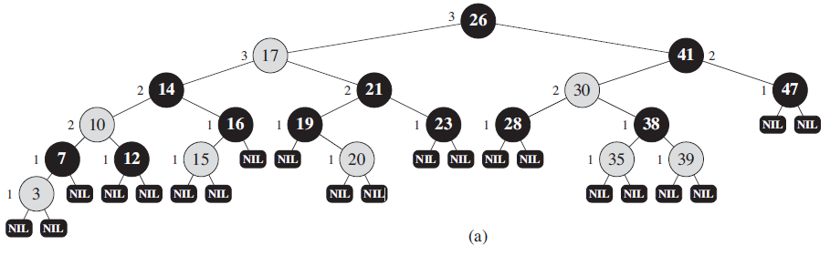
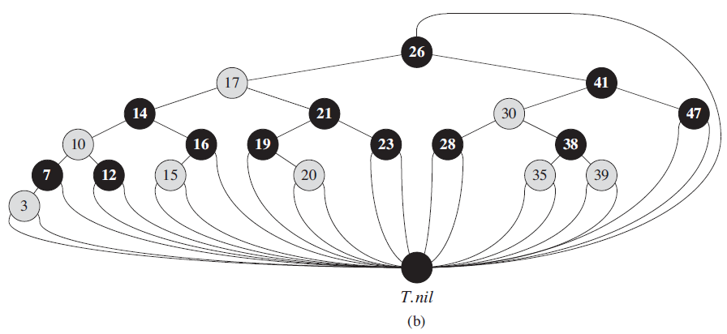
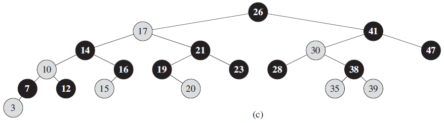
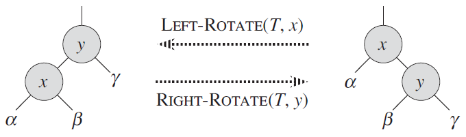

## 1 红黑树的性质

### 1.1 红黑树的平衡性

> 红黑树确保没有一条路径会比其他路径长出2倍，因而是近似于平衡的。

### 1.2 红黑树需要满足的红黑性质

下面是红黑树的5个必要性质，摘自第174页

> 1. 每个结点或是红色的，或是黑色的。
> 2. 根结点是黑色的。
> 3. 每个叶结点(NIL)是黑色的。
> 4. 如果一个结点是红色的，则它的两个子结点都是黑色的。
> 5. 对每个结点，从该结点到其所有后代叶结点的简单路径上，均包含相同数目的黑色结点。

红黑树的一个示例，如下图 a 所示

### 1.3 关于叶结点的说明

> 如果一个结点没有子结点或父结点，则该结点响相应的指针属性的值为NIL，我们可以把这些NIL视为指向二叉搜索树的叶结点(外部结点)的指针，而把带关键字的结点视为树的内部结点。

个人猜测，叶结点(NIL)的作用是为了方便表示黑高。例如上图 a 中，因为叶结点被设置为黑色的，所以黑色结点12的黑高为1，红色结点15的黑高为0；假如没有叶结点，那么结点12和结点15的黑高都为0，显然是不对的。

### 1.4 哨兵的使用

将所有叶结点都指向一个哨兵结点 T.nil，该结点和其他结点有相同的结构，只不过只使用了 color 属性，且为 BLACK，其他属性 p、left、right 和 key 可以为任意值。使用哨兵还可以节省空间，因为不必为每一个叶结点都新增一个哨兵结点。下图 b 为使用哨兵后的情况

为了将注意力放在红黑树的内部结点上，通常忽略叶结点，如下图 c 所示

### 1.5 黑高的定义

> 从某个节点 x 出发(不含该结点)到达一个叶结点的任意一条简单路径上的黑色结点个数成为该结点的**黑高**。

### 1.6 红黑树的性能

#### 1.6.1 关于树高(不是黑高)的引理

> 一棵有 n 个内部结点的红黑树的高度至多为 $2\lg(n+1)$

#### 1.6.2 动态集合操作的时间复杂度

> 关键字查找(SEARCH)、最小值查找(MININUM)、最大值查找(MAXINUM)、后继查找(SUCCESSOR)、前驱查找(PREDECESSOR)、插入(INSERT) 和删除(DELETE)操作的时间复杂度均为：$O(\lg n)$，因为这些操作在一棵高度为 h 的二叉搜索树上的运行时间为：$O(h)$

## 2 旋转操作

**注意：旋转操作是一种能保持二叉搜索树性质的搜索树局部操作，即旋转不是红黑树特有的操作，而是红黑树需要旋转操作来保持红黑性质(另外还需要改变结点颜色)**

### 2.1 旋转步骤

左旋和右旋为对称操作，如下图所示

注意：图中的 $α，β，γ$ 代表任意的子树，旋转操作后，仍保持是叉搜索树的性质。

