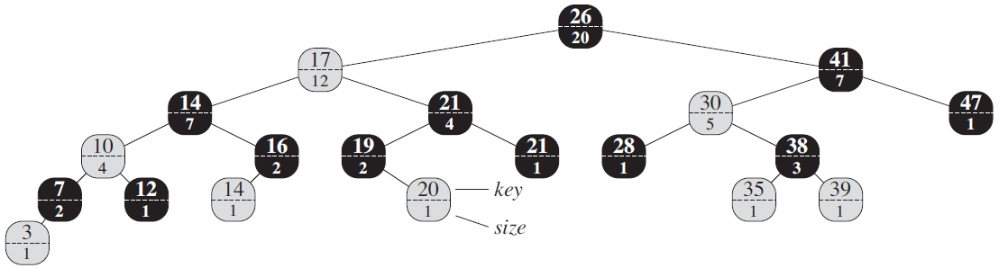
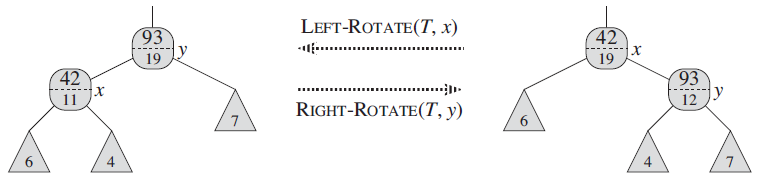
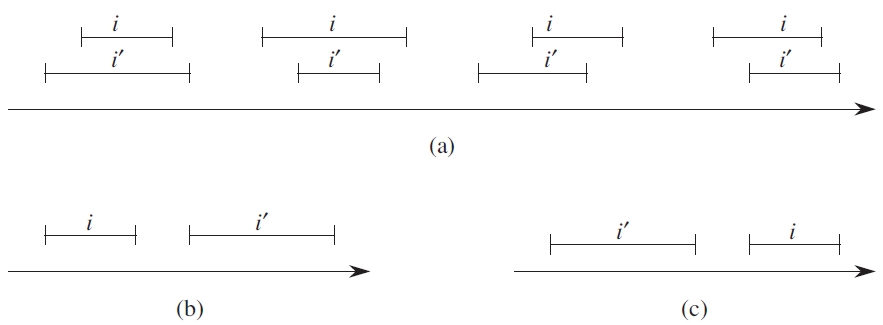
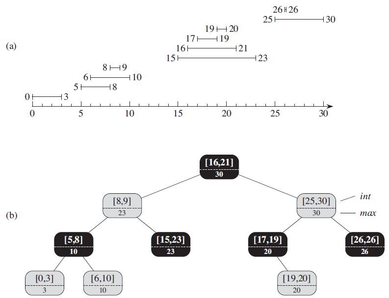

## 1 动态顺序统计

对于一些特殊的需求，基础的数据结构不太适用。

> 例如：对于普通红黑树，如果想实现查找第 i 小的元素，需要 $\Theta(n)$ 的时间；假如对红黑树进行改造，可以在 $O(\lg n) $ 时间内完成查找。

### 1.1 为红黑树结点添加新属性

以对红黑树的改造为例，改造方法为：**为红黑树的结点添加一个属性 $x.size$，这个属性包含了以 x 的为根的子树(包括 x 本身)的(内)结点数，即这棵子树的大小**。定义哨兵 $T.nil.size$ 为0，则有等式：

> $x.size = x.left.size + x.right.size + 1$

下图是一个顺序统计红黑树的例子

### 1.2 定义新的操作

结点属性中多了 size 属性后，下面两种操作会更快，都能在 $O(\lg n)$的时间内完成。

1. 查找具有给定秩[^1]的元素
2. 确定一个元素的秩

### 1.3 维护子树规模

由于红黑树的结点新增了属性 size，那么应该保证红黑树在做插入和删除这些会改变红黑树结构的操作时，也要维护好 size 属性，且维护 size 属性的时间复杂度不应该超过原本的插入或删除操作的时间复杂度。

对于红黑树来说，会修改树结构的操作只有旋转，下图展示了旋转操作如何维护 size 属性：

即在原本的旋转操作中增加了下面两个操作

> $y.size = x.size$
>
> $x.size = x.left.size + x.right.size + 1$

可以看出对 size 性质的维护没有增加旋转操作的时间复杂度，因此也不会增加红黑树的插入和删除的时间复杂度。

## 2 如何扩张数据结构

扩张一种数据结构可以分为4个步骤：

> 1. 选择一种基础数据结构。
> 2. 确定基础数据结构中要维护的附加信息。
> 3. 校验基础数据结构上的基本修改操作能否维护附加信息。
> 4. 设计一些新操作。

下面以第1节中的顺序统计树为例，来说明上面的4个步骤

> 步骤1：选择红黑树作为基础数据结构。
>
> 步骤2：添加 size 属性，在每个结点 x 中的 size 属性存储了以 x 为根的子树的大小。
>
> 步骤3：保证了插入和删除操作仍能在 $O(\lg n)$ 的时间内维护 size 属性。
>
> 步骤4：设计了新操作 OS-SELECT 和 OS-RANK。

**红黑树扩展定理**定义如下

> 设 $f$ 是 $n$ 个结点的红黑树 $T$ 扩张的属性，且假设对任一结点 $x$ ，$f$ 的值仅依赖于结点 $x$ 、$x.left$ 和 $x.right$ 的信息，还可能包括 $x.left.f $和 $x.right.f$。那么我们可以在插入和删除操作期间对 $T$ 的所有结点的 $f$ 值进行维护，并且不影响这两个操作的 $O(\lg n)$ 渐近时间性能。

## 3 区间树

区间分为闭区间： $[...]$，开区间：$(...)$ 和半开区间：$[...)$，$(...]$。本节介绍的区间假设都为闭区间。

**区间三分律**

假设有区间 i 和 i'，则 i 和 i' 的关系一定下图所示的3种情况之一

- 图 a 表示 i 和 i' **重叠**的情况，又分为4种子情况。
- 图 b 表示 i 和 i' 不重叠，且 i 位于 i‘ 的左边。
- 图 c 表示 i 和 i' 不重叠，且 i 位于 i‘ 的右边。

**注意：区间的重叠不是两个区间完全重叠，而是两个区间有交集就算重叠。**

**区间树的定义**

> 区间树是一种对动态集合进行维护的红黑树，其中每个元素 x 都包含一个区间 x.int。

**区间查找操作**

> 区间查找操作返回一个指向区间树 T 中元素 x 的指针，是 x.int 与 i 重叠；若次元素不存在，则返回 T.nil。

**示例**

图 a 表示一个区间的集合

图 b 表示对应的区间树，结点上部表示区间，且左端点作为红黑树的关键字[^2]；结点下部表示以 x 为根的子树中所有端点的最大值。

**区间查找算法** 

> 查找与 i 重叠的区间 x 的过程从以 x 为根的树根开始，逐步向下搜索。当找到一个重叠区间或者 x 指向 T.nil 时过程结束，通过比较判断往左右子树的方向移动。
>
> 下面通过两个例子来展示查找过程：
>
> - 查找成功的情况：假设要找一个与区间 i=[22, 25]重叠的区间。首先指针 x 从根结点开始比较：x.high=21 < i.low=22，未重叠；由于 x.left.max=23 > i.low=22，所以将指针 x 指向左子树，因为 x.high=9 < i.low=22，未重叠；由于 x.left.max=10 < i.low=22, 所以将指针 x 指向右子树，这时 x.high=23 > i.low=22，重叠，查找成功，返回该结点。
> - 查找失败的情况：假设要找一个与区间 i=[11, 14]重叠的区间。首先指针 x 从根结点开始比较：x.low=16 > i.high=14，未重叠；由于 x.left.max=23 > i.low=11，所以将指针 x 指向左子树，因为 x.high=9 < i.low=11，未重叠；由于 x.left.max=10 < i.low=11, 所以将指针 x 指向右子树，这时 x.low=15> i.high=22，未重叠，且该结点已经没有孩子结点，所以查找失败，返回 T.nil。

[^1]: 中序遍历序列的排名 
[^2]:即这棵树中序遍历将会列出按左端点顺序排列的各个结点