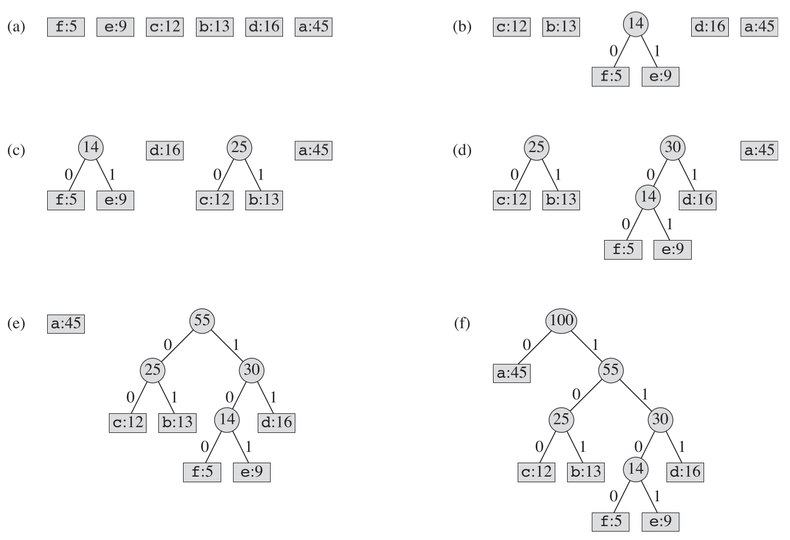

## 0 简介

贪心算法和动态规划方法同样都是用来求解最优化问题的，**贪心算法不保证能求出最优解**，但是对于很多问题能求出最优解。


## 1 活动选择问题

### 1.1 问题描述

有多个活动需要使用同一个教室，每个活动有开始和结束时间，求最多能满足几个活动在不重叠的时间占用这个教室。

### 1.2 动态规划解法

对于 $n$ 个活动的活动序列 $a_1,a_2,...,a_n$

定义 $c[i, j]$ 表示活动 $a_i $ 至活动 $a_j$ 这个活动序列的最大兼容活动数量$( 1>=i>=j>=n)$，假设活动 $a_k$ 在 $a_i$ 和 $a_j$ 之间，则

>  $c[i, j] = \max\{c[i, k-1] + c[k+1,j]\} + 1\space (其中k=i,i+1,...,j)$

有了上面的式子，可以用带备忘录的自顶向下方法进行求解，或者用自底向上方法求解。

### 1.3 贪心选择

动态规划方法中，每个子问题都依赖多个子问题的解，如果可以让每个子问题只依赖1个子问题的解，那么可以大大降低时间复杂度，贪心选择就是这样。

对于活动选择问题，可以使用贪心选择。在所有活动都按结束时间递增顺序排序的情况下，每次都选出与已选活动兼容[^1]的活动就能得到最优解。

### 1.4 设计贪心算法

**递归算法**

```java
	/**
	 * 递归算法求解活动选择问题
	 * 
	 * @param startTimes
	 * @param finishTimes
	 * @param m-已经处理完的活动位置
	 * @param n-活动总数
	 * @param result-记录活动选择结果
	 */
	private static void selectRecursively(int[] startTimes, int[] finishTimes, int k, int n, List result) {
		int m = k + 1;// 从下一个活动开始查找
		while (m <= n - 1 && startTimes[m] < finishTimes[k])
			++m;
		if (m <= n - 1) {// 查找成功
			result.add(m);// 加入新活动
			selectRecursively(startTimes, finishTimes, m, n, result);// 继续查找活动
		} else// 查找失败，结束查找
			return;
	}
```

**迭代算法**

```java
	/**
	 * 迭代算法求解活动选择问题
	 * 
	 * @param startTimes
	 * @param finishTimes
	 * @return
	 */
	private static List selectIteratively(int[] startTimes, int[] finishTimes) {
		List result = new ArrayList<>();
		result.add(0);// 第一个活动必选
		int n = startTimes.length;// 活动数量
		int k = 0;// k指向第一个活动
		for (int i = 1; i < n; ++i)
			if (startTimes[i] > finishTimes[k]) {// 查找兼容活动
				result.add(i);// 查找成功，将该活动加入结果集
				k = i;// 让k指向该活动
			}
		return result;
	}
```


## 2 贪心算法原理

### 2.1 贪心算法性质

**贪心算法步骤**

> 1. 将最优化问题转化为这样的形式：对其做出一次选择后，只剩下一个子问题需要求解。
> 2. 证明做出贪心选择后，原问题总是存在最优解，即贪心选择总是安全的。
> 3. 证明做出贪心选择后，剩余的子问题满足性质：其最优解与贪心选择组合即可得到原问题的最优解，这样就得到了最优子结构。

**判断一个问题能否使用贪心算法求最优解**

> 并没有适合所有情况的方法，但**贪心选择性质**和**最优子结构**是两个关键要素。如果能够证明问题具有这些性质，就向贪心算法迈出了重要一步。

**贪心选择性质**

> 我们可以通过做出局部最优选择来构造全局最优解。换句话说，当进行选择时，我们直接做出在当前问题中看来最优的选择，而不必考虑子问题的解。
>
> 在动态规划方法中，每个步骤都要进行一次选择，但选择通常依赖于子问题的解。因此，我们通常以一种自底向上的方式求解动态规划问题，先求解小的子问题，然后是较大的子问题。
>
> 在贪心算法中，我们总是做出当时看来最佳的选择，然后求解剩下的唯一子问题。贪心算法进行选择是可能依赖之前做出的选择，但不依赖任何将来的选择或是子问题的解，所以一个贪心算法通常是自顶向下的。

**最优子结构** 

> 如果一个问题的最优解包含其子问题的最优解，则称此问题具有**最优子结构**的性质。
>
> 当应用于贪心算法是，我们通常使用更为直接的最优子结构。我们可以假定，通过对原问题应用贪心选择即可得到子问题。我们真正要做的全部工作就是论证：**将子问题的最优解与贪心选择组合在一起就能生成原问题的最优解**。 

### 2.2 贪心算法和动态规划算法的区别

**0-1背包问题和分数背包问题**

> **0-1背包问题**：一个正在抢劫商店的小偷发现了 $n$ 个商品，第 $i$ 个商品价值 $v_i$ 美元，重 $w_i$ 磅， $v_i$ 和 $w_i$ 都是整数。这个小偷希望拿走价值尽量高的商品，但他的背包最多能容纳 $W$ 磅重的商品， $W$ 是一个整数。他应该拿哪些商品(每个商品小偷要么拿，要么不拿)？
>
> **分数背包问题**：与0-1背包问题类似，唯一的差别是每个商品都能拿走一部分，而不必全拿走。

**算法选择**

> 首先两个问题都满足最优子结构性质
>
> **0-1背包问题**：只能选择动态规划算法 ，而不能使用贪心算法。很容易举出反例证明贪心选择得不到最优解。
>
> **分数背包问题**：可以使用贪心算法。首先对每个商品计算每一磅的价值，然后按高到低顺序拿商品，直到背包装满就能拿走价值最高的商品。


## 3 赫夫曼编码

### 3.1 相关概念

**编码树**

假设一篇文章由 $n$  个不同字符组成，每个字符出现频率为 $p_i$，为这 $n$ 个不同字符设计一种二进制编码方式，使得整篇文章的编码长度最短。这种二进制编码方式可以表示为一颗二叉树，称为**编码树**。

**定长编码方案**：每个字符的编码长度相同，所以如果有 n 个不同字符，那么编码长度为 $\lceil \lg n\rceil$。虽然这种编码方式产生的二叉树最矮，但对于各个字符出现频率相差很大的情况，这种编码方式不太合理，不能得到最短的编码长度。

**变长编码**：每个字符的编码长度可以不相同，这样就可以为出现频率较高的字符设置较短的码长，而为出现频率较低的字符设置较长的码长，这样可以使编码总长度更短。

**前缀码**：变长编码需要注意的是，不同字符的编码不能有歧义[^2]，前缀码就符合这一条件。前缀码没有任何码字是其他码字的前缀(所以其实将前缀码称作**无前缀码**更合理)。

### 3.2 构造赫夫曼编码

**算法思路**

首先将所有字符看成一个结点 $c$ ，且 $c.freq$ 为字符出现频率；然后将所有结点按照出现频率升序排序，并加入最小优先队列；每次将队列中两个频率最低的结点合并得到父结点 $f$，$f.freq$ 为两个结点频率之和(这两个结点将会从队列中被移除)，然后将 $f$ 加入最小优先队列中，然后再对队列做相同的合并操作，直到队列只剩1个结点，该结点就是赫夫曼树的根结点。

**构造过程**



从上图可以看出，赫夫曼树的所有关键字都是叶结点。且赫夫曼树不是二叉搜索树，这也是最优二叉搜索树和赫夫曼树的区别。

**时间复杂度**

构造赫夫曼树的时间复杂度与最小优先队列的结构有关，如果队列用最小二叉堆实现，则时间复杂度为：$O(n\lg n)$，如果队列用第20章中的 van Emde Boas树，则时间复杂度可以减少到 $O(n\lg \lg n)$。


[^1]: 兼容表示选出的活动不会与已选活动有时间冲突，选出的活动的开始时间在已选所有活动最后结束时间之后
[^2]:比如对字符 $a$ 编码为 $101$，而对字符 $b$ 编码为$1010$，那么如果在翻译编码的时候遇到$101010$，就不知道将最前面一位解析为 $a$ 还是 $b$

