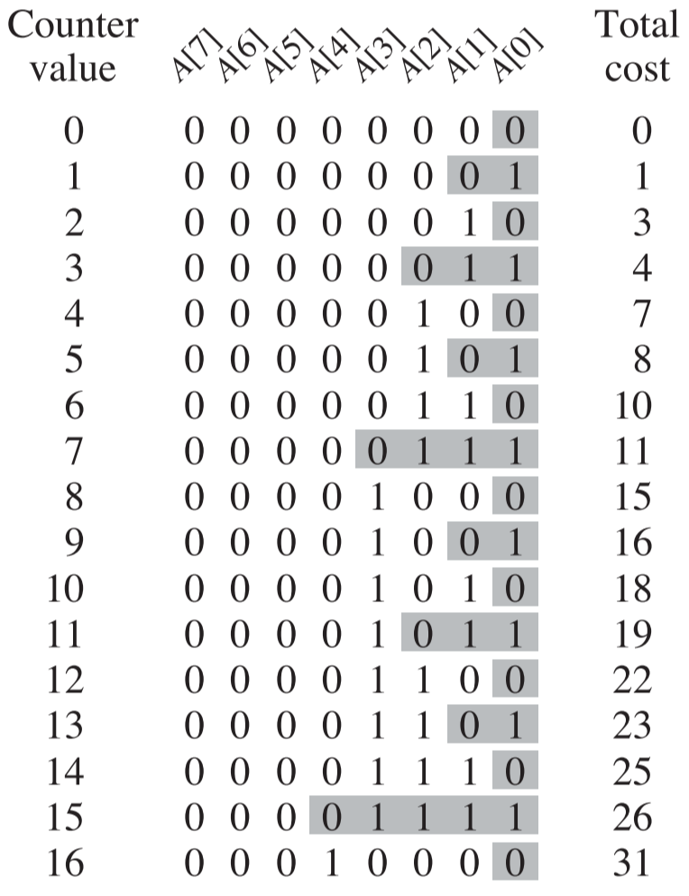

## 0 简介

> 在摊还分析中，我们求数据结构的**一个操作序列中所执行的所有操作的平均时间**，来评价操作的代价。这样，我们就可以说明一个操作的评价代价是很低的，即使序列中某个单一的操作的代价很高。摊还分析不同于平均情况分析，它并不涉及概率，它可以保证最坏情况下每个操作的平均性能。
>
> 摊还分析中最常用的三种技术是：**聚合分析**，**核能法**和**势能法**。

## 1 聚合分析

利用聚合分析，我们证明对所有 $n$，一个 $n$ 个操作的序列最坏情况下话费的总时间为 $T(n)$。因此，在最坏情况下每个操作的平均代价，或**摊还代价**为 $T(n)/n$。

### 1.1 实例1：栈操作

一个栈操作序列中包含3种操作：$PUSH$，$POP$ 和 $MULTIPOP$，其中 MULTIPOP 操作可以一次将多个元素弹出，求这个栈操作序列的摊还代价。

在分析最坏情况代价时，可能会得到这样的结果，$MULTIPOP$ 操作的最坏情况时间为 $O(n)$，而最多可能有 $n$ 个 $MULTIPOP$ 操作，所以最坏情况代价为 $O(n^2)$。

然而进一步分析会发现这个代价不是紧确的，还可以得到更低的最坏情况代价。再分析一下栈的性质会发现：当将一个对象压入栈后，我们至多将其弹出一次。一次，对于一个非空的栈，可以执行的 $POP$ 操作的次数(包括了 $MULTIPOP$ 中调用 $POP$ 的次数) 最多与 PUSH 操作的次数相当，即最多 $n$ 次。因此，对任意的 $n$ 值，任意一个由 $n$ 个 $PUSH$、$POP$ 和 $MULTIPOP$ 组成的操作序列，最多花费 $O(n)$ 时间。一个操作的平均时间为 $O(n)/n = O(1)$。**在聚合分析中，我们将每个操作的摊还代价设定为平均代价**。因此，在此例中，所有三种栈操作的摊还代价都是 $O(1)$。

### 1.2 实例2：二进制计数器

用一个 $k$ 位二进制数 $A$ 进行计数，从 0 开始累加到 $n$，求 $A$ 的翻转[^1]次数的摊还代价。

粗略分析可以得到每次计数器累加， A 的翻转次数为 $\Theta(k)$，所以最坏情况下 n 次累加得到总的翻转次数为 $\Theta(kn)$，但是这个代价也不是紧确的。下图是进行16次计数的翻转次数统计：

可以看到翻转次数不会超过 $2n$。原因是 $A$ 中除了最低位每次都会翻转，其他位要累加多次才会进行翻转，例如从低位数第2位要累加2次才翻转，第3位要累加4次才翻转，第 $i$ 位要累加 $2^{i-1}$ 次才翻转。根据附录 A 中的公式6(A.6)，可以计算出累加 $n$ 次的翻转次数为：

$\sum\limits_{i=0}^{k-1}\lfloor \frac{n}{2^i}\rfloor < n\sum\limits_{i=0}^{\infty}\frac{1}{2^i} = 2n$

所以 $n$ 次累加操作在最坏情况下 $A$ 的翻转次数为 $\Omicron(n)$，每个操作的平均代价，即摊还代价为 $\Omicron(n)/n=\Omicron(1)$。

## 2 核算法

> 用核算法分析时，我们对不同的操作赋予不同的费用，赋予某些操作的费用可能多于或少于其实际代价。我们将赋予一个操作的费用称为它的摊还代价。当一个操作的摊还代价超出其实际代价时，我们将差额存入数据结构中的特定对象，存入的差额称为**信用**。对于后续操作中摊还代价小于实际代价的情况，信用可以用来支付差额。
>
> 我们必须小心地选择操作的摊还代价。如果我们希望通过分析摊还代价来证明每个操作的平均代价的最坏情况很小，就应确保操作序列的总摊还代价给出了序列总真是代价的**上界**。而且，与聚合分析一样，这种关系必须对所有操作序列都成立。如果用 $c_i$ 表示第 i 个操作的真实代价，用 $\hat{c}_i$ 表示其摊还代价，则对任意 $n$ 个操作的序列，要求
>
> $\sum\limits_{i=1}^{n}\hat{c}_i\geqslant \sum\limits_{i=1}^{n}c_i$
>
> 数据结构中的信用恰好等于摊还代价与总实际代价的差值，即 $\sum\limits_{i=1}^{n}\hat{c}_i - \sum\limits_{i=1}^{n}c_i$。且信用必须一致为非负值。**如果在某个步骤，我们允许信用为负值，那么当时的总摊还代价就会低于总实际代价，对于那个时刻为止的操作序列，总摊还代价就不再是总实际代价的上界了**。所以如果前面操作缴费不足时，想在后面操作补齐欠费的方式是不被允许的。

### 2.1 实例1：栈操作

各个栈操作的**实际代价**

> PUSH	1
>
> POP	1
>
> MULTIPOP	$\min(k,s)$

设计各个栈操作的**摊还代价**如下

> PUSH	2
>
> POP	0
>
> MULTIPOP	0

这样设计摊还代价的**正确性**

> 当执行一次 $PUSH$ 操作时，缴费 2 元，$PUSH$ 操作消耗 1 元，剩下 1 元存入信用，以供后面的 $POP$ 或 $MULTIPOP$ 操作消耗，因为每次 PUSH 操作最多只会导致 1 次 $POP$ 操作或 $MULTIPOP$ 操作中的 1次弹出，所以信用永远不会为负。

**时间复杂度**

对于上面设计的摊还代价，只有 $PUSH$ 操作会增加代价，所以最坏情况就是所有操作都是 $PUSH$，n 个操作的总代价为 $2n$，所以最坏情况下栈操作序列的总摊还代价为 $\Omicron(n)$。

### 2.2 实例2：二进制计数器

> 对于这个问题，设计摊还代价的方法是：对计数器中的每一位二进制数，置位操作(0变1)会的摊还代价为2，复位操作(1变0)的摊还代价为0，这样计数器中所有为1的位都保存了1元的信用，而计数器中1的个数不可能为负数，所以信用不可能为负的。
>
> 对于 n 个累加操作，因为只有置位操作会增加摊还代价，所以最坏情况就是所有累加操作都产生置位，但是对于每次累加，置位的位数都是1，所以对于 n 次累加操作，总的摊还代价为 $2n$，所以总摊还代价为 $\Omicron(n)$。

## 3 势能法

### 3.1 工作方式

> 势能法摊还分析并不像核算法一样，将预付代价表示为数据结构中特定的对象的信用，而是表示为“势能”，或称为“势”，将势能释放即可用来支付未来操作的代价。我们将势能与整个数据结构而不是特定对象相关联。
>
> 势能法工作放回如下。我们将对一个初始数据结构 $D_0$ 执行 $n$ 个操作。对每个 $i=1,2,...,n$，令 $c_i$ 为第 $i$ 个操作的实际代价，令 $D_i$ 为在数据结构 $D_{i-1}$ 上执行第 $i$ 个操作得到的结果数据结构。**势函数 $\Phi$** 将每个数据结构 $D_i$ 映射到一个实数 $\Phi(D_i)$，此值即为关联到数据结构 $D_i$ 的**势**。第 $i$ 个操作的摊还代价 $\hat{c}_i$ 用势函数 $\Phi$ 定义为：
>
> $\hat{c}_i = c_i + \Phi(D_i) - \Phi(D_{i-1})$
>
> 因此，**每个操作的摊还代价等价于其实际代价加上此操作引起的势能变化**。有上面公式可以得出 n 个操作的总摊还代价为
>
> $\sum\limits_{i=1}^{n}\hat{c}_i = \sum\limits_{i=1}^{n}(c_i+\Phi(D_i)-\Phi(D_{i-1})) = \sum\limits_{i=1}^{n}c_i+\Phi(D_n)-\Phi(D_0)$
>
> 如果能定义一个势函数 $\Phi$，使得 $\Phi(D_n)\geqslant \Phi(D_0)$，则总摊还代价 $\sum\limits_{i=1}^{n} \hat{c}_i$给出了总实际代价 $\sum\limits_{i=1}^{n} c_i$ 的一个上界，则可以像核算法一样保证总能提前支付。

**势函数的选择**

总摊还代价的计算依赖于势函数 $\Phi$ 的选择。不同的势函数会产生不同的摊还代价，但摊还代价仍为实际代价的上界。

### 3.2 实例1：栈操作

> 我们将一个栈的势函数定义为其中的对象数量。对于初始的空栈 $D_0$，我们有 $\Phi(D_0) = 0$。由于栈中对象数目永远不可能为负，因此，第 i 步操作得到的栈 $D_i$ 具有非负的势，即
>
> $\Phi(D_i) \geqslant 0 = \Phi(D_0)$
>
> 因此，用 $\Phi$ 定义的 n 个操作的总摊还代价即为实际代价的一个上界。
>
> 下面计算不同栈操作的摊还代价。
>
> - 如果第 i 个操作时 $PUSH$ 操作，假设此时栈中包含 s 个对象，则**势差**为
>
>   $\Phi(D_i) - \Phi(D_{i-1}) = (s+1) - s = 1$
>
>   所以 PUSH 操作的摊还代价为
>
>   $\hat{c}_i = c_i + \Phi(D_i) - \Phi(D_{i-1}) = 1 + 1 = 2$
>
> - 如果第 i 个操作时 **$MULTIPOP(S, k)$**，将 $k' = min(k, s)$ 个对象弹出栈。对象的实际代价为 $k'$，势差为
>
>   $\Phi(D_i) - \Phi(D_{i-1}) = -k'$
>
>   所以 MULTIPOP 的摊还代价为
>
>   $\hat{c}_i = c_i + \Phi(D_i) - \Phi(D_{i-1}) = k' + (-k') = 0$
>
>   类似的，普通的 POP 操作的摊还代价也是0
>
> 由于所有栈操作的代价都是 $\Omicron(1)$，因此，n 个操作的总摊还代价为 $\Omicron(n)$。

### 3.3 实例2：二进制计数器

> 我们将计数器执行 $i$ 次累加操作后的势定义为 $b_i$，即 $i$ 次操作后计数器中1的个数。
>
> 假设第 $i$ 个累加操作将 $t_i$ 个位复位，则其实际代价至多为 $t_i +1$，因为除了复位 $t_i$ 个位之外，还至多置位1位。如果 $b_i = 0$，则第 $i$ 个操作将所有 $k$ 位都复位了，因此 $b_{i-1} = t_i = k$。如果 $b_i > 0$，则 $b_i = b_{i-1} - t_i + 1$。无论哪种情况，$b_i \leqslant b_{i-1} - t_i + 1$，势差为
>
> $b_i - b_{i-1} \leqslant 1 - t_i$
>
> 因此，摊还代价
>
> $\hat{c}_i = c_i + b_i - b_{i-1} \leqslant (t_i + 1) + (1 - t_i) = 2$
>
> 如果计数器从0开始，则 $b_0=0$。由于对所有 $i$ 均有 $\Phi(D_i) \geqslant 0$，因此，一个 $n$ 个累加操作的序列的总摊还代价是总实际代价的上界，所以 $n$ 个累加操作的最坏情况代价为 $\Omicron(n)$。

[^1]: 当 $A$ 中的某一位从 0 变为 1，或从 1 变为 0 时，表示 1 次翻转

