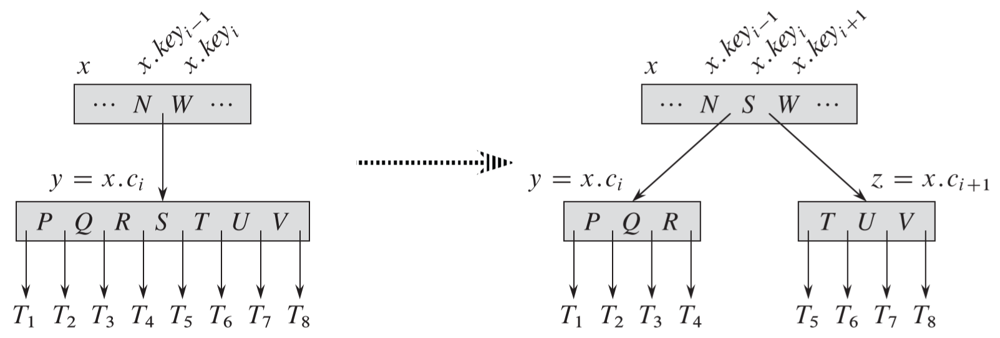
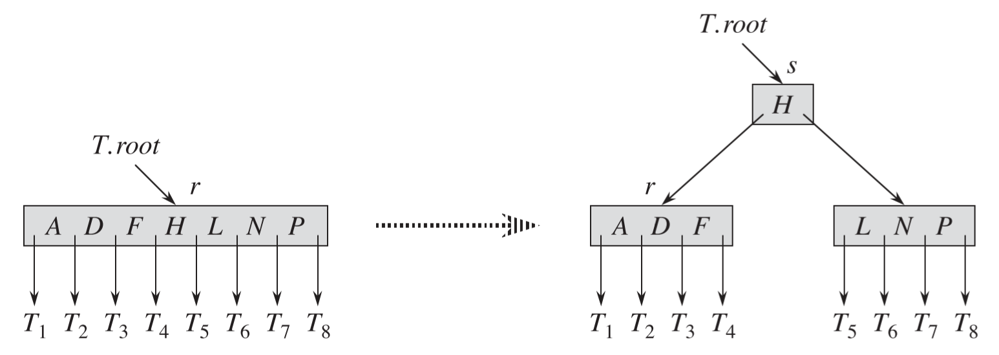
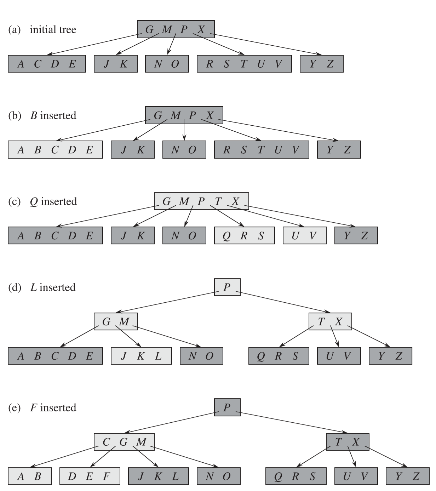
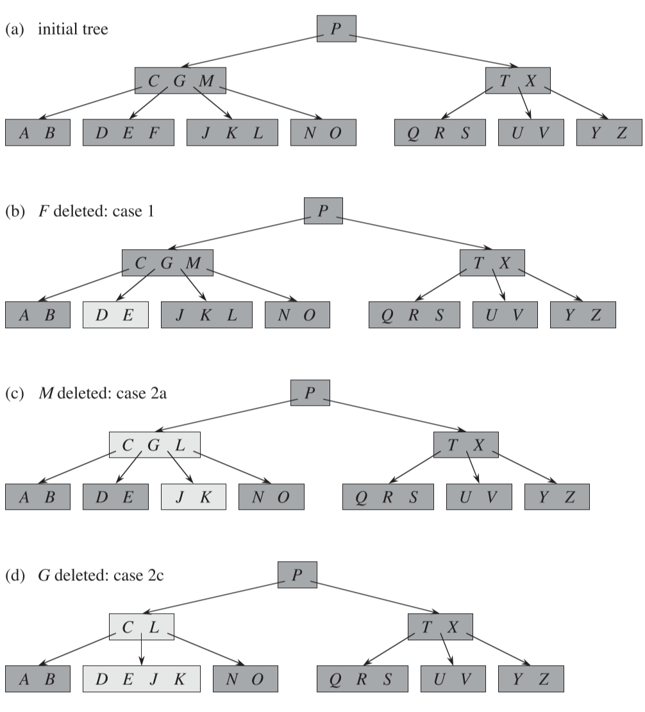
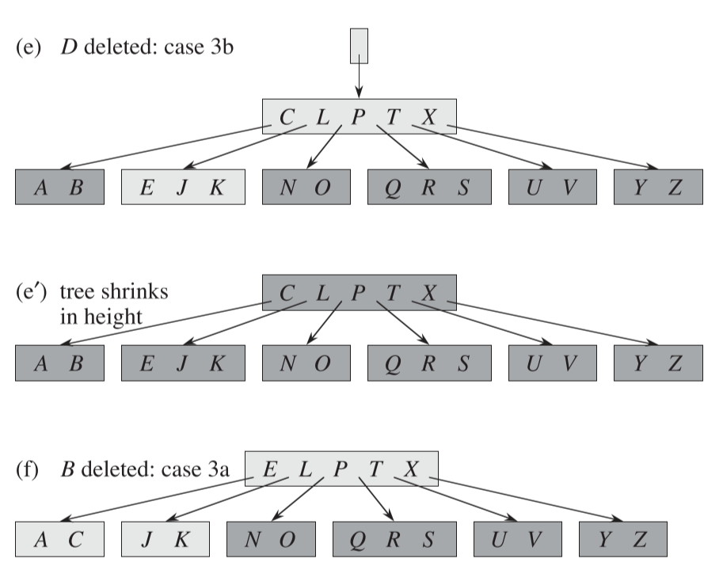

## 0 简介

B 树是一种二叉搜索树的推广(结点的孩子数可以大于2)，所以 B 树也是一种搜索树。下面是一颗简单的 B 树：

从上图可以看出，如果某个内部结点包含 n 个关键字，则它有 n+1 个孩子。

### 0.1 磁盘存储

通常磁盘存储采用 B 树或者 B^+^ 树，而不是二叉树。目的是为了减少磁盘访问次数，因为磁盘访问的速度相比内存访问速度是很慢的。对于同样的数据量，使用 B 树来存储会比使用二叉搜索树来存储的树的高度矮很多；而通常每个树的结点都保存一个磁盘页面，所以树的高度就是磁盘访问的次数，所以 B 树比二叉树的搜索次数少很多，从而提高了磁盘操作速度。

对于下面一颗分支因子为1001，高度为2的 B 树，它可以存储超过10亿个关键字。不过，由于根结点可以持久地保存在主存中，所以在这棵树中查找某个关键字至多只需要两次磁盘存取。

**B^+^树**

B^+^ 树是一种常见的 B 树变种，它把所有的卫星数据都存储在叶结点中，内部结点只存放关键字和孩子指针，因此最大化了内部结点的分支因子。

## 1 B 树的定义

一颗 B 树 T 是具有以下性质的有根树

> 1. 每个结点 $x$ 有下面属性：
>
>    - a. $x.n$，当前存储在结点 $x$ 中的关键字个数。 
>
>    - b. $x.n$ 个关键字本身 $x.key_1, x.key_2, ..., x.key_{x.n}$，以非降序存放，使得$x.key_1 \leqslant x.key_2 \leqslant...\leqslant x.key_{x.n}$。
>
>    - c. $x.leaf$，一个布尔值，如果 $x$ 是叶结点，则为 $TRUE$；如果 $x$ 为内部结点，则为 $FALSE$。
>
> 2. 每个内部结点 $x$ 还包含 $x.n+1$ 个指向其孩子的指针 $x.c_1, x.c_2, ..., x.c_{x.n+1}$。叶结点没有孩子，所以它们的 $c_i$ 属性没有定义。
>
> 3. 关键字 $x.key_i$ 对存储在子树中的关键字范围加以分割：如果 $k_i$ 为任意一个存储在以 $x.c_i$ 为根的子树中的关键字，那么
>
>    $k_1 \leqslant x.key_1 \leqslant k_2 \leqslant x.key_2 \leqslant ... \leqslant x.key_{x.n} \leqslant k_{x.n+1}$
>
> 4. 每个叶结点具有相同的深度，即树的高度 $h$。
>
> 5. 每个叶结点所包含的关键字个数有上界和下界。用一个被称为 B 树的最小度数的固定整数 $t\geqslant2$ 来表示这些界
>
>    - a. 除了根结点以外的每个结点必须至少有 $t-1$ 个关键字。因此，除了根结点以外的每个内部结点至少有 $t$ 个孩子。如果树非空，根结点至少有一个关键字。
>
>    - b. 每个结点至多包含 $2t-1$ 个关键字。因此，一个内部结点至多可有 $2t$ 个孩子。当一个 结点恰好有 $2t-1$ 个关键字时，称该结点是满的。

**B 树的高度**

> B 树上大部分的操作所需的磁盘存取次数与 B 树的高度是成正比的。有下面的定理
>
> 如果 $n \geqslant 1$，那么对任意一颗包含 $n$ 个关键字、高度为 $h$，最小度数 $t \geqslant 2$ 的 B 树 T，有
>
> $h \leqslant \log_t{\frac{n+1}{2}}$
>
> 与红黑树相比，这里我们看到了 B 树的能力。尽管二者的高度都以 $\Omicron(\lg n)$ 的速度增长，但对 B 树来说，对数的底可以大很多倍。因此，对大多数的操作来说，要检查的结点在 B 树中要比在红黑树中少大约 $\lg t$ 的因子。**由于一棵树中检查任意一个结点都需要一次磁盘访问，所以 B 树避免了大量的磁盘访问。**

## 2 B 树上的基本操作

### 2.1 搜索 B 树

> 搜索一棵 B 树和搜索一棵二叉树很相似，只是在每个结点所做的不是二叉或者“两路”分支选择，而是根据结点的孩子数做多路分支选择。
>
> 时间复杂度：一次搜索操作需要的
>
> 磁盘访问次数： $\Omicron(h) = \Omicron(\log_tn)$ 
>
> CPU时间[^1]：$\Omicron(th) = \Omicron(t\log_tn)$

### 2.2 创建一棵空的 B 树

> 为了构造一棵 B 树 T，先用 B-TREE-CREATE 来创建一个空的根结点，然后调用 B-TREE-INSERT 来添加新的 关键字。这些过程都要用到一个辅助过程 ALLOCATE-NODE，它在 $\Omicron(1)$ 时间内为一个新结点分配一个磁盘页。

### 2.3 向 B 树中插入一个关键字

> B 树中插入一个关键字要比二叉搜索树中插入一个关键字复杂得多。像二叉搜索树中一样，要查找插入新关键字的叶结点的位置。但是如果查到的位置所在结点已经是满的，那么需要先按其**中间关键字**将该结点$分裂$为两个各含 $t-1$ 个关键字的结点。
>
> 与一棵二叉搜索一样，可以在从树根到叶子这个单程向下过程中将一个新的关键字插入 B 树中。为了做到这一点，我们不是等到找出插入过程中实际要分裂的满结点时才做分裂。相反，**当沿着树往下查找新的关键字所属位置时，就分裂沿途遇到的每个满结点**。因此，每当要分裂一个满结点 y 时，就能确保它的父结点不是满的。
>
> 当分裂一个满的根结点时，首先要让根成为一个新的**空根结点**的孩子，这样才能使用 B-TREE-SPLIT-CHILD。树的高度因此增加1；**分裂是树长高的唯一途径**。

**普通结点的分裂**

下图是一个 $t=4$ 的结点 $y$ 的分裂过程：可以看到结点 $y$ 别分裂为了 $y$ 和 $z$，中间关键字 S 被提升到了 $y$ 的父结点 $x$ 中，而分裂出的新结点 $z$ 成为了根结点 $x$ 的新孩子。

**根结点的分裂**

下图展示了根结点被分裂的情况：在查找插入位置时，从根结点往下查找；如果根结点是满的，那么需要分裂根结点，由于根结点没有父结点，所以需要创建一个新的根结点，这时新的根结点为空的，老的根结点分裂后会将中间关键字放入新的根结点。所以根结点和其他结点不同，可以只有1个关键字($\leqslant t-1$)。根结点分裂后树的高度+1。**与二叉搜索树不同，B 树高度的增加发生在顶部而不是底部**。

**向 B 树插入关键字的各中情况**

下图是一棵 $t=3$ 的 B树。

- b. 插入 B 时，由于插入结点未满，所以直接插入
- c. 插入 Q 时，插入结点已满，分裂，且将关键字 T 放入根结点
- d. 插入 L 时，在从根结点往下查找过程中发现根结点已满，所以分裂根结点；然后找到插入 L 的结点，该结点未满，所以直接插入
- e. 插入 F 时，插入结点已满，分裂，再插入

**插入操作的性能**

磁盘访问次数： $\Omicron(h) = \Omicron(\log_tn)$ 

CPU时间：$\Omicron(th) = \Omicron(t\log_tn)$

## 3 从 B 树中删除关键字

> 就像必须保证一个结点不会因为插入而变得太大一样，**必须保证一个结点不会在删除期间变得太小**(根结点除外，因为它允许有比最少关键字树 $t-1$ 还少的关键字个数)

删除操作要处理的情况较多，具体情况参考 P286。

下面是删除操作的一个示例

**删除操作的性能**

磁盘访问次数： $\Omicron(h) = \Omicron(\log_tn)$ 

CPU时间：$\Omicron(th) = \Omicron(t\log_tn)$

[^1]:磁盘访问时间乘以每个结点比较次数