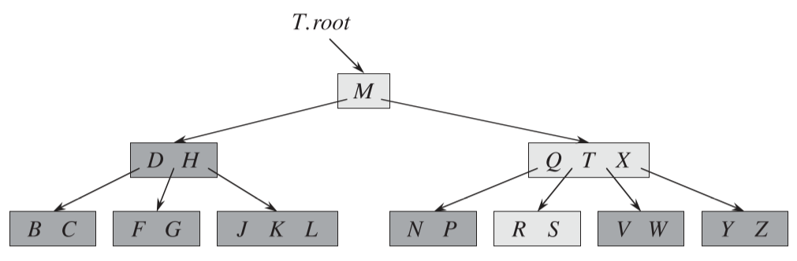

## 0 简介

B 树是一种二叉搜索树的推广(结点的孩子数可以大于2)，所以 B 树也是一种搜索树。下面是一颗简单的 B 树：

从上图可以看出，如果某个内部结点包含 n 个关键字，则它有 n+1 个孩子。

### 0.1 磁盘存储

通常磁盘存储采用 B 树或者 B^+^ 树，而不是二叉树。目的是为了减少磁盘访问次数，因为磁盘访问的速度相比内存访问速度是很慢的。对于同样的数据量，使用 B 树来存储会比使用二叉搜索树来存储的树的高度矮很多；而通常每个树的结点都保存一个磁盘页面，所以树的高度就是磁盘访问的次数，所以 B 树比二叉树的搜索次数少很多，从而提高了磁盘操作速度。

对于下面一颗分支因子为1001，高度为2的 B 树，它可以存储超过10亿个关键字。不过，由于根结点可以持久地保存在主存中，所以在这棵树中查找某个关键字至多只需要两次磁盘存取。

