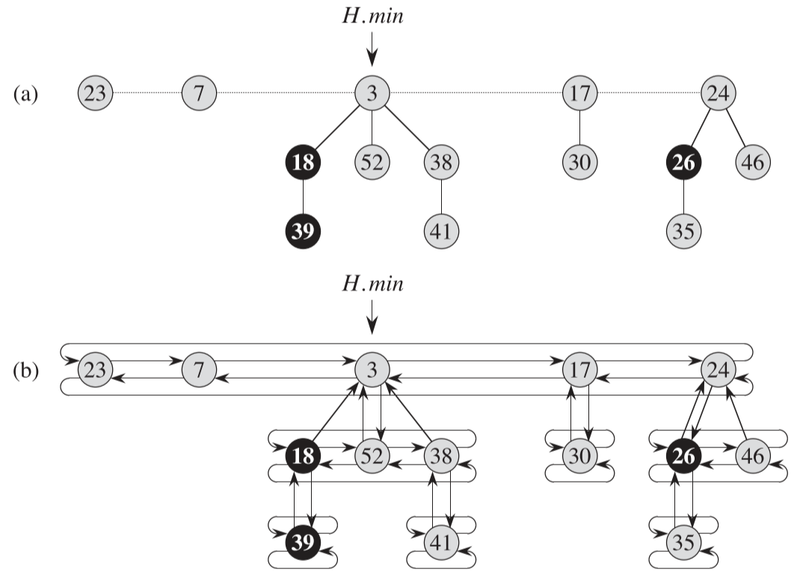
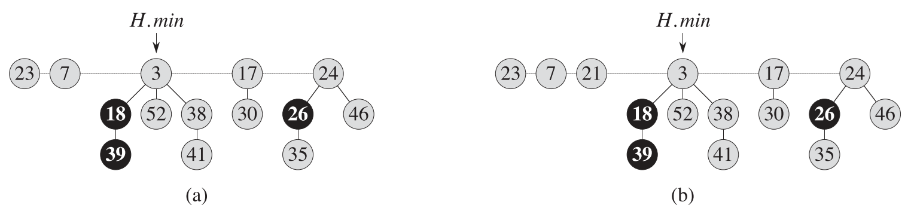
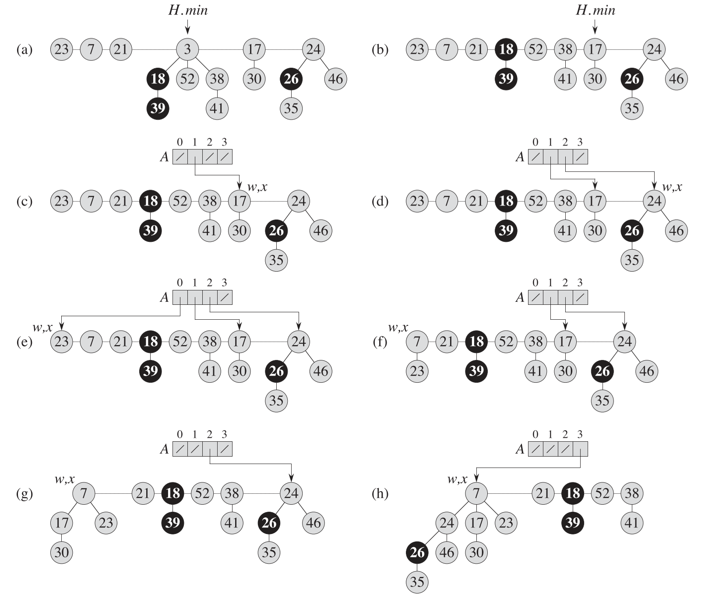
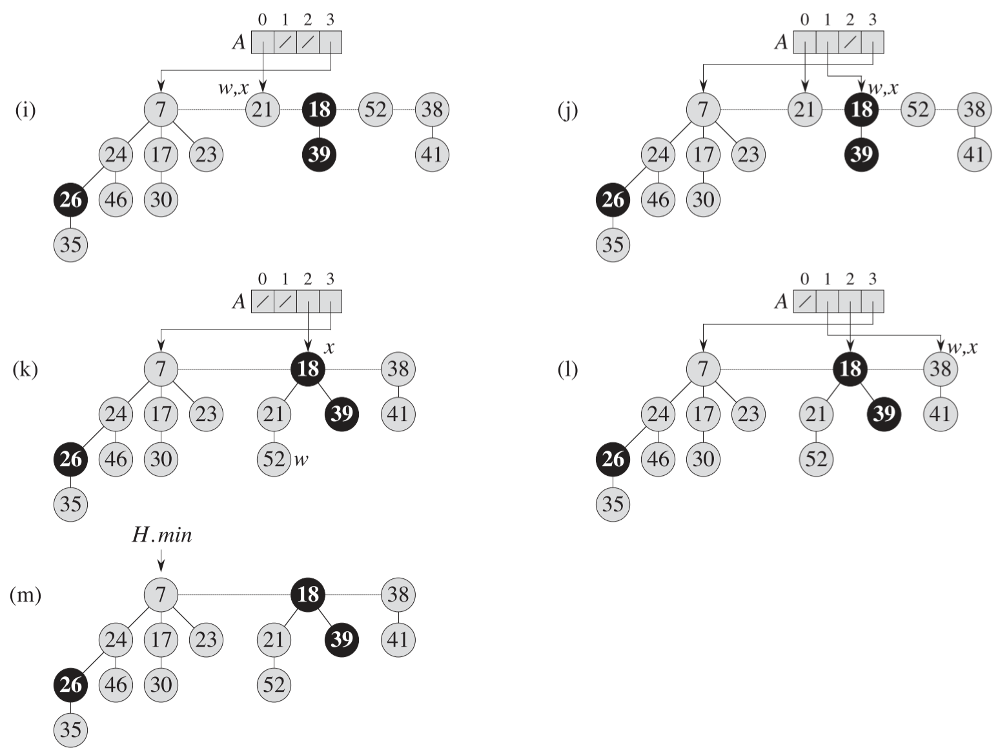
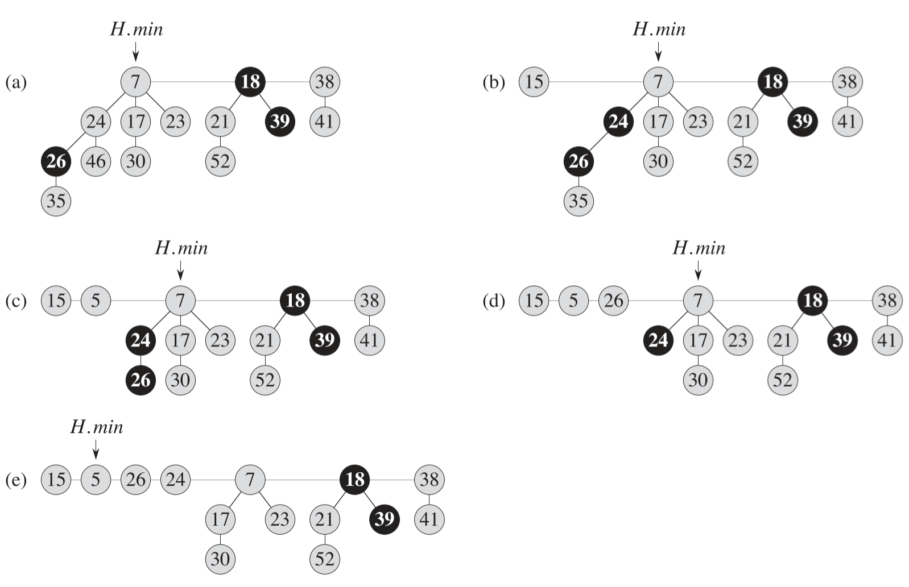

## 0 简介

> 斐波那契堆数据结构有两种用途。第一种，它支持一系列操作，这些操作构成了所谓的“可合并堆”。第二种，斐波那契堆的一些操作可以在常熟摊还时间内完成，这使得这种数据结构非常适合于需要频繁调用这些操作的应用。

**需要用到斐波那契堆的问题**

计算最小生成树和和寻找单源最短路径的快速算法。

## 1 斐波那契堆结构

> 一个斐波那契堆是一系列具有最小堆序的有根树的集合。也就是说，每棵树均遵循最下堆性质：每个结点的关键字大于或等于它的父结点的关键字。

j**结构**

下图是一个斐波那契堆的例子，图 b 是实际结构，图 a 是省略了一些指针后的版本。在斐波那契堆中，所有树的根都用其 $left$ 和 $right$ 指针链成一个环形的双链表，该双链表称为斐波那契堆的**根链表**。指针 $H.min$ 指向根链表中关键字最小的那个结点。根链表中的树次序可以任意。

**势函数**

对于一个斐波那契堆 H ，用 $t(H)$ 来表示 H 中根链表中树的数目，用 $m(H)$ 来表示 H 中已标记的结点数目。然后，定义斐波那契堆 H 的势函数 $\Phi(H)$ 如下：

$\Phi(H) = t(H) + 2m(H)$

**最大度数**

度数即结点的孩子数，如上图中的最大度数为3。

## 2 可合并堆操作

### 2.1 创建一个新的斐波那契堆

创建一个空的斐波那契堆，摊还代价等于实际代价 $\Omicron(1)$。

### 2.2 插入一个结点

插入结点操作，实际上就是将结点插入根链表中，然后修改一些参数。

 下图展示了插入结点 21 的过程

插入操作的摊还代价等于实际代价 $\Omicron(1)$。

### 2.3 寻找最小结点

因为 $H.min$ 指针总是指向最小结点，所以该操作的摊还代价等于实际代价 $\Omicron(1)$。

### 2.4 两个斐波那契堆的合并

合并过程只需要将两个斐波那契堆 $H_1$ 和 $H_2$ 的根链表链接称为新根链表，然后设定新的最小结点，再修改结点数量属性。所以该操作的摊还代价等于实际代价 $\Omicron(1)$。

### 2.5 抽取最小结点

> 该过程首先将最小结点的每个孩子变为根结点，并从根链表中删除该最小结点。然后通过把具有相同度数的根结点合并的方法来链接成根链表，**直到每个度数至多只有一个根在根链表中**。

上图就是抽取最小结点的过程

a. 初始状态。

b. 从根链表中移除最小结点 $z$ 并把它的孩子加入根链表后的情形。

c~l. 该过程对根链表的处理是从 $H.min$ 指向的结点开始的，并沿着 $right$ 指针的方向进行。这个过程会借助数组 $A$ 进行很多轮，直到根链表中的每个结点的度数都不同。

m. 将 $H.min$ 指针指向根链表中最小的结点。

**摊还代价**

抽取最小结点的摊还代价为 $\Omicron(\lg n)$。

### 2.6 关键字减值

上图为关键字减值操作。

a. 初始的斐波那契堆。

b. 关键字为 46 的结点将关键字减小到 15。该结点成为一个根结点，它的父结点之前没有被标记，现在被标记了。

c~e. 关键字为 35 的结点将关键字减小到 5。图 c 中，该结点的关键字已经为 5，变为根结点。它的父结点是被标记过的，因此需要调用一个级联切断操作。关键字为 26 的结点被从父结点上剪切下来，成为图 d 中的一个未被标记过的根。另一个级联切断操作需要执行，因为关键字为 24 的结点也已经被标记。该结点被从父结点上剪切下来，成为图 e 中的一个未被标记过的根。因为关键字为 7 的结点是个根，所以级联切断操作在此结束。

**摊还代价**

关键字减值的摊还代价为 $\Omicron(1)$。

### 2.7 删除一个结点

删除一个结点操作可以由上面的操作组合实现。分别是下面两个操作：

1. 将要删除的结点减值为 $-\infty$
2. 抽取最小结点

**摊还代价**

删除一个结点的摊还代价即抽取最小结点的摊还代价为 $\Omicron(\lg n)$。

## 3 最大度数的界

斐波那契堆中任意结点的度数上界 $D(n)$ 为 $\Omicron(\lg n)$，这也是抽取最小结点的摊还代价为 $\Omicron(\lg n)$ 的必要条件。

