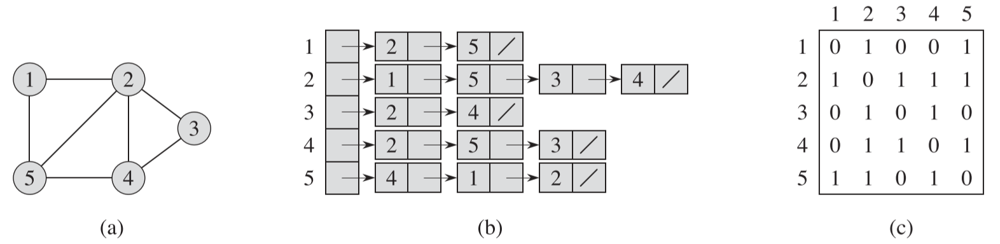
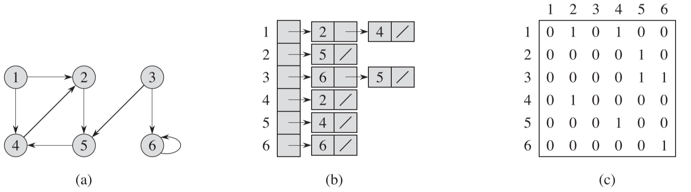
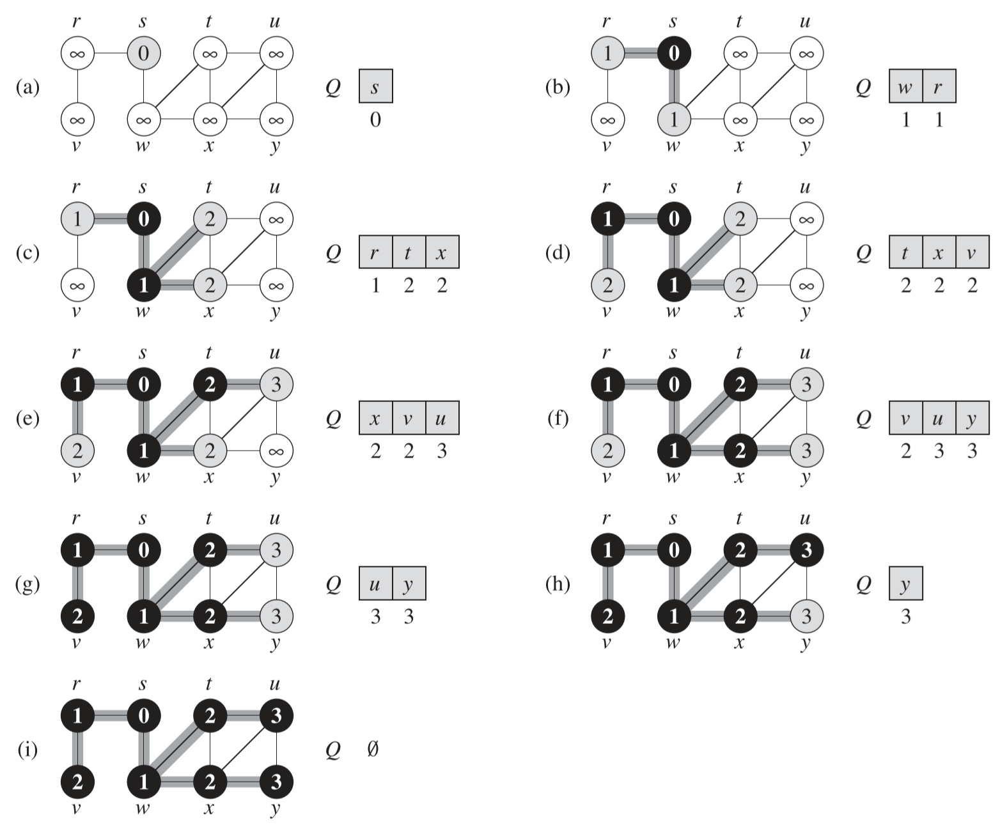
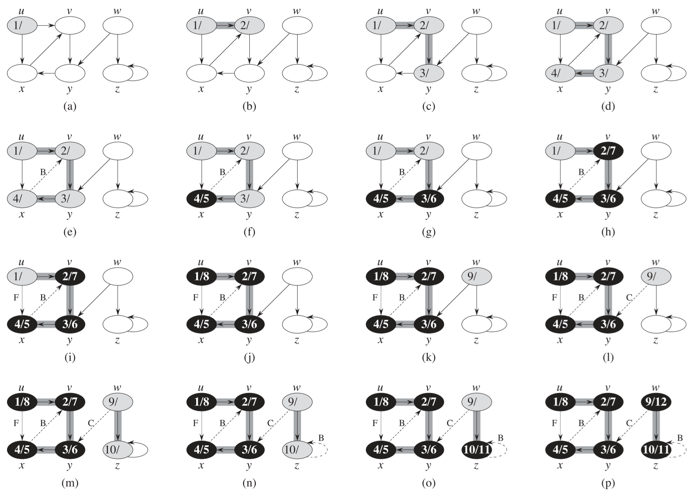
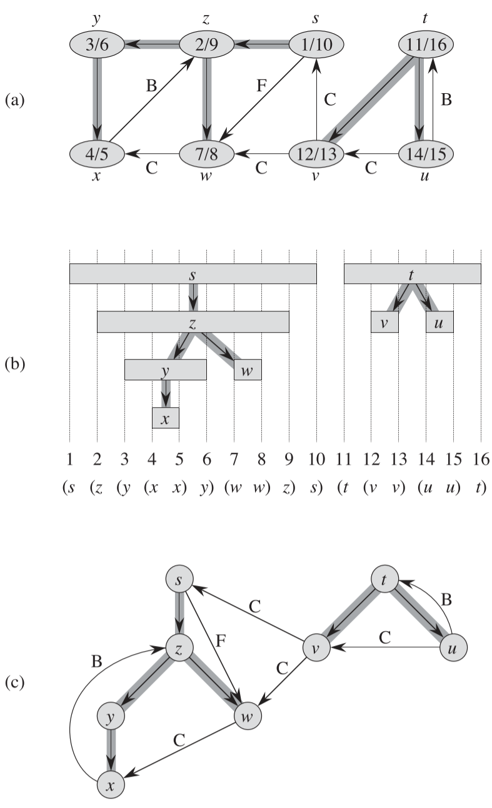
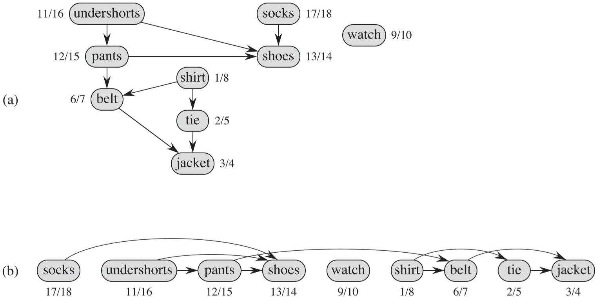

## 1 图的表示

图的表示主要有**邻接链表**和**邻接矩阵**，两种表示法的既能表示无向图，也能表示有向图。

邻接链表通常用于表示**稀疏图**(边的条数$|E|$远远小于定点数的二次方$|V|^2$的图)。

邻接矩阵通常用于表示**稠密图**(边的条数$|E|$接近定点数的二次方$|V|^2$的图)

> 对于图 $G=(V,E)$ 来说，其**邻接链表表示**由一个包含 $|V|$ 条链表的数组 $Adj$ 所构成，每个结点有一条链表。对于每个结点 $u\in V$，邻接链表 $Adj[u]$ 包含所有与结点 $u$ 之间有边相连的结点 $v$，即 $Adj[u]$ 包含图 $G$ 中所有与 $u$ 邻接的结点(也可以说，该链表里包含指向这些结点的指针)。
>
> 对于**邻接矩阵表示**来说，我们通常会将图 $G$ 中的结点编号为 $1,2, ... , |V|$，这种编号可以是任意的。在进行此种编号之后，图 $G$ 的邻接矩阵表示由一个 $|V| \times|V|$ 的矩阵 $A=(a_{ij})$ 予以表示，该矩阵满足下述条件：
>
> $a_{ij}=\left\{\begin{array} \\1 & 若 (i,j)\in E \\0 & 其他 \end{array} \right.$

下图展示了**无向图**的两种表示法，图(b)为邻接链表，图(c)为邻接矩阵。

- 在无向图的邻接链表表示中，链表总长度=2|E|，因为每条边会出现在两个顶点的链表中。
- 在无向图的邻接矩阵表示中，不管一个图有多少条边，空间需求皆为 $\Theta(V^2)$。

下图展示了**有向图**的两种表示法，图(b)为邻接链表，图(c)为邻接矩阵。

- 在有向图的邻接链表表示中，链表总长度=|E|，因为每条边只出现在一个顶点的链表中。
- 与无向图一样，在有向图的邻接矩阵表示中，不管一个图有多少条边，空间需求皆为 $\Theta(V^2)$。

**权重图的表示**

> 邻接链表表示：设 $G=(V,E)$ 为一个权重图，其权重函数为 $w$，我们可以直接将边 $(u,v) \in E$ 的权重值 $w(u,v)$ 存放在结点 $u$ 的邻接链表里。例如在上图(b)中，边 $(1,2)$ 的权重为 $w_1$，就将结点 1 的链表中的结点 2 的权重属性设置为 $w_1$。
>
> 邻接矩阵表示：如果 $G = (V,E)$ 为一个权重图，其权重函数为 $w$，则我们直接将边 $(u,v) \in E$ 的权重 $w(u,v)$ 存放在邻接矩阵中第 $u$ 行第 $v$ 列记录上。对于不存在的边，则在相应的行列记录上存放指 $NIL$。不过，对于许多问题来说，用 0 或 $\infty$ 来表示一条不存在的边可能更为便捷。

## 2 广度优先搜索

> 给定图 $G=(V,E)$ 和一个可以识别的源节点 $s$，**广度优先搜索**对图 $G$ 中的边进行系统性的探索来发现可以从源节点 $s$ 到达所有结点。该算法能够计算从源节点 $s$ 到每个可到达的结点的距离(最少的边数)，同时生成一棵“广度优先搜索树”。该树以源结点 $s$ 为根结点，包含所有可以从 $s$ 到达的结点。对于每个从源结点 $s$ 可以到达的结点 $v$，在广度优先搜素树里从结点 $s$ 到结点 $v$ 的简单路径所对应的就是图 $G$ 中从结点 $s$ 到结点 $v$ 的“最短路径”，即包含最少边树的路径。该算法既可以用于有向图，也可以用于无向图。

广度优先搜索(Breadth-First-Search BFS)过程

如上图所示：BFS算法借助先进先出队列 $Q$ 来保存要访问的结点(灰色结点)。初始时 Q 中只包含源结点 $s$，且 $s.d = 0$，然后总是从队列头取出一个结点 $u$，然后访问该结点的邻接结点 $v$ ，且置 $v.d = s.d + 1$，并将 $v$ 加入队列 $Q$，然后从队列 $Q$ 中删除结点 $u$ (黑色结点)；然后从发上面的过程，假设当前访问的是结点 $u$ 的邻接点 $v$，则 $v.d = u.d+1$；最终队列 Q 中不再有结点时算法结束。

广度优先搜索的结果可能依赖于对每个结点的邻接点的访问顺序：广度优先搜索树可能不一样，但本算法所计算出来的距离 d 都是一样的。

**BFS算法时间复杂度**：$\Omicron(V+E)$

**最短路径**

> 我们定义从源结点 $s$ 到结点 $v$ 的**最短路径距离** $\delta(s,v)$ 为从结点 $s$ 到结点 $v$ 之间所有路径里面最少的边数。如果从结点 $s$ 到结点 $v$ 之间没有路径，则 $\delta(s,v) = \infty$。我们称从结点 $s$ 到结点 $v$ 的长度为 $\delta(s,v)$ 的路径为 $s$ 到 $v$ 的**最短路径**。

**BFS算法和最短路径的关系**

对于有向图或者无向图 $G=(V,E)$，对于所有的 $v \in V$，$v.d=\delta(s,v)$，其中 $s$ 为源结点。

构造最短路径：结点 $s$ 到结点 $v$ 的最短路径可以通过不断访问结点 $v$ 的 $\pi$ 属性来构造，例如边$(v.\pi,v)$是最短路径中的一条边，$(v.\pi.\pi, v.\pi)$也是最短路径中的一条边，以此类推，直到访问到源结点 $s$，整条最短路径就被构造出来了。

**广度优先树**

> 对于图 $G=(V,E)$ 和源结点 $s$，我们定义图 $G$ 的**前驱子图**为 $G_\pi = (V_\pi,E_\pi)$，其中 $V_\pi=\{v\in V: v.\pi\neq NIL\} \bigcup \{s\}$，$E_\pi=\{(v.\pi,v): v\in V_\pi-\{s\}\}$
>
> 当运行在一个有向图或无向图 $G=(V,E)$ 上时，BFS 过程所建造出来的 $\pi$ 属性使得前驱子图 $G_\pi=(V_\pi,E_\pi)$ 成为一棵广度优先树。

**有向图的广度优先搜索**

在无向联通图中，从任一源结点出发进行广度优先搜索都能访问到所有结点。但在有向图中从单一结点出发进行广度优先搜搜可能有些结点不可达，如果需要访问所有结点，就还需要从这些未被访问的结点出发再进行广度优先搜索，不过这不是广度优先搜索通常被应用的场景。

## 3 深度优先搜索

> 深度优先搜索所使用的策略像其名字所隐含的：只要可能，就在图中尽量“深入”。深度优先搜索总是对最近发现的结点 v 的出发边进行探索，直到该结点的所有出发边都被发现为止。一旦结点 v 的所有出发边都被发现，搜索则“回溯”到 v 的前驱结点( v 是经过该结点才被发现的)，来搜索该前驱结点的出发边。该过程一直持续到从源结点可以达到的所有结点都被发现为止。如果还存在尚未被发现的结点，则深度优先搜索将从这些未被发现的结点中任选一个作为新的源结点，并重复同样的搜索过程。该算法重复整个过程，直到图中的所有结点都被发现为止。

**前驱子图**

> 深度优先搜索中的**前驱子图**的定义与广度优先搜索中有所不同。
>
> 设图 $G_\pi = (V,E_\pi)$，其中 $E_\pi = \{(v._\pi,v): v \in V 且 v._\pi \neq NIL\}$。深度优先搜索的前驱子图形成的是一个由多棵深度优先树构成的深度优先森林。森林 $E_\pi$ 中的边仍然称为**树边**。

**算法执行过程**

如下图所示，结点分3中颜色

- 白色：未被发现的结点
- 灰色：已被发现的结点
- 黑色：已处理完成的结点，即该结点的邻接链表全部访问完成

具体步骤如下：

0. 初始时，所有结点为白色，时间戳为0
1. a：发现结点 u，置灰色，发现时间 u.d = 1
2. b：搜索结点 u 的邻接链表，发现了结点 v，置灰色，发现时间 v.d = 2
3. c：搜索结点 v 的邻接链表，发现了结点 y，置灰色，发现时间 y.d = 3
4. d：搜索结点 y 的邻接链表，发现了结点 x，置灰色，发现时间 x.d = 4
5. e：搜索结点 x 的邻接链表，发现了结点 v，但 v 不是白色结点，将该边标示为 B (Back)
6. f：回溯到结点 x，发现结点 x 的邻接链表已经处理完成，置黑色，完成时间 x.f = 5
7. g：回溯到结点 y，发现结点 y 的邻接链表已经处理完成，置黑色，完成时间 y.f = 6
8. h：回溯到结点 v，发现结点 v 的邻接链表已经处理完成，置黑色，完成时间 v.f = 7
9. i：回溯到结点 u，发现结点 u 的邻接链表中还有待处理的结点 x，但 x 不是白色结点，将该边标示为 F (Front)
10. j：再次回溯到结点 u，发现结点 u 的邻接链表已经处理完成，置黑色，完成时间 v.f = 8
11. k：这时从源结点 u 出发的深度优先搜索已经完成，但是还有未被发现的结点 w 和 z，所以再次以结点 w 作为源结点进行深度优先搜索，发现结点 w，置灰色，发现时间 w.d = 9
12. l：搜索结点 w 的邻接链表，发现了结点 y，但 y 不是白色结点，将该边标示为 C (Cross)
13. m：回溯到结点 w，由于结点 w 的邻接链表中还有待处理的结点 z，且 z 是白色的，于是发现了结点 z，置灰色，发现时间 z.d=10
14. n：搜索结点 z 的邻接链表，发现了自身即结点 z，但 z 不是白色，将该边标示为 B (Back)
15. o：回溯到结点 z，发现结点 z 的邻接链表已经处理完成，置黑色，完成时间 z.f = 11
16. p：回溯到结点 w，发现结点 w 的邻接链表已经处理完成，置黑色，完成时间 w.f = 12。至此所有结点访问完成，算法结束。

**DFS算法时间复杂度**

$\Theta(V+E)$，即结点数和边数之和

**DFS的性质**

下面的图 b 中，每个结点的发现时间和完成时间所构成的区间对应图中所示的括号化结构。如果两个时间区间存在重叠，则其中一个区间必定完全囊括在另一个区间内部，而对应较小区间的结点时对应较大区间的结点的后代。

**边的分类**

> 对于在图 G 上进行深度优先搜索算法所生成的深度优先森林 G。我们可以定义 4 种边的类型：
>
> 1. **树边**：为深度优先森林 G_\pi 中的边。如果结点 v 是因为算法对边 (u,v) 的探索而首先被发现，则 (u,v) 是一条树边。
> 2. **后向边**：后向边 (u,v) 是将结点 u 连接到其在深度优先树中(一个)祖先结点 v 的边。由于有向图中可以由自循环，**自循环也被认为指后向边**。
> 3. **前向边**：是将结点 u 连接到其在深度优先树中一个后代结点 v 的边 (u,v)。
> 4. **横向边**：指其他所有的边，这些边可以连接同一棵深度优先树中的结点，只要其中一个结点不是另一个结点的祖先(**即深度优先树中同一层的边**)，也可以连接**不同深度优先树**中的两个结点。

**根据结点颜色推断边的类型**

> 当第一次探索边 (u,v) 时，结点 v 的颜色能够告诉我们关于该边的一些信息。
>
> 1. 结点 v 为白色表明该边 (u,v) 是一条树边。
> 2. 结点 v 为灰色表明该边 (u,v) 是一条后向边。
> 3. 结点 v 为黑色表明该边 (u,v) 是一条前向边或横向边。

**无向图的深度优先搜索**

> 定理：在对无向图的深度优先搜索中，从来不会出现前向边和横向边。

## 4 拓扑排序

可以使用深度优先搜索来对**有向无环[^1]图**进行拓扑排序。

下图展示了对一个人的穿衣进行拓扑排序的情形：

图 a 是中每条有向边 (u, v) 表明服装 u 必须在服装 v 之前穿上。深度优先搜索的发现时间和完成时间在每个结点旁边。

图 b 是以拓扑排序展示的同一个图，所有的结点按照其**完成时间的逆序**被排成从左至右的一条水平线。所有的有向边都从左指向右。

**拓扑排序过程**

1. 对有向无环图进行深度优先搜索，并计算所有结点的完成时间
2. 每个结点完成时就将它插入链表头部
3. 这样得到的链表就是按结束时间倒序排序的

**拓扑排序时间复杂度**

$\Theta(V+E)$

**关于拓扑排序的两个引理**

> 1. 一个**有向**图 G=(V,E) 是无环的当且仅当对其进行的深度优先搜索不产生后向边
> 2. 拓扑排序算法生成的是有向无环图的拓扑排序

**简单原理**

对任意一条边 (u, v)，有 v.f < u.f，因为深度优先搜索中每个结点都会回溯

## 5 强连通分量

> 有向图 G = (V, E) 的强连通分量是一个最大结点集合 $C \subseteq V$，对于集合中任意一对结点 u 和 v 来说，路径 $u \leadsto v$ 和路径 $v \leadsto u$ 同时存在；也就是说，结点 u 和结点 v 可以相互到达

[^1]: 如果图包含环路，则不可能排出一个线性次序

