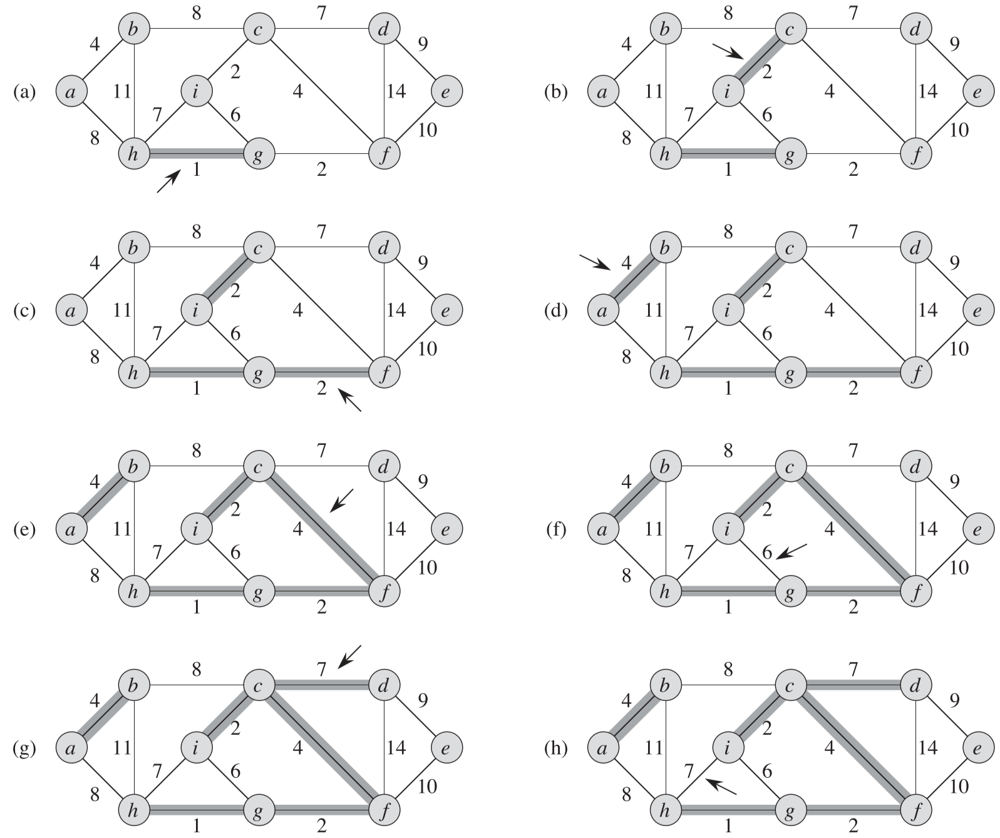
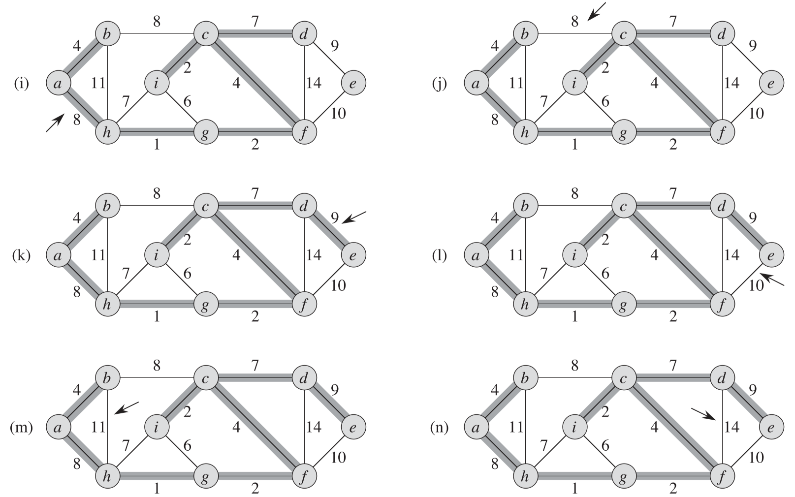
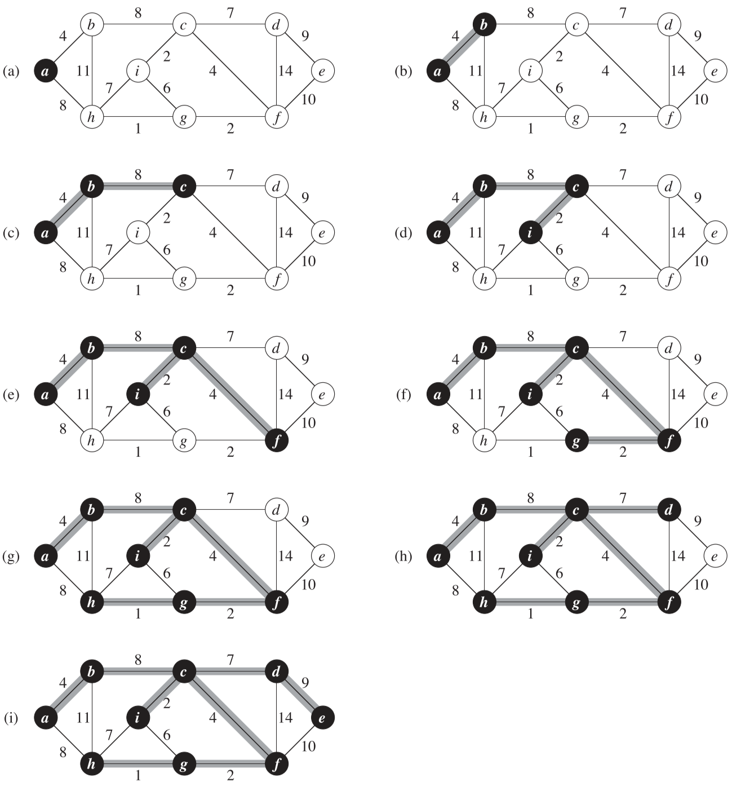

## 1 最小生成树算法思想

本章的两种最小生成树算法都使用贪心策略，基本思想是：使用边集合 A 来存放最小生成树的边，然后每次选择一条边 (u, v)，将其加入 A 中，使得 A 同样是某棵最小生成树的子集，这样的边被称为**安全边**。

**注意：最小生成树针对的是==连通无向图==。**

## 2 Kruskal(克鲁斯卡尔) 算法

Kruskal 算法找到安全边的办法是，在所有连接森林中两棵不同树的边里面，找到权重最小的边 (u, v)。

**算法执行过程**

> 1. 将最小生成树包含的边集合 A 初始化为一个空集合
> 2. 创建 |V| 棵树[^1]，每棵树仅包含一个结点
> 3. 按照权重正序对每条边进行检查。对于每条边 (u, v) ，检查 u 和 v 是否属于一棵树；如果是，该边不能加入到森林里，否则将形成环路；如果不是，则 u 和 v 属于不同的树，将边 (u, v) 加入都 A ，并将两棵树中的结点进行合并

如下图所示，每次找权重最小的边尝试加入 A 中，除非形成环。

下图 a-e 中每次都成功的加入了一条权重最小的边，但是图 f 中的权重最小的边每被加入，因为如果加入该边，会形成环。

直到图 n，所有边都检查完了，算法结束。

**时间复杂度**

Kruskal 算法的运行时间依赖于不相交集合的实现方式。

渐进时间最快的实现方式是使用**不相交集合森林**，并增加按秩合并和路径压缩的功能；这种实现方式下 Kruskal 算法的时间复杂度为：$\Omicron(E \lg V)$。

## 3 Prim(普里姆) 算法

Prim 算法从任意的根结点 r 开始，一直长大到覆盖 V 中的所有结点时为止。算法每一步在连接集合 A[^2] 和 A 之外的结点的所有边中，选择一条轻量级边加入到 A 中，显然每次加入的边都是对 A 安全的边。

如下图所示

- 图 a-b：初始时 A 为空，所以只需选择一条与结点 a 相连且权重最小的边，即边 (a, b)，权重为4。
- 图 c：现在 A 包含边 (a, b)，与 A 相连的边有 (a, h)=8，(b, h)=11，(b, c)=8，选择最小权重的边 (b, c)。
- 图 d：现在 A 包含边 (a, b) 和 边(b, c)，与 A 相连的边有 (a, h)=8，(b, h)=11，(c, i)=2，(c, f)=4，(c, d)=7，选择最小权重的边 (c, i)。
- 以此类推，直到集合 A 中的边包含了所有结点。

**Prim 算法的实现**

> 在算法执行过程中，所有不在树 A 中的结点都存放在一个基于 key 属性的最小优先队列 Q 中。对于每个结点 v，属性 v.key 保存的是连接 v 和树中结点的所有边中最小边的权重。

**时间复杂度**

Prim 算法的运行时间取决于最小优先队列 Q 的实现方式。

- 如果用二叉最小优先队列实现 Q，运行时间为：$\Omicron(E \lg V)$，与 Kruskal 算法渐进相同。
- 如果用斐波那契堆实现 Q，运行时间为：$\Omicron(E+V \lg V)$，比 Kruskal 算法渐进更快。

[^1]:这里的树使用结点的不相交集合表示
[^2]:A为最小生成树的边集合