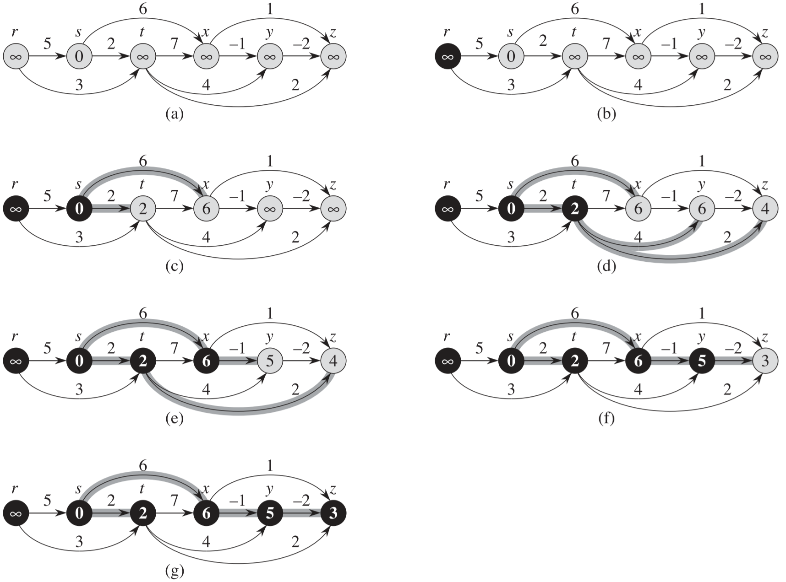
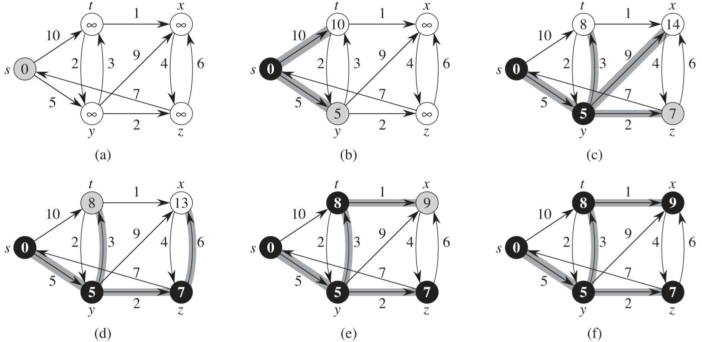

## 0 一些概念

**广度优先搜索与最短路径**

> 广度优先搜索算法就是一个求取最短路径的算法，但该算法只能用于无权重图，即每条边的权重都是单位权重的图。

**单源最短路径问题**

> 给定一个图 $G=(V, E)$，我们希望找到从给定源结点 $s \in V$ 到每个结点 $v \in V$ 的最短路径。

**最短路径的最优子结构**

> 最短路径算法通常依赖最短路径的一个重要性质：两个结点之间的一条最短路径包含着其他的最短路径。即**最短路径的子路径也是最短路径**。

**负权重的边**

单源最短路径问题可以包含权重为负值的边，但是不能包含从源结点可以到达的权重为负值的环路，因为可以在那个环路一直绕，使最短路径为 $-\infty$。

**环路**

最短路径中不应该包含任何环路(不管是权重为正还是为负的环路)，因此，如果最短路径包含 |V|个顶点，那么它最多包含|V|-1条边。

**最短路径的表示**

> 在通常情况下，我们不但希望计算出最短路径的权重，还希望计算出最短路径上的结点。给定图 $G=(V, E)$，对于每个结点 v，我们维持一个前驱结点 $v.\pi$。该前驱结点可能是另一个结点或者 NIL。将从结点 v 开始的前驱结点链反转过来，就是从 s 到 v 的一条最短路径。
>
> **最短路径树**
>
> 非形式化地说，最短路径树是一颗有根结点的树，该树包含了从源结点 s 到每个可以从 s 到达的结点的一条最短路径。需要指出的是，最短路径不一定是惟一的，最短路径树也不一定是唯一的。

**松弛操作**

我们使用 $v.d$ 来记录从源结点 s 到结点 v 的最短路径权重的上界，我们称 $v.d$ 为 s 到 v 的**最短路径估计**。通常在计算最短路径算法开始时，$v.d$ 都被设置为 $\infty$，松弛操作就是寻找适当的边来减小 $v.d$。

下图是对边(u, v)进行松弛操作的示例。图 a 中，因为松弛操作前有 $v.d > u.d + w(u, v)$，因而 $v.d$ 的值减小。图 b 中松弛操作前有 $v.d \leqslant u.d + w(u, v)$，因此松弛操作维持 v.d 的取值不变。

注意：松弛是**唯一**导致最短路径估计和前驱结点发生变化的操作。

***最短路径和松弛操作的性质**

> **三角不等式性质**：对于任何边 $(u, v) \in E$，我们有 $\delta(s, v) \leqslant \delta(s, u) + w(u, v)$。
>
> **上界性质**：对于所有的结点 $v \in V$，我们总是有 $v.d \geqslant \delta(s, v)$。一旦 $v.d$ 的取值达到 $\delta(s, v)$，其值将不再发生变化。
>
> **非路径性质**：如果从结点 $s$ 到结点 $v$ 之间不存在路径，则总是有 $v.d  = \delta(s, v) = \infty$。
>
> **收敛性质**：对于某些结点 $u，v \in V$，如果 $s \leadsto u \rightarrow v$ 是图 G 中的一条最短路径，并且在对边 $(u, v)$ 进行松弛前的任意时间有 $u.d = \delta(s, u)$，则在之后的所有时间有 $v.d = \delta(s, v)$。
>
> **路径松弛性质**：如果 $p=<v_0, v_1, ... , v_k>$ 是从源结点 $s=v_0$ 到结点 $v_k$ 的一条最短路径，并且我们对 $p$ 中的边所进行松弛的次序为 $(v_0, v_1), (v_1, v_2), ... , (v_{k-1}, v_k)$，则 $v_k.d=\delta(s, v_k)$。该性质的成立与任何其他的松弛操作无关，即使这些松弛操作是对 $p$ 上的边所进行的松弛操作穿插进行的。
>
> **前驱子图性质：**对于所有几点 $v \in V$，一旦 $v.d = \delta(s, v)$，则前驱子图是一棵根结点为 $s$ 的最短路径树。

**概要**

Bellman-Ford 算法可以允许有负边权的边，并且可以侦测是否存在从源结点可以到达的权重为负值的环路。

Dijkstra 算法要求所有边的权重为非负值。

## 1 Bellman-Ford(贝尔曼福德) 算法

> Bellman-Ford 算法解决的是一般情况下的单源最短路径问题，在这里，边的权重可以为负值。给定带权重的有向图 $G=(V, E)$ 和权重函数 $w: E\rightarrow R$，Bellman-Ford 算法返回一个布尔值，如果返回 $FALSE$ 则表明有从源结点可达的权重为负的环路，否则返回 $TRUE$ 表示已经计算出最短路径和它们的权重。

**算法步骤**

- 步骤**化结点属性：对除源结点 $s$ 外的所有结点 $v$，令 $v.d = \infty$，$v.\pi = NIL$，$s.d = 0$。
- 对图的每条边进行 $|V| -1$ 次松弛操作
- 检查图中是否有权重为负值的环路

**算法执行过程**

如下图所示，源结点为 $s$，结点中的数值为该结点的 $d$ 值，加了阴影的边表示前驱值：如果边 $(u, v)$ 加了阴影，则 $v.\pi = u$。

需要注意的是，在对每条边进行 $|V| -1$ 轮松弛操作的过程中，每一轮松弛操作的顺序都是一样的，这里每一轮松弛操作对边的处理顺序为：$(t, x), \space (t, y),  \space (t, z),  \space (x, t),  \space (y, x),  \space (y, z),  \space (z, x),  \space (z, s),  \space (s, t),  \space (s, y)$。

- a：松弛前的状态，除 $s$ 外的所有结点 $v$，令 $v.d = \infty$，$v.\pi = NIL$，$s.d = 0$
- b：第一轮松弛，依次松弛前 8 条边，即$(t, x), \space (t, y),  \space (t, z),  \space (x, t),  \space (y, x),  \space (y, z),  \space (z, x),  \space (z, s)$ 的过程中，由于每条边的出发结点都是 $\infty$ ，且边的权重都是有限值，所以相加结果还是 $\infty$，没有改变前驱子图；当最后松弛边 $\space (s, t),  \space (s, y)$ 时，$t.d$ 和 $y.d$ 都被减小了，所以 $t.d = s.d + w(s, t) = 0 + 6 = 6$，$y.d = s.d + w(s, y) = 0 + 7 = 7$；同时改变 t 和 y 的前驱结点为 s，即 $t.\pi = s$，$y.\pi=s$
- c：第二轮松弛，和第一轮松弛一样，按照同样的顺序处理边。这一轮松弛发现了边 $(t, z)$ 和 $(y, x)$ 可以改变最短路径估值(同时也改变了前驱子图)。
- d：第三轮松弛，这一轮松弛发现了边 $(x, t)$ 可以改变最短路径估值(同时也改变了前驱子图)，注意这里 $t.\pi$ 原来是 s，现在被替换为了 x。
- e：第四轮松弛，这一轮松弛没有发现能够改变任何结点的最短路径估值的边。

**为什么松弛的轮数为 |V| - 1**

因为在一个有 |V| 个结点的图中，最复杂的路径[^1]就是包含所有结点的简单路径，由于是简单路径，所以不存在环路，因此这条路径最多包含 |V|-1 条边。假设图中包含一条有 |V|-1 条边的最短路径，那么**第1轮松弛可以确定只包含1条边的最短路径[^2]**；同样，第2轮松弛可以确定包含2条边的最短路径；以此类推，直到在第 |V|-1 轮松弛中确定了包含|V|-1 条边的最短路径。 

然而，可能不存在包含|V|-1 条边的最短路径，例如上图中的例子就是，在最后一轮松弛操作中，每个结点的最短路径估值和前驱子图都未发生变化，因为它不包含|V|-1 条边的最短路径。

**时间复杂度**

$\Omicron(VE)$

 

## 2 有向无环图中的单源最短路径问题

Bellman-Ford算法可以用于可以有环的普通图，如果是有向**无环**图，可以有更快的方法来计算单源最短路径，即**有向无环图单源最短路径算法**[^3]。

**算法执行步骤**

有向无环图单源最短路径算法(DAG-Shortest-Paths)的执行步骤如下：

1. 对图中的所有结点做拓扑排序
2. 初始化所有结点，即 $v.d=\infty, v.\pi=NIL, s.d=0$
3. 按拓扑排序的顺序对结点进行处理，根据结点的邻接链表来松弛边

**算法示例**

下图是一个有向无环图单源最短路径算法示例，执行过程如下：

- 图a：拓扑排序后的情形
- 图b：对结点 r 的邻接矩阵中的所有边进行松弛，因为 $r.d=\infty$，加上有限值边权仍然是 $\infty$，所以松弛没产生效果
- 图c：对结点 s 的邻接矩阵中的所有边进行松弛，因为 $s.d=0$，加上有限值边权为有限值，小于原来的 $\infty$，所以松弛产生了效果，并产生了两条最短路径树边，边 $(s,t)$ 和边 $(s,x)$
- 图d：对结点 t 的邻接矩阵中的所有边进行松弛，松弛产生了效果，产生了两条最短路径树边，边 $(t,y)$ 和边 $(t,z)$
- 图e：对结点 x 的邻接矩阵中的所有边进行松弛，松弛产生了效果，更新了一条最短路径树边，边 $(t, y)$ 被更新为边 $(x, y)$
- 图f：对结点 y 的邻接矩阵中的所有边进行松弛，松弛产生了效果，更新了一条最短路径树边，边 $(t, z)$ 被更新为边 $(y, z)$
- 图g：对结点 z 的邻接矩阵中的所有边进行松弛，因为结点 z 的邻接链表为空，所以没有进行松弛操作，

注意，上图中因为源结点 s 无法到达结点 r，所以算法执行完后仍然有：$r.d=\infty$。

**时间复杂度**

$\Theta(V+E)$，明显快于Bellman-Ford算法($\Omicron(VE)$)

**应用**

> 可以用于求 PERT 图(一种有向无环图)的关键路径，关键路径是该有向无环图中一条最长的路径，该条路径代表任何工作序列所需要的的最长时间。
>
> 可以用下面两种办法了求 PERT 图中的关键路径(最长路径)：
>
> - 将所有权重变为负数，然后运行**有向无环图单源最短路径算法**，负数最短路径即相应正数的最长路径。
> - 运行**有向无环图单源最短路径算法**，但进行如下修改：在初始化结点步骤，将 $\infty$ 替换为 $-\infty$，在松弛过程中将比较中的大于号改为小于号。

## 3 Dijkstra 算法

与有向无环图中的单源最短路径问题类似，Dijkstra 算法同样对图有更特殊的要求，有向无环图中的单源最短路径问题要求图是**无环**的，而 Dijkstra 算法要求图的**权重为非负值**。

**算法执行步骤**

Dijkstra 算法比较简单，不过需要借助最小优先队列来实现，执行步骤如下：

1. 初始化所有结点，即 $v.d=\infty, v.\pi=NIL, s.d=0$
2. 已处理结点集合 $S=\varnothing$，未处理结点集合(最小优先队列) $Q=G.V$
3. 每次从 $Q$ 中取出结点 $u$，要求 $u.d$ 为所有结点中最小的；然后将 $u$ 加入 $S$，并对 结点 $u$ 的邻接链表中的所有边进行松弛。直到 $Q=\varnothing$

**算法示例**

下图是一个 Dijkstra 算法示例，执行过程如下：

- 图a：从 $Q$ 中取出结点 $s$，因为 $s.d=0$，其他结点的 $d$ 值为 $\infty$，所以取出的是结点 $s$。
- 图b：对结点 $s$ 的邻接链表中的所有边进行松弛，且松弛产生了效果，产生了两条最短路径树边，边 $(s,t)$ 和边 $(s,y)$。接着再从 $Q$ 中取出结点 $y$，因为 $y.d=5$ 是 $Q$ 中的最小 $d$ 值。
- 图c：对结点 $y$ 的邻接链表中的所有边进行松弛，且松弛产生了效果，产生了两条最短路径树边，边 $(y,x)$ 和边 $(y,z)$，更新了一条最短路径树边，边 $(s,t)$ 被更新为边 $(y,t)$。接着再从 $Q$ 中取出结点 $z$，因为 $z.d=7$ 是 $Q$ 中的最小 $d$ 值。
- 图d：对结点 $z$ 的邻接链表中的所有边进行松弛，且松弛产生了效果，更新了一条最短路径树边，边 $(y,x)$ 被更新为边 $(z,x)$。接着再从 $Q$ 中取出结点 $t$，因为 $t.d=8$ 是 $Q$ 中的最小 $d$ 值。
- 图e：对结点 $t$ 的邻接链表中的所有边进行松弛，且松弛产生了效果，更新了一条最短路径树边，边 $(z,x)$ 被更新为边 $(t,x)$。接着再从 $Q$ 中取出结点 $x$，$x$ 已经是 $Q$ 中的最后一个结点。
- 图f：对结点 $t$ 的邻接链表中的所有边进行松弛，松弛没产生效果。最终 $S=G.V$，$Q=\varnothing$，算法结束。

**时间复杂度分析**

> **Dijkstra 算法的总运行时间依赖于最小优先队列的实现**，下面是3种不同实现对应的时间复杂度
>
> 1. **数组**：$\Omicron(V^2+E)=\Omicron(V^2)$
> 2. **二叉堆**：$\Omicron((V+E)\lg V)$
> 3. **Fibonacci 堆**：$\Omicron(V\lg V+E)$
>
> ***历史**
>
> Fibonacci 堆提出的动机就是因为人们观察到 Dijkstra 算法调用的 DECREASE-KEY 操作通常比 EXTRACT-MIN 操作更多，因此，任何能够将 DECREASE-KEY 操作的摊还代价降低到 $\omicron(\lg V)$ 而又不增加 EXTRACT-MIN 操作的摊还代价的方法都将产生比二叉堆的渐进性能更优的实现。
>
> **小总结**
>
> 对于需要利用最小优先队列的算法，时间复杂度很可能依赖于最小优先队列的实现，因为对于一些最小优先队列的操作，不用实现由不同性能。

[^1]: 这里的指包含结点数最多的路径
[^2]: 因为源结点 $s$ 的最短路径估值，即 $s.d = 0$，所以第1轮松弛可以确定 s 能到达的结点的最短路径估值(即d值)，所以可以确定边数为1的最短路径

[^3]: 自己取的名字，因为这个算法没有简称或者以人名命名的名称