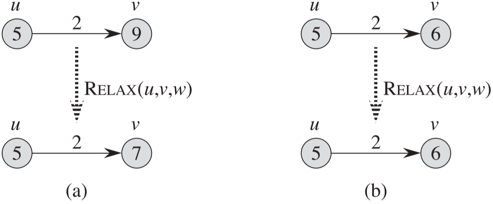

## 0 一些概念

**广度优先搜索与最短路径**

> 广度优先搜索算法就是一个求取最短路径的算法，但该算法只能用于无权重图，即每条边的权重都是单位权重的图。

**单源最短路径问题**

> 给定一个图 $G=(V, E)$，我们希望找到从给定源结点 $s \in V$ 到每个结点 $v \in V$ 的最短路径。

**最短路径的最优子结构**

> 最短路径算法通常依赖最短路径的一个重要性质：两个结点之间的一条最短路径包含着其他的最短路径。即**最短路径的子路径也是最短路径**。

**负权重的边**

单源最短路径问题可以包含权重为负值的边，但是不能包含从源结点可以到达的权重为负值的环路，因为可以在那个环路一直绕，使最短路径为 $-\infty$。

**环路**

最短路径中不应该包含任何环路(不管是权重为正还是为负的环路)，因此，如果最短路径包含 |V|个顶点，那么它最多包含|V|-1条边。

**最短路径的表示**

> 在通常情况下，我们不但希望计算出最短路径的权重，还希望计算出最短路径上的结点。给定图 $G=(V, E)$，对于每个结点 v，我们维持一个前驱结点 $v.\pi$。该前驱结点可能是另一个结点或者 NIL。将从结点 v 开始的前驱结点链反转过来，就是从 s 到 v 的一条最短路径。
>
> **最短路径树**
>
> 非形式化地说，最短路径树是一颗有根结点的树，该树包含了从源结点 s 到每个可以从 s 到达的结点的一条最短路径。需要指出的是，最短路径不一定是惟一的，最短路径树也不一定是唯一的。

**松弛操作**

我们使用 v.d 来记录从源结点 s 到结点 v 的最短路径权重的上界，我们称 v.d 为 s 到 v 的**最短路径估计**。通常在计算最短路径算法开始时，v.d 都被设置为 $\infty$，松弛操作就是寻找适当的边来减小 v.d。

下图是对边(u, v)进行松弛操作的示例。图 a 中，因为松弛操作前有 v.d > u.d + w(u, v)，因而 v.d 的值减小。图 b 中松弛操作前有 v.d <= u.d + w(u, v)，因此松弛操作维持 v.d 的取值不变。

注意：松弛是**唯一**导致最短路径估计和前驱结点发生变化的操作。