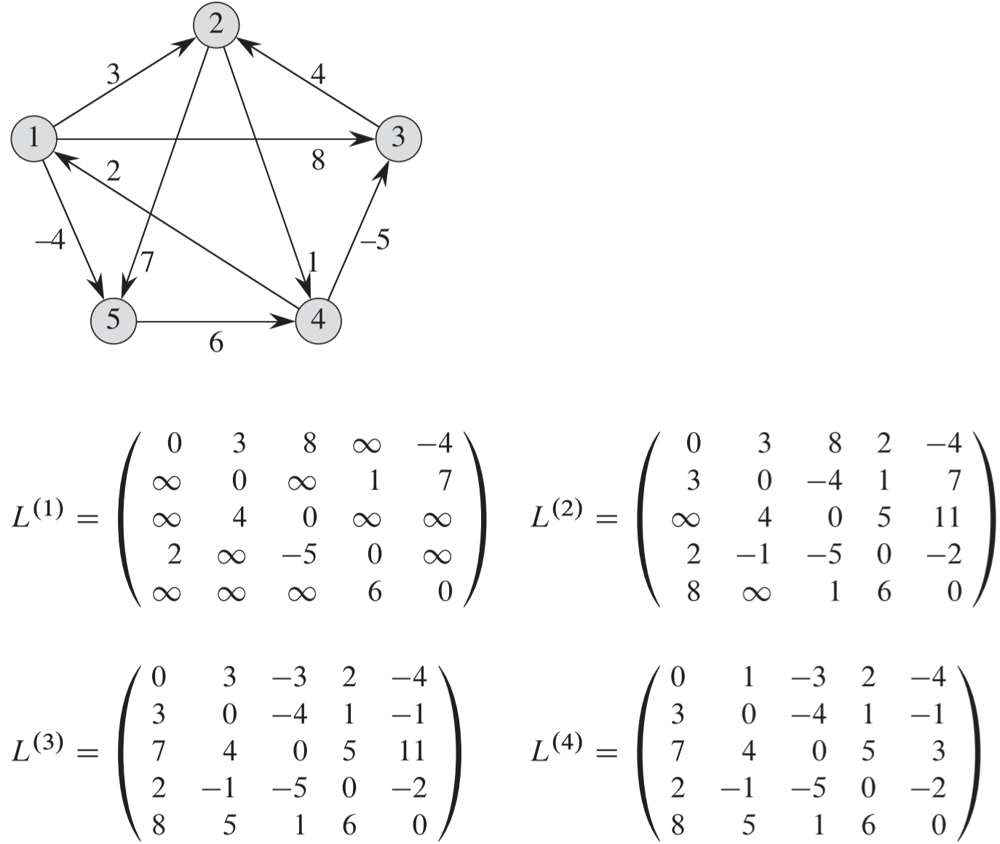
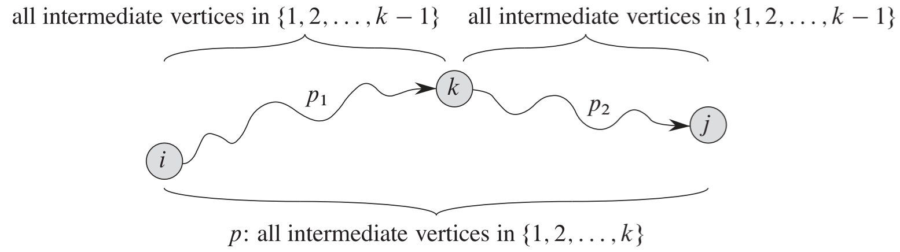
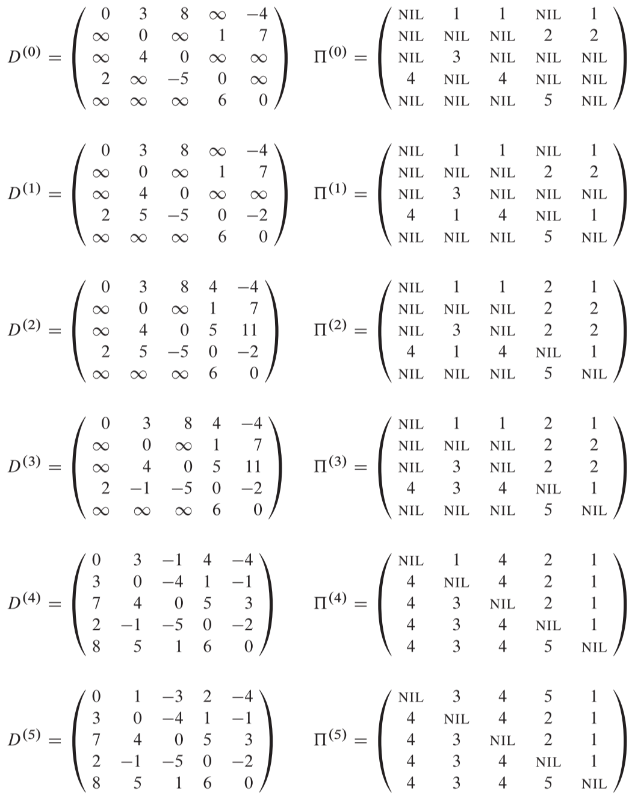
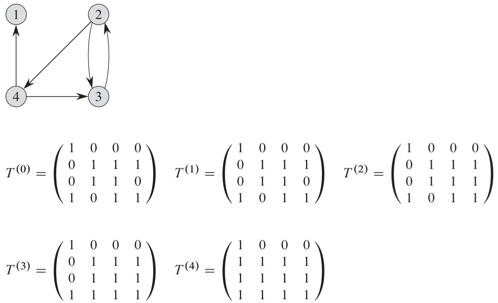

## 0 简介

**问题描述**

> 给定一个带权重的有向图 $G=(V,E)$，其权重函数为 $w: E\rightarrow R$，该函数将边映射到实数值的权重上。我们希望找到，对于所有的结点对$u, v\in V$，一条从结点 $u$ 到结点 $v$ 的最短路径，其中一条路径的权重为组成该路径的所有边的权重之和。
>
> 我们通常希望以表格的形式来表示输出：第 $u$ 行 第 $v$ 列给出的是结点 $u$ 到结点 $v$ 的最短路径权重。

**传统方法**

> 我们可以通过运行|V|次单源最短路径算法来解决所有结点对之间的最短路径问题，每一次使用一个不同的结点作为源结点。如果所有的边的权重为非负值，那么可以使用 Dijkstra 算法，否则我们必须使用效率更低的 Bellman-Ford 算法。
>
> - 如果能使用 Dijkstra 算法，则时间复杂度取决于最小优先队列的实现：
>
>   数组：$\Omicron(V^3+VE) = \Omicron(V^3)$
>
>   二叉堆：$\Omicron(VE\space \lg V)$
>
>   斐波那契堆：$\Omicron(V^2\space \lg V+VE)$
>
> - 如果使用 Bellman-Ford 算法：
>
>   时间复杂度为 $\Omicron(V^2E)$，在稠密图的情况下，为 $\Omicron(V^4)$
>
> 本章将介绍比上面两种算法更快的算法。

**权重矩阵**

> 算法的输入通常是一个 $n \times n$ 的矩阵 $W$，该矩阵代表的是一个由 $n$ 个结点的有向图 $G=(V, E)$ 的边的权重。也就是说，$W=(w_{ij})$，其中
>
> $w_{ij} = \left\{\begin{array} \\ 0 & 若\space i=j \\ 有向边(i,j)的权重 & 若 \space i \neq j \space 且(i,j) \in E \\ \infty & 若 \space i\neq j \space  且(i,j)\notin E \end{array}\right.$

## 1 最短路径和矩阵乘法

**算法思路浅析**

如下图所示，$L^{(1)}$ 表示包含1条边的最短路径；$L^{(2)}$ 表示包含2条边的最短路径，如果 $L^{(2)}$ 矩阵中某个位置有更小的值，则覆盖 $L^{(1)}$ 中那个位置的值；$L^{(3)}$ 和 $L^{(4)}$ 也做类似操作。由于包含 $n$ 个结点的图的最短路径最多包含 $n-1$ 条边，所以由于下图包含5个结点，所以只需要求包含4条边的最短路径即可，即 $L^{(4)}$ 就是最终解。

**时间复杂度**

$\Theta(V^4)$

然而，可以对算法进行改进，仅用 $\lceil\lg (n-1)\rceil$ 个矩阵乘积来计算 $L^{(n-1)}$，改进后的时间复杂度为

$\Theta(V^3 \lg V)$

## 2 Floyd-Warshall(弗洛伊德) 算法

**算法条件**

可以存在负权重的边，但是不能存在权重为负的环路；可以看出条件比较宽松，类似 Bellman-Ford 算法的条件。

**算法关键思想**

对任意两个结点间的最短路径，从没有中间结点的情况开始，不断扩大中间结点的范围，直到中间结点的范围达到图的所有结点。

如下图所示，对于任意结点对 $i$ 和 $j$，我们首先求 $i$ 和 $j$ 之间不包含任何中间结点的情况，即最短路径 $\delta(i, j)= w(i, j)$，然后我们逐渐尝试扩大中间结点的范围，例如我们允许 $i$ 和 $j$ 之间可以包含 $\{k\}$，那么可能存在路径 $i\leadsto k$ 和 路径 $k\leadsto j$，假如都存在，那么 $\delta(i, j)$ 就被更新为 $w(i, j)$ 与 $\delta(i, k)+\delta(k,j)$ 之间较小的一个；当然，虽然 $i$ 和 $j$ 之间可以包含 $\{k\}$，但是不一定包含 $k$，即不同时存在路径 $i\leadsto k$ 和 路径 $k\leadsto j$，那么 $\delta(i, j)$ 就不被更新，依然等于 $w(i,j)$。然后，我们再加入一个允许的中间结点 $l$，即允许 $i$ 和 $j$ 之间可以包含 $\{k, l\}$，我们可以做同样的比较和选择，且由于前面已经求出了包含 $\{k\}$ 的情况的最短路径，当加入 $l$ 时，需要比较的数据都已经计算过并保存了，所以能使用自底向上的动态规划方法。然后我们重复上面的过程，直到允许 $i$ 和 $j$ 之间允许的中间结点为图中的全部结点，即 $V$，这样就求出了最终结果。

上面的描述可以表示为下面的公式

> $d^{(k)}_{ij}=\left\{\begin{array} \\w_{ij} & 若 \space k=0 \\min(d^{(k-1)}_{ij},d^{(k-1)}_{ik}+d^{(k-1)}_{kj}) & 若\space k\geqslant 1\end{array}\right.$ 

**算法执行步骤**

1.  $D^{(0)}$ 表示不存在中间结点的情况，这时刚好等于图的权重矩阵 $W$
2. $D^{(1)}$ 表示最短路径可以包含中间结点 $\{v_1\}$ 的情况，由于求解 $D^{(1)}$ 只需依赖 $D^{(0)}$，而 $D^{(0)}$ 已在第 1 步中求解，所以 $D^{(1)}$ 也能顺利求解
3. $D^{(2)}$ 表示最短路径可以包含中间结点 $\{v_1, v_2\}$ 的情况，同样，由于求解 $D^{(2)}$ 只需依赖 $D^{(1)}$，而 $D^{(1)}$ 已在第 2 步中求解，所以 $D^{(2)}$ 也能顺利求解
4. $D^{(3)}$、$D^{(4)}$ 和 $D^{(5)}$ 也同理可以求解，由于 $D^{(5)}$ 已经允许中间结点包含了所有结点(即 $V$)，所以算法在此结束

另外，在算法执行的同时，还在不断更新前驱矩阵 $\Pi$，以构造前驱子图。

**Floyd-Warshall 算法的时间复杂度**

$\Theta(V^3)$

**Floyd-Warshall 算法的应用-有向图的传递闭包**

> 给定有向图 $G=(V, E)$，结点集合为 $V=\{1,\space 2,\space  ..., \space  n\}$，我们希望判断对于所有的结点对 $i$ 和 $j$，图 $G$ 是否包含一条结点 $i$ 到结点 $j$ 的路径。我们定义图 $G$ 的**传递闭包**为 $G^*=(V, E^*)$，其中 $E^*=\{(i, j): \space 如果图 G 中包含一条从结点 i 到结点 j 的路径\}$。

我们可以使用 Floyd-Warshall 算法来求解传递闭包，如上面的矩阵图中，最终求解结果为 $D^{(5)}$，该矩阵中如果第 $i$ 行，第 $j$ 列位置的值既不是0也不是 $\infty$，那么说明存在从结点 $i$ 到结点 $j$ 的路径。

进一步，由于传递闭包不关心路径的长度，只关心存不存在路径，所以可以改进一下 Floyd-Warshall 算法，使用逻辑或操作($\or$)和逻辑与操作($\and$)来替换 Floyd-Warshall 算法中的算术操作 min 和 +。这样可以节省时间和空间，尽管时间复杂度同样是 $\Theta(n^3)$。如下图所示，Floyd-Warshall 算法被简化为用1表示存在路径，而用0表示不存在路径。

## 3 用于稀疏图的 Johnson 算法

> 对于稀疏图来说，Johnson 算法的渐进表现要优于复平方和 Floyd-Warshall 算法。Johnson 算法要么返回一个包含所有结点对的最短路径权重的矩阵，要么报告输入图包含一个权重为负值的环路。Johnson 算法在运行中需要使用 Dijkstra 算法和 Bellman-Ford 算法作为自己的子程序。
>
> Johnson 算法使用的技术成为**重新赋予权重**。该技术的工作原理如下：如果图 $G=(V, E)$ 中所有的边权重 $w$ 皆为非负值，我们可以通过对每个结点运行一次 Dijkstra 算法来找到所有结点对之间的最短路径；如果使用斐波那契堆最小优先队列，该算法的运行时间为 $\Omicron(V^2\lg V+VE)$。**如果图 G 包含权重为负值的边，但没有权重为负值的环路，那么只要计算出一组新的非负权重值，然后使用同样的方法(即 Dijkstra 算法)即可**。新赋予的权重 $\hat{w}$ 必须满足下面两个重要性质：
>
> 1. 对于所有结点对 $u, v \in V$，一条路径 $p$ 是在使用权重函数 $w$ 时从结点 $u$ 到结点 $v$ 的一条最短路径，当且仅当 $p$ 是在使用权重函数 $\hat{w}$ 时从 $u$ 到 $v$ 的一条最短路径。
> 2. 对于所有的边$(u, v)$，新权重 $\hat{w}(u, v)$ 为非负值。

 **Johnson 算法执行步骤**

可以分为下面三个大的步骤：

- 一：生成新图，并通过重新赋值来生成非负权重，这个步骤最为复杂，包含下面几个步骤(参见下图的图a 和图b)：
  1. 创建新图：新增结点 $s$ ，以及对所有结点 $v\in V$，新增边$(s, v)$，权重都为0
  2. 使用 Bellman-Ford 算法检查是否存在负权重的环路
  3. 使用 Bellman-Ford 算法计算 s 到每个结点的最短路径，并将其存放到结点中
  4. 为所有边重新赋非负边权值
- 二：对新图每个结点使用 Dijkstra 算法计算最短路径(参见下图的图c-g)
- 三：将新图计算的结果转换为原图的结果(可以通过下图c-g中的结点中“/”右边的值即为转换后的结果)

**通过重新赋值来生成非负权重过程**

如下图所示的图a 和图b 即重新赋值非负权重的过程

- 图a：在原来的图 G 中加入一个结点 $s$，这里是黑色结点，然后对 G 中的所有结点 $v$，都新增边$(s, v)$，且设置 $w(s, v)=0$；然后计算 $s$ 到每个结点的最短路径 $\delta(s, v)$，并将最短路径权重存放在结点 $v$ 中；设最终得到的为图 G'。
- 图b：对图a 中得到的图 G' 中的每条边进行重新赋值，新的权重 $\hat{w}(u,v)=w(u,v)+h(u)-h(v)$，其中 $h(u)$，$h(v)$ 就是  $\delta(s, u)$ ， $\delta(s, v)$ 的权重，这个已经在图a 中计算出来了；最终所有的边权重都被重新赋值为非负值了。

**时间复杂度**

由于算法使用到了 Dijkstra 算法，所以时间复杂度依赖于最小优先队列的实现：

**Fibonacci 堆**：$\Omicron(V^2\lg V+VE)$

**二叉堆**：$\Omicron(VE\lg V)$

在稀疏图中，两种实现都比 Floyd-Warshall 算法的时间表现好。