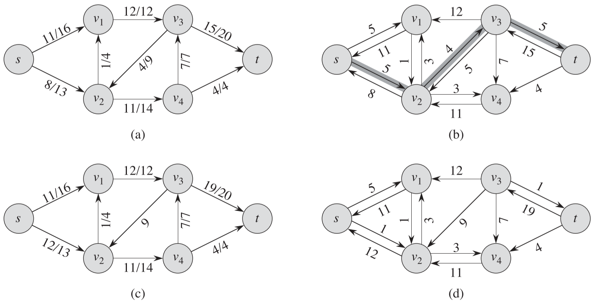
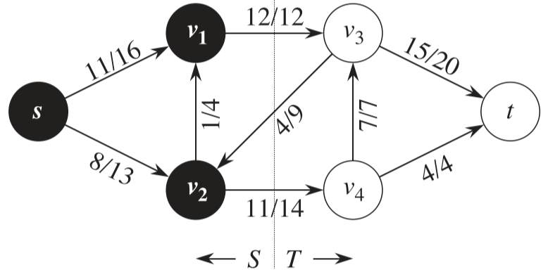
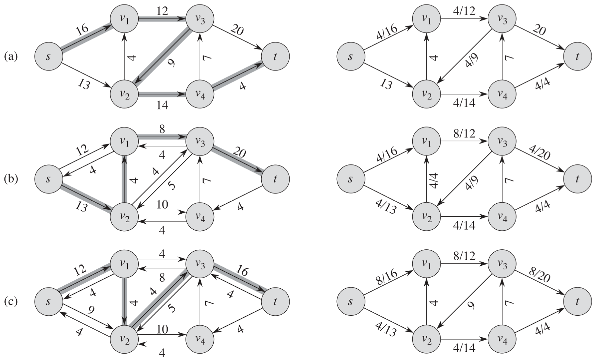
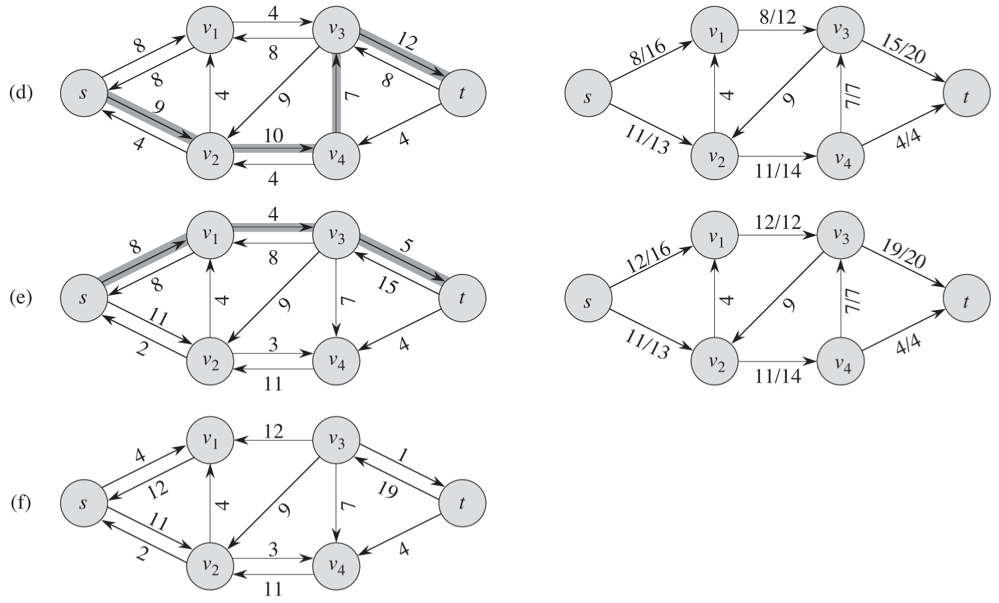
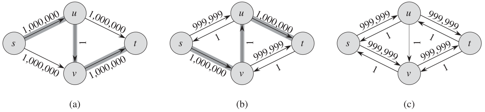
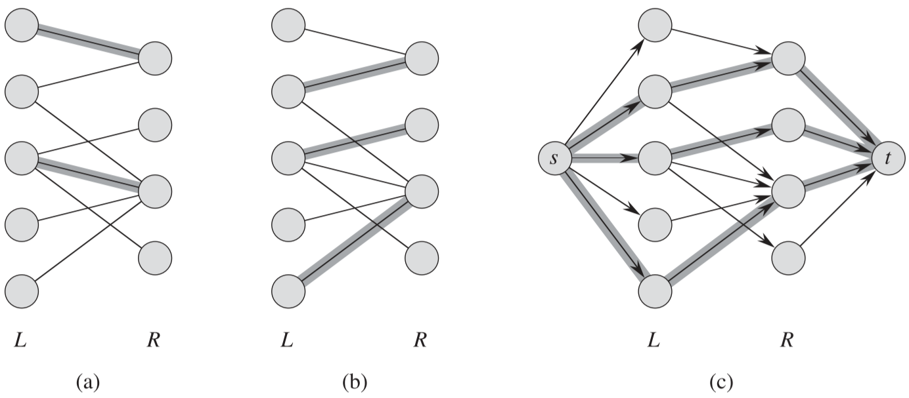

## 1 流网络的一些概念

> **流网络** $G=(V, E)$ 是一个有向图，图中每条边 $(u, v) \in E$ 有一个非负的**容量值** $c(u, v) \geqslant 0$。而且，如果边集合 E 包含一条边 $(u, v)$，则图中不存在反向边$(v, u)$。如果$(u, v) \notin E$，则为方便起见，定义 $c(u, v) = 0$，并且在图中不允许自循环。
>
> **源结点和汇点**：我们特别分辨出两个特殊结点：**源结点** $s$ 和**汇点** $t$。为了方便起见，假设每个结点都在从源结点到汇点的某条路径上。也就是说，对于每个结点 $v \in V$，流网络都包含一条路径 $s \leadsto v \leadsto t$。因此，**流网络图是连通的**。并且由于除源结点外的每个结点都至少有一条进入的边，我们有 $|E|\geqslant |V|-1$。下图为一个流网络的例子：
>
> 

**流的形式化定义**

> 设 $G = (V, E)$ 为一个流网络，其容量函数为 $c$。设 $s$ 为网络的源结点，t 为汇点。G 中的**流**是一个实值函数 $f: V\times V \rightarrow R$，满足下面的两条性质：
>
> **容量限制**：对于所有的结点 $u, v \in V$，要求 $0 \leqslant f(u, v) \leqslant c(u, v)$。
>
> **流量守恒**：对于所有的结点 $u\in V-\{s, t\}$，要求
>
> ​							$\sum\limits_{v\in V}f(v,u)=\sum\limits_{v\in V}f(u,v)$ (**此等式可以理解为结点 u 的流入(左)等于流出(右)**)
>
> 当 $(u, v) \notin E$ 时，从结点 $u$ 到结点 $v$ 之间没有流，因此 $f(u, v) = 0$。
>
> **流 f 的值 |f| 的定义**：我们称非负数值 f(u, v) 为从结点 u 到结点 v 的流，一个流 f 的值 |f| 定义如下：
>
> ​							$|f| = \sum\limits_{v\in V}f(s,v)-\sum\limits_{v\in V}f(v,s)$
>
> 也就是说，流 f 的值是从源结点流出的总量减去流入源结点的总量。通常来说，一个流网络不会有任何进入源结点的边，因此，上面公式的 $\sum\limits_{v\in V}f(v,s)$ 将是 0。将其囊括在公式里的原因是后面讨论的残存网络需要考虑流入源结点的流量。

**使用反平行边来模拟问题**

如下图a 所示，如果由于实际原因，需要新增边 $(v_1, v_2)$，但是这违反了流网络的定义。

我们可以新增一个结点 $v‘$，并将边 $(v_1, v_2)$ 分为 $(v_1, v')$ 和 $(v', v_2)$ 两段，且容量都和 $(v_1, v_2)$ 相同，如图b 所示。

**具有多个源结点和多个汇点的网络**

一个最大流问题可能有多个源结点和多个汇点，如下图a 所示。

不过可以转换为单个源结点和单个汇点，如图b 所示，方法是加入一个超级源结点 $s$ 和超级汇点 $t$，然后加入有向边 $(s, s_i)，(s_i \in 原源结点集)$ 和有向边 $(t_i, t)，(t_i \in 原汇点集)$。

## 2 Ford-Fulkerson 方法

> 之所以称 Ford-Fulkerson “方法”，而不是“算法”，是因为它包含了几种运行时间各不相同的具体实现，Ford-Fulkerson 方法依赖于三种重要思想，它们与许多的流算法和问题有关，如残存网络、增广路径和切割。

**残存网络**

给定流网络 $G$，残存网络 $G_f$ 由 $G$ 计算出来。对于 $G$ 中的边 $(u, v)$， 其**残存容量** $c_f(u, v) = c(u, v) - f(u, v)$，如果 $c_f(u, v) > 0$，则在 $G_f$ 中加入一条边 $(u, v)$，容量为 $c_f(u, v)$；另外再加入一条反向边 $(v, u)$，且容量 $c_f(v, u) = f(u, v)$。

更形式化的说，假如有一个流网络 $G=(V,E)$，其源结点为 $s$，汇点为 $t$。设 f 为图 $G$ 中的一个流，考虑结点对 $u，v\in V$，定义残存网络 $c_f(u, v)$ 如下：

​										$c_f(u, v) = \left \{ \begin{array} \\ c(u,v)-f(u,v) & 若(u,v) \in E \\ f(v,u) & 若(v,u) \in E \\ 0 & 其他 \end{array}\right.$

如下图所示，图 b 即由图 a 构造的残存网络

> **递增**
>
> 如果 $f$ 是 $G$ 的一个流，$f'$ 是对应的残存网络 $G_f$ 中的一个流，定义 $f\uparrow f'$ 为流 $f’$ 对流 $f$ 的**递增**
>
> ​		$f\uparrow f'(u, v)=\left\{\begin{array} \\f(u,v)+f'(u,v)-f'(v,u) & 若(u,v)\in E \\ 0 & 其他 \end{array}\right.$
>
> 并且有下面的引理
>
> $|f\uparrow f'|=|f|+|f'|$

**增广路径**

> 给定流网络 $G=(V,E)$ 和流 $f$，增广路径 $p$ 是残存网络 $G_f$ 中一条从源结点 $s$ 到汇点 $t$ 的简单路径。根据残存网络的定义，对于一条增广路径上的边 $(u, v)$，我们可以增加其流量的幅度最大为 $c_f(u, v)$，而不会违反原始流网络 G 中对边 $(u, v)$ 或 $(v, u)$ 的容量限制。
>
> 如上图 b 中阴影覆盖的路径是一条增广路径。如果将图中的残存网络 $G_f$ 看做一个流网络，那么可以对这条路径上每条边的流量增加 4 个单位，而不会违反容量限制，因为该条路径上最小的残存容量是 $c_f(v_2, v_3)=4$。我们称在一条增广路径 $p$ 上能够为每条边增加的流量的最大值为**路径 $p$ 的残存容量**，该容量由下面的表达式给出：
>
> $c_f(p) = \min\{c_f(u,v):(u,v) 属于路径 p\}$
>
> 并且有下面的引理
>
> > 设 $G=(V,E)$ 为一个流网络，设 $f$ 为图 $G$ 中的一个流，设 $p$ 为残存网络 $G_f$ 中的一条增广路径。定义一个函数 $f_p: V\times V \rightarrow R$ 如下：
> >
> > $f_p(u,v)=\left \{ \begin{array} \\ c_f(p) & 若(u,v)在p上 \\ 0 & 其他 \end{array}\right. $
> >
> > 则 $f_p$ 是残存网络 $G_f$ 中的一个流，其值为 $|f_p| = c_f(p) >0$。
> >
> > 如果将流 $f$ 增加 $f_p$ 的量，则将获得 $G$ 的另一个流，该流的值更加接近最大值。
> >
> > 上面的图 c 所描述的是对图 a 的流 $f$ 增加图 b 所示的 $f_p$ 的量所获得的结果，而图 d 描述的则是由图 c 构造的残存网络 $G_f$。

**流网络的切割**

> 流网络 $G=(V,E)$ 中的一个切割 $(S, T)$ 将结点集合 $V$ 划分为 $S$ 和 $T=V-S$ 两个集合，使得 $s\in S, t\in T$。若 $f$ 是一个流，则定义横跨切割 $(S, T)$ 的**净流量** $f(S, T)$ 如下：
>
> $f(S,T)=\sum\limits_{u\in S}\sum\limits_{v\in T}f(u,v) - \sum\limits_{u\in S}\sum\limits_{v\in T}f(v,u)$
>
> 切割 (S, T) 的**容量**是：
>
> $c(S,T)=\sum\limits_{u\in S}\sum\limits_{v\in T}c(u,v)$

**切割示例**

如下图所示的切割

净流量为：$f(v_1,v_3)+f(v_2,v_4)-f(v_3,v_2) = 12+11-4=19$

切割的容量为：$c(v_1,v_3)+c(v_2,v_4) = 12+14=26$

**切割的性质**

> - 横跨任何切割的净流量都相同，都等于$|f|$，即流的值。
> - 一个最大流的值等于一个最小切割的容量。
> - 最大流最小切割定理：设 $f$ 为流网络 $G=(V,E)$ 中的一个流，该流网络的源结点为 $s$，汇点为 $t$，则下面的条件时等价的：
>   1. $f$ 是 $G$ 的一个最大流。
>   2. 残存网络 $G_f$ 不包括任何增广路径。
>   3. $|f|=c(S,T)$，其中 $(S,T)$ 是流网络 $G$ 的某个切割。

**基本的 Ford-Fulkerson 方法**

如下图所示，Ford-Fulkerson 算法的执行步骤为：

> 1. 对每条边的流量初始化为 0，如下图 a 左边部分即将流量初始化为 0 后的图，该图中每条边只有容量值，而没有流量值，因为流量值为 0。
> 2. 在残存网络中寻找增广路径，如图 a 左边部分所示，该图是输入图，同时也是一个残存网络。从图中标出的增广路径中可以得出 $c_f(p) = min(c_f(u, v): (u,v) \in p) = 4$，即增广路径中容量最小的边。
> 3. 对原来的流网络进行更新。即用第 2 步计算出来的 $c_f(p)$对增广路径上的所有边的流量进行更新，正向边加上 $c_f(p)$，反向边减去 $c_f(p)$。图 a 右边部分即更新后的流网络，可以看到在图 a 左边部分的增广路径上的边都有了等于 4 的流量。
> 4. 根据第 3 步的流网络再次计算残存网络，得到图 b 左边部分所示的残存网络。然后重复步骤1-3，直到计算出的残存网络中已经找不到增广路径了；如图 f 所示的残存网络，就找不到任何一条中 $s$ 到 $t$ 的路径了。

**Ford-Fulkerson 算法的分析**

> Ford-Fulkerson 算法的运行时间取决于算法是如何寻找增广路径的，如果选择不好，算法可能不会终止：流的值会随着后续的递增而增加，但它却不一定收敛于最大的流值。如果使用广度优先搜索来寻找增广路径，算法的运行时间将是多项式数量级。
>
> 在实际情况中，最大流问题中的容量常常是整数。如果容量为有理数，则可以通过乘以某个系数来将其转换为整数。如果 $f^*$ 表示转换后网络中的一个最大流，则在 Ford-Fulkerson 方法中寻找增广路径的次数最多为 $|f^*|$ 次，**因为流量值在每次迭代中最少增加一个单位**。如果使用深度优先搜索或广度优先搜索，在一个残存网络中找到一条路径的时间应是 $\Omicron(E)$，从而 Ford-Fulkerson 方法的运行时间为 $\Omicron(E|f^*|)$j。

**Edmonds-Karp 算法**

如下图 a 所示，对于这样一个流网络，如果 Ford-Fulkerson 方法使用深度优先搜索的方式来寻找增广路径，如果第一条增广路径为 $s\rightarrow u \rightarrow v \rightarrow t$，则在第一次迭代后，流的值为 1。这样产生的残存网络如下图 b 所示，然后流的值将为 2，图 c 为对图 b 查找增广路径($s\rightarrow v \rightarrow u \rightarrow t$)后得到的流网络的残存网络。在每个奇数次迭代中，选择增广路径 $s\rightarrow u \rightarrow v \rightarrow t$，在每个偶数次迭代中，选择增广路径 $s\rightarrow v \rightarrow u \rightarrow t$，并如此继续下去。这样将一共执行 2000000 次递增操作，每次将流量增加 1 个单位。

显然针对这样一个流网络，使用上面常规的 Ford-Fulkerson 方法是低效的，因为如果选择增广路径时能选到  $s\rightarrow u \rightarrow t$ 和  $s\rightarrow v \rightarrow t$，那么只需要两次递增操作。Edmonds-Karp 算法就能实现这个目标，Edmonds-Karp 算法在寻找增广路径时使用广度优先搜索来改善 Ford-Fulkerson 方法的效率，这样选择的增广路径是一条送 s 到 t 的**最短路径**(假设其中每条边的权重为单位距离)。对于上图的流网络，广度优先搜搜得到的增广路径就会是   $s\rightarrow u \rightarrow t$ 和  $s\rightarrow v \rightarrow t$。我们称如此实现的 Ford-Fulkerson 方法为 **Edmonds-Karp 算法**。

**Edmonds-Karp 算法的时间复杂度**

$\Omicron(VE^2)$

## 3 最大流的应用-最大二分匹配

**二分图**

> 在一个二分图中，结点集合可以划分为 $V=L\bigcup R$，其中 L 和 R 是不相交的，并且边集合 E 中所有的边都横跨 L 和 R。

**最大匹配**

> 给定一个无向图 $G=(V, E)$，一个匹配是**边的一个子集** $M\subseteq E$，使得对于所有结点 $v \in V$，子集 M 中最多有一条边与结点 $v$ 相连。

如下图所示：

- 图 a 是一个二分图，其中两条加阴影的边表明这是一个基数为 2 的匹配。
- 图 b 是一个基数为 3 的匹配。
- 图 c 是二分图对应的流网络 G'， 图中显示的是最大流。

可以看出，当将二分图转换为流网络后 G' 后，求出 G' 的最大流就能求出对应二分图的最大匹配。

**寻找最大二分匹配的时间复杂度**

$\Omicron(VE)$