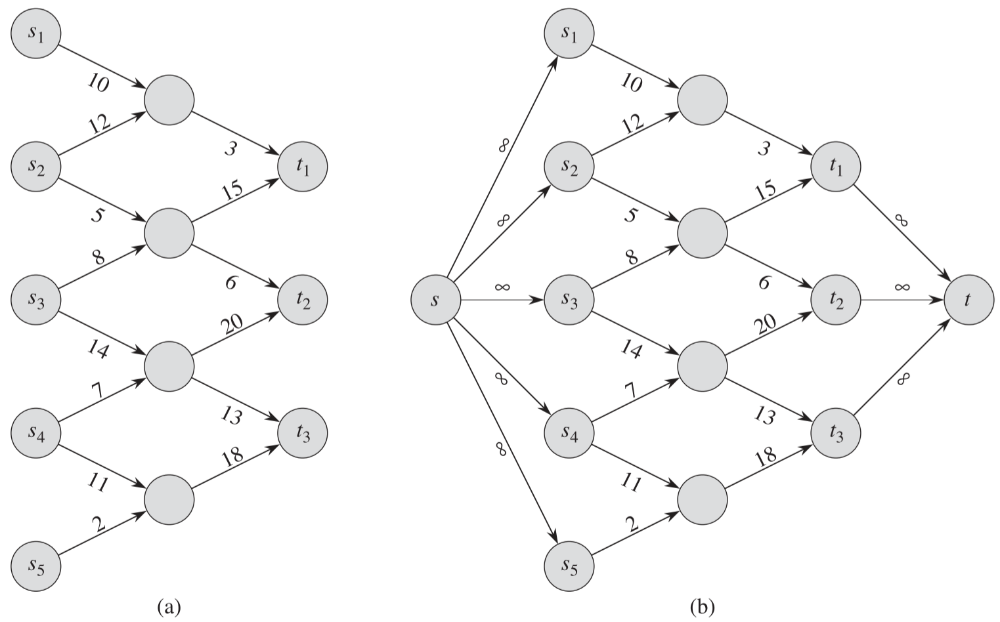

## 1 流网络的一些概念

> **流网络** $G=(V, E)$ 是一个有向图，图中每条边 $(u, v) \in E$ 有一个非负的**容量值** $c(u, v) \geqslant 0$。而且，如果边集合 E 包含一条边 $(u, v)$，则图中不存在反向边$(v, u)$。如果$(u, v) \notin E$，则为方便起见，定义 $c(u, v) = 0$，并且在图中不允许自循环。
>
> **源结点和汇点**：我们特别分辨出两个特殊结点：**源结点** $s$ 和**汇点** $t$。为了方便起见，假设每个结点都在从源结点到汇点的某条路径上。也就是说，对于每个结点 $v \in V$，流网络都包含一条路径 $s \leadsto v \leadsto t$。因此，**流网络图是连通的**。并且由于除源结点外的每个结点都至少有一条进入的边，我们有 $|E|\geqslant |V|-1$。下图为一个流网络的例子：
>
> 

**流的形式化定义**

> 设 $G = (V, E)$ 为一个流网络，其容量函数为 $c$。设 $s$ 为网络的源结点，t 为汇点。G 中的**流**是一个实值函数 $f: V\times V \rightarrow R$，满足下面的两条性质：
>
> **容量限制**：对于所有的结点 $u, v \in V$，要求 $0 \leqslant f(u, v) \leqslant c(u, v)$。
>
> **流量守恒**：对于所有的结点 $u\in V-\{s, t\}$，要求
>
> ​							$\sum\limits_{v\in V}f(v,u)=\sum\limits_{v\in V}f(u,v)$ (**此等式可以理解为结点 u 的流入(左)等于流出(右)**)
>
> 当 $(u, v) \notin E$ 时，从结点 $u$ 到结点 $v$ 之间没有流，因此 $f(u, v) = 0$。
>
> **流 f 的值 |f| 的定义**：我们称非负数值 f(u, v) 为从结点 u 到结点 v 的流，一个流 f 的值 |f| 定义如下：
>
> ​							$|f| = \sum\limits_{v\in V}f(s,v)-\sum\limits_{v\in V}f(v,s)$
>
> 也就是说，流 f 的值是从源结点流出的总量减去流入源结点的总量。通常来说，一个流网络不会有任何进入源结点的边，因此，上面公式的 $\sum\limits_{v\in V}f(v,s)$ 将是 0。将其囊括在公式里的原因是后面讨论的残存网络需要考虑流入源结点的流量。

**使用反平行边来模拟问题**

如下图a 所示，如果由于实际原因，需要新增边 $(v_1, v_2)$，但是这违反了流网络的定义。

我们可以新增一个结点 $v‘$，并将边 $(v_1, v_2)$ 分为 $(v_1, v')$ 和 $(v', v_2)$ 两段，且容量都和 $(v_1, v_2)$ 相同，如图b 所示。

**具有多个源结点和多个汇点的网络**

一个最大流问题可能有多个源结点和多个汇点，如下图a 所示。

不过可以转换为单个源结点和单个汇点，如图b 所示，方法是加入一个超级源结点 $s$ 和超级汇点 $t$，然后加入有向边 $(s, s_i)，(s_i \in 原源结点集)$ 和有向边 $(t_i, t)，(t_i \in 原汇点集)$。

