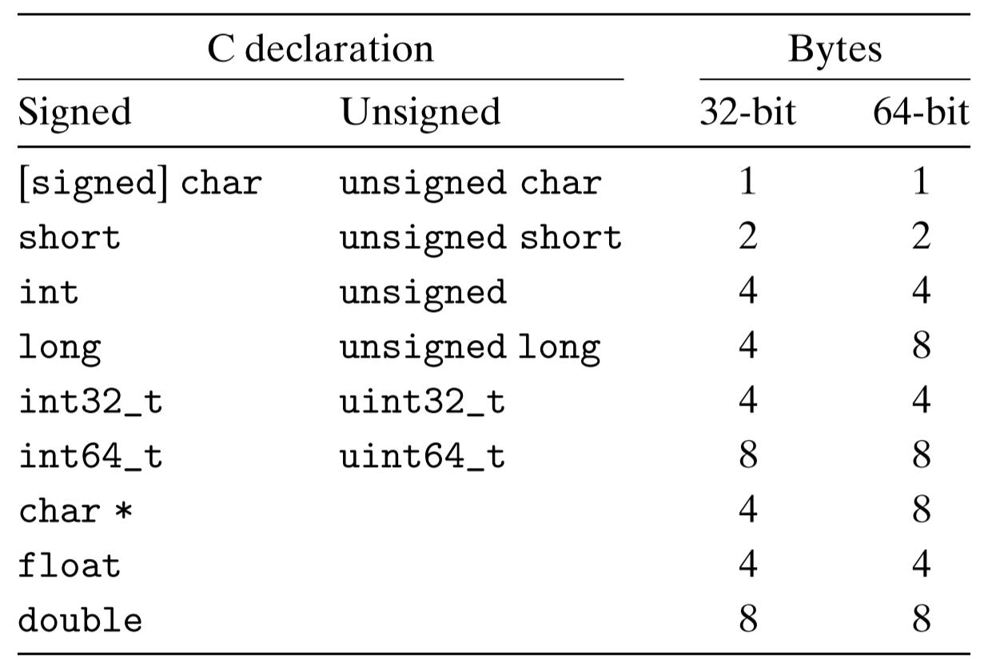
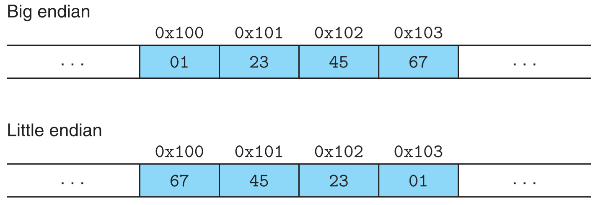

## 1 信息存储

> 大多数计算机使用 8 位的块，或者*字节*，作为最小的可寻址的内存单位，而不是访问内存中单独的位。机器级程序将内存视为一个非常大的字节数组，称为**虚拟内存**。内存的每个字节都由一个唯一的数字来标识，称为它的**地址**，所有可能地址的集合就称为**虚拟地址空间**。

### 1.1 字数据大小

> 每台计算机都有一个**字长**，指明指针数据的**标称大小**(指标准大小)。因为虚拟地址是以这样的一个字来编码的，所以字长决定的最重要的系统参数就是**虚拟地址空间的最大大小**。也就是说，对于一个长为 $w$ 位的机器而言，虚拟地址的范围为 $0\thicksim 2^w-1$，程序最多访问 $2^w$ 个字节。简而言之，就是**计算机的字长决定了寻址范围**。

**32 位程序和 64 位程序**

一个程序是 32 位还是 64 位和运行它的机器无关，区别在于该程序是如何编译的。例如，若使用下面命令编译一个 C 程序

`linux> gcc -m32 prog.c`

那么该程序可以在 32 位或 64 位机器上正确运行。若使用下面命令编译同样一个 C 程序

`linux> gcc -m64 prog.c`

那它只能在64位机器上运行。


**C 语言中的数据类型**

下图展示了 C 语言中的部分数据类型。可以看到，对于有些数据类型，在 32 位和 64 位机器上占用不同的字节数，例如 long 类型和 unsigned long 类型，还有 char* 类型，因为指针类型都是**全字长**的。



**关于 long 类型**

在 Windows 64 下，尽管将程序编译为 64 为程序，但是 long 类型仍然是 4 字节，原因如下：

> **一.c语言数据占用字节**
>
> 32位：char 1   short 2  int 4 long 4 long long 8
>
> 64位：char 1  short 2   int 4 long 8 long long 8
>
> **二.可能原因 编译器的数据模型**
>
> Datetype LP64  ILP64  LLP64  ILP32   LP32
>
> char      8      8     8       8      8
>
> short      16    16    16      16     16
>
> int        32    64    32      32     16
>
> long       64    64    32      32     32 
>
> long long   64
>
> pointer     64    64     64      32     32
>
> 一般情况下windows64位一般使用LLP64模型
>
> 64位Unix,Linux使用的是LP64模型


### 1.2 寻址和字节顺序

> 对于跨越**多个字节**的程序对象，我们必须建立两个规则：这个**对象的地址**是什么，以及在内存中**如何排列**这些字节。
>
> 在几乎所有的机器上，多字节对象都被存储为**连续的**字节序列，对象的地址为所使用字节中最小的地址。例如：有一个 int 类型的数据对象 x，它的地址为 0x100，由于 x 占用 4 个字节，所以 x 被存储在内存的 0x100、0x101、0x102 和 0x103 位置。

**大端法和小端法**

对于一个跨多个字节的对象，比如 C 中的 int 类型，占用 4 个字节，最低有效字节在最前面的方式，称为**小端法**，最高有效字节在最前面的方式，称为**大端法**。下图分别展示了使用大端法和小端法对同一个 int 类型的变量 x=0x01234567 的存储顺序。



大多数 Intel 兼容机都只用小端模式。IBM 和 Oracle 的大多数机器是按大端模式操作。许多比较新的超链接是**双端发**(bi-endian)，也就是说可以把它们配置成作为大端或小端的机器运行。然而，实际情况是：一旦选择了特定操作系统，那么字节顺序也就固定下来。比如，用于许多移动电话的 ARM 微处理器，其硬件可以按小端或大端两种模式操作，但是这些芯片上最常见的两种操作系统——Android 和 IOS——却只能运行于小端模式

**大/端法带来的问题**

1. 在大小端模式不同的机器上传输信息：比如一台大端模式的机器上产生的二进制对象数据被传输到一台小端模式的机器上就会出现问题。解决办法是：网络协议制定标准来约束二进制对象的传输顺序，比如规定必须按照大端模式来传送数据，那么发送方和接收方就知道对发送和接收的数据做必要的转换。

2. 在阅读机器级程序时，如果遇到整数，而且恰好使用的小端法。如下面代码所示，左边的机器码后面8位 43 0b 20 00 表示的是一个整数，但使用的小端法，所以需要反过来看，这会给阅读带来困难。

   `4004d3: 01 05 43 0b 20 00 		add 	%eax,0x200b43(%rip)`

3. 当编写规避正常的类型系统的程序时。在 C 语言中，可以通过使用强制类型转换或联合来允许以一种数据类型引用一个对象，而这种数据类型与创建这个对象时定义的数据类型不同。

小结：小端法用的比较多，大端法用于整数比较直观。需要注意的是，大端法和小端法针对的是一个不可拆分的对象，**但不一定是数值对象**，例如在 win64 Intel处理器环境中 C 语言的 int 变量，long int 变量，int64_t 变量，float 变量，double 变量和**指针变量**的存储都是小端法；但同样环境中的数组变量和字符串变量却不依赖于大端法和小端法，因为字符串实际上也是数组，所以只说说数组，数组中的每个元素的存储顺序都是按元素在数组中的顺序，而不是将整个数组当成一个大对象，然后按大/小端法顺序来存储字节，因为数组不是一个不可拆分的对象；但是如果数组的元素是不可拆分对象(例如 int 变量)，那么该元素会按照大/小端法来存储。具体测试看下面的代码

```c
#include <stdio.h>
#include <stdlib.h>
#include <stdint.h>
#include <string.h>

typedef unsigned char *byte_pointer;

// 打印对象的字节序列-按字节位置序列由小到大
void show_bytes(byte_pointer start, size_t len) {
	size_t i;
	for (i = 0; i < len; i++)
		printf(" %.2x", start[i]);
	printf("\n");
}

//打印整数存储序列
void show_int(int x) {
	show_bytes((byte_pointer) &x, sizeof(int));
}
//打印浮点数存储序列
void show_float(float x) {
	show_bytes((byte_pointer) &x, sizeof(float));
}
//打印长整型数存储序列
void show_long(long x) {
	show_bytes((byte_pointer) &x, sizeof(long));
}
//打印64位整型数存储序列
void show_int64(int64_t x) {
	show_bytes((byte_pointer) &x, sizeof(int64_t));
}
//打印双精度数存储序列
void show_double(double x) {
	show_bytes((byte_pointer) &x, sizeof(double));
}
//打印指针存储序列
void show_pointer(void *x) {
	show_bytes((byte_pointer) &x, sizeof(void *));
}
//打印整型数组存储序列
void show_array(int x[], int len) {
	show_bytes((byte_pointer) x, len);
}
//打印字符串存储序列
void show_string(char *x) {
	show_bytes((byte_pointer) x, strlen(x));
}

int main(void) {
	/*下面测试使用64位win10进行，使用MinGW编译为64位程序*/
	/*int 类型，4字节，按小端法存储*/
	int iVal = 0x012345;
	show_int(iVal); //  45 23 01 00

	/*float 类型，4字节，按小端法存储*/
	float fVal = 7.0f; //	0x40E00000
	show_float(fVal); // 00 00 e0 40

	/*long 类型，4字节，按小端法存储，
	 * 尽管是编译为64位程序，但是在
	 * windows系统中仍然认为 long 为 4字节，
	 * 结果是截取低4字节按小端法存储*/
	long lVal = 0x0123456789112233;
	show_long(lVal); // 33 22 11 89

	/*int64_t 类型，8字节，按小端法存储*/
	int64_t i64Val = 0x0123456789112233;
	show_int64(i64Val);//33 22 11 89 67 45 23 01

	/*double 类型，4字节，按小端法存储*/
	double dVal = 7.5;//	0x401E000000000000
	show_double(dVal);// 00 00 00 00 00 00 1e 40

	/*指针类型，8字节，注意，虽然指针不是数字类型，
	 * 但是指针的地址是值也是按小端法存储的*/
	int * p = &iVal;
	printf("pointer value = %p\n", p);//000000000064FDEC
	show_pointer(p);// ec fd 64 00 00 00 00 00

	/*数组 类型，元素占用字节*元素个数个字节，
	 * 每个元素之间按照数组中的顺序存储，
	 * 但是数组中的元素按照小端法存储*/
	int iArr[6] = { 406, 407, 408, 409, 410, 411 };	//0x00000196, ...
	show_array(iArr, sizeof(iArr));// 96 01 00 00 97 01 00 00 98 01 00 00 99 01 00 00 9a 01 00 00 9b 01 00 00

	/*字符串类型，类似数组类型，
	 * 因为本身字符串就是字符的数组，
	 * 每个元素之间也是按照数组中的顺序存储*/
	char *s = "abcdef";
	show_string(s);// 61 62 63 64 65 66

	/* 在 64位 Windows 10 中，编译为64位的程序中的 long 类型也是4字节，
	 * 但是在 Unix 和 Linux 中，编译为 32位程序的long 类型是4字节，
	 * 编译为 64 位程序的long 类型是8字节，在 AIX 上亲测过，注意 AIX 上
	 * 编译为 64 位的命令是 gcc -maix64 proc.c，而不是 gcc -m64 proc.c。
	 * 因此 long 类型的大小不仅与编译器有关，还与操作系统有关
	 */
	printf("size of long = %I64d \n", sizeof(long)); //size of long = 4
	/* 64 位程序中的指针类型都是全字长，即8字节，不管是什么操作系统 */
	printf("size of pointer = %I64d \n", sizeof(p));//size of pointer = 8
	/* 数组的大小 = 元素大小 * 元素个数 */
	printf("size of array = %I64d \n", sizeof(iArr));//size of array = 24
}

```


### 1.3 布尔代数

**符号表示**

- &：与
- |：或
- ~：非
- ^：亦或

**& 和 | 之间的分配律**

- & 对 | 有分配律：a&(b|c) = (a&b)|(a&c)
- | 对 & 也有分配律：a|(b&c) = (a|b)&(a|c)

**亦或(^)的性质**

(a\^b)\^a=b，这个性质有很多用处，比如：1) 加密解密，2) 不使用第三个变量就对两个变量的值进行交换(详细参考P38 习题2.10)。

### 1.4 位级运算

位级运算的符号和 1.3 节中的布尔代数的符号表示一模一样。

**~ 0的使用**

> 表达式 ~0 将生成一个全 1 的掩码，不管机器的字大小是多少。尽管对于一个 32 位机器来说，同样的掩码可以写成 0xFFFFFFFF，但是这样的代码不是可移植的。

### 1.5 逻辑运算

**符号表示**

- ||：或
- &&：与
- !：非
- 逻辑运算中没有亦或操作

**逻辑运算与位级运算的区别**

逻辑运算认为所有非零的参数都表示 TRUE，而参数 0 表示 FALSE。所以有

$11110000_2 \space \& \space  00001111_2 = 0_2$

但是

$11110000_2 \space  \&\& \space  00001111_2 = 1 \space  \&\& \space  1 = 1$

### 1.6 移位运算

**符号表示**

- <<：左移
- \>\>：右移

**移位性质**

- 左移总是在右端补0
- 而右移需要区分逻辑右移和算术右移，其中逻辑右移是在左端补0，而算术右移是在左端补最高有效位。

**关于逻辑右移和算术右移的选择**

> C 语言标准并没有明确定义对于有符号数应该使用哪种类型的右移——算术右移或者逻辑右移都可以。但是实际上，几乎所有的编译器/机器组合都对有符号数使用算术右移，且许多程序员也都假设机器会使用这种右移。对于无符号数，右移必须是逻辑的。
>
> 与 C 相比，Java 对于如何进行右移有明确的定义。表达式 x>>k  会将 x 算术右移 k 个位置，而 x>>>k 会对 x 做逻辑右移。

**当移位数量超过数字大小时**

考虑一个 32 位的二进制数，如果向左或向右移动 33 位。对于 C 语言来说，由于 C 标准没有说明这种情况怎么处理，所以应该保证移位数量小于 32，尽管许多机器上都只会移动 33 mod 32 = 1 位。

Java 有明确说明移位数量必须 = 33 mod 32 = 1 位，所以在 Java 中当不必担心移位数量过大的问题。

**移位运算的优先级**

移位运算的优先级低于加减法的优先级，所以下面的表达式

1<<2+3<<4

等价于 1<<5<<4，而不是 (1<<2) + (3<<4)。

**当不确定各种运算符之间的优先级顺序时，应该使用括号**。

## 2 整数表示

### 2.1 无符号数的编码

> C 和 C++ 都支持有符号(默认)和无符号数。Java 只支持有符号数。

**无符号数编码的定义**

对向量 $\vec x=[x_{w-1},x_{x-2},...,x_0]$ :

$B2U_w(\vec x) \doteq \sum\limits_{i=0}^{w-1}x_i2^i$

这里的 B2U[^1] 表示二进制位表示为无符号数值的结果，符号 “$\doteq$” 表示左边被定义为等于右边。

**无符号数编码的唯一性**

简言之，一个特定的二进制位序列只能表示一个无符号数；而一个无符号数对应的二进制位序列也是唯一的。如果 $B2U(x) = y$，那么有 $U2B(y) = x$。


### 2.2 补码编码

> 对于许多应用，我们希望表示负数值。最常见的有符号数的计算机表示方式就是补码形式。在这个定义中，将字的最高有效位解释为负权。

**补码编码的定义**

对向量 $\vec x=[x_{w-1},x_{x-2},...,x_0]$ :

$B2T_w(\vec x) \doteq -x_{w-1}2^{w-2}+\sum\limits_{i=0}^{w-1}x_i2^i$

从上面的公式可以看出，由于  $2^{w-1}$ 比 $\sum\limits_{i=0}^{w-2}2^i$，所以补码编码表示的负数的范围比整数范围大1。

**C 和 Java 对补码编码的应用**

C 语言标准并没有要求用户补码形式来表示有符号整数，但是几乎所有的机器都是这么做的。然而在 Java 标准中是非常明确的，它要求采用补码编码方式来编码整数(即有符号整数，因为 Java 中没有无符号数)。

### 2.3 有符号数和无符号数之间的转换

> 从数学的角度来说，可以想象到几种不同的规则。很明显，对于在两种形式中都能表示的值，我们是想要保持不变的。另一方面，将负数转换为无符号数可能会得到0.如果转换的无符号数太大以至于超出了补码能表示的范围，可能会得到 TMax。不过，对于大多数 C 语言的实现来说，对这个问题的回答都是从位级角度来看的，而不是数学的角度。

在 C 语言中，强制类型转换的结果保持位值不变，只是改变了解释这些位的方式。执行下面的代码：

```c
	//	有符号转无符号
	short int v = -12345;
	unsigned short uv = (unsigned short) v;
	printf("v = %d, uv = %u\n", v, uv);
	//无符号转有符号
	unsigned u = 4294967295u; // UMax
	int tu = (int) u;
	printf("u=  %u, tu = %d\n", u, tu);

```

将得到如下输出：

```
v = -12345, uv = 53191
u=  4294967295, tu = -1
```

可以看出，有符号数和无符号数的位级表示是一样的。

**转换方式**

根据上面的分析，可以得出结论，有符号数和无符号数之间的转换可以按照下面的步骤进行(以 U 转 T 为例)：

1. 先将 U 转换为二进制位 $\vec x$
2. 再将 $\vec x$ 转换为 T

**转换公式**

> **补码转换为无符号数**
>
> 对满足 $TMin_w \leqslant x \leqslant TMax_w$ 的 $x$ 有：
>
> ​			$T2U_w(x)=\left\{\begin{array} \\ x+2_w,& x<0 \\ x, & x\geqslant 0 \end{array}\right.$
>
> **无符号数转换为补码**
>
> 对满足 $0\leqslant u\leqslant UMax_w$ 的 $u$ 有：
>
> ​			$U2T_w(u)=\left\{\begin{array}\\ u, & u\leqslant TMax_w \\ u-2^w, & u \gt TMax_w \end{array}\right.$

**C 表达式中的隐式转换**

> 在 C 语言中，当执行一个运算时，如果它的一个运算树是有符号的而另一个是无符号的，那么 C 语言会隐式地将有符号参数强制类型转换为**无符号数**，并假设这两个数都是非负的，来执行这个运算。

下面的代码会打印 false

```c
	int v1 = -3;
	unsigned int uv1 = 2;
	if (v1 + uv1 > 0)
		printf("true\n");// v1 被隐式转换为无符号数，所以结果虽然是-1，但是是一个很大的无符号数
	else
		printf("false\n");
```

如果把后面4行改为如下代码，则会打印 true

```c
	if (v1 + (int) uv1 > 0)
		printf("true\n");
	else
		printf("false\n");// 强制将 uv1 转换为有符号数，所以结果也是有符号数 -1
```

### 2.4 整数的扩展

**无符号数的零扩展**

> 定义宽度为 $w$ 的向量 $\vec u=[u_{w-1},u_{w-2},...,u_0]$ 和宽度为 $w'$ 的位向量 $\vec u'=[0,...,0,u_{w-1},u_{w-2},...,u_0]$，其中 $w'>w$。则 $B2U_w(\vec u)=B2U_{w'}(\vec u')$。

也就是说，无符号数的扩展只需要简单的在最前面加0。

**补码数的符号扩展**

> 定义宽度为 $w$ 的位向量 $\vec x=[x_{w-1},x_{w-2},...,x_0]$ 和宽度为 $w'$ 的位向量 $\vec x'=[x_{w-1},...,x_{w-1},x_{w-1},x_{w-2},...,x_0]$，其中 $w'>w$。则 $B2T_w(\vec x)=B2T_{w'}(\vec x')$。

也就是说，补码数使用符号位(即最高位)来进行扩展。

**代码测试**

```c
	short sx = -12345;
	unsigned short usx = sx;
	int x = sx;//有符号数扩展
	unsigned ux = usx;//无符号数扩展

	printf("sx = %d:\t", sx);
	show_bytes((byte_pointer) &sx, sizeof(short));
	printf("usx = %u:\t", usx);
	show_bytes((byte_pointer) &usx, sizeof(unsigned short));
	printf("x = %d:\t", x);
	show_bytes((byte_pointer) &x, sizeof(int));
	printf("ux = %u:\t", ux);
	show_bytes((byte_pointer) &ux, sizeof(unsigned));
```

打印结果(小端法)

```
sx = -12345:	 c7 cf
usx = 53191:	 c7 cf
x = -12345:	 c7 cf ff ff
ux = 53191:	 c7 cf 00 00
```

可以看出无符号数前面扩展0，有符号数前面扩展符号位(这里符号位为1)。


### 2.5 整数的截断

**截断无符号数**

> 令 $\vec x$ 等于向量 $[x_{w-1},x_{w-2},...,x_0]$，而 $\vec x'$ 是将其截断为 $k$ 位的结果：$\vec x' = [x_{k-1},x_{k-2},...,x_0]$。令 $x=B2U_w(\vec x)$，$x' = B2U_k(\vec x')$。则 $x'=x\mod 2^k$

也就是说，截断是直接将高位截取，而只保留需要的位数。

**截断补码数值**

> 令 $\vec x$ 等于向量 $[x_{w-1},x_{w-2},...,x_0]$，而 $\vec x'$ 是将其截断为 $k$ 位的结果：$\vec x' = [x_{k-1},x_{k-2},...,x_0]$。令 $x=B2U_w(\vec x)$，$x' = B2U_k(\vec x')$。则 $x'= U2T_k(x\mod 2^k)$

可以看出，在位级层面上，补码数值的截断和无符号数的截断是一样的，都是直接将高位截取，当然符号位也会被截取

**代码测试**

```c
	int x = 53191;
	short sx = (short) x; // 截断
	int y = sx; // 再扩展，这时已经无法恢复截断前的值了

	printf("x = %d:\t", x);
	show_bytes((byte_pointer) &x, sizeof(int));
	printf("sx = %d:\t", sx);
	show_bytes((byte_pointer) &sx, sizeof(short));
	printf("y = %d:\t", y);
	show_bytes((byte_pointer) &y, sizeof(int));
```

输出结果

```
x = 53191:	 c7 cf 00 00
sx = -12345:	 c7 cf
y = -12345:	 c7 cf ff ff
```

可以看出，截断在位级层面总是截去高位，保留低位，且有符号数的截断是不可恢复的，尽管截去的全是0。


## 3 整数运算

### 3.1 无符号加法

**无符号加法公式**

> 对于满足 $0 \leqslant x,\space y \lt 2^w$ 的 x 和 y 有：
>
> $x+^u_wy=\left\{\begin{array} \\ x+y, & x+y \lt 2^w & 正常 \\x+y-2^w, & 2^w \leqslant x+y \lt 2^{w+1} & 溢出 \end{array} \right.$

**检测无符号数中的溢出**

> 对在范围 $0 \leqslant x, \space y \leqslant UMax_w$ 中的 x 和 y，令 $s \doteq x+^u_wy$。则对计算 s，当且仅当 $s\lt x$(或者等价地 $s \lt y$)时，发生了溢出。

对于上面括号中 $s \lt y$，是由 $s < x$ 推导出来的，因为如果 $s < x$，那么说明有溢出，即 $x + y \geqslant 2^w$，那么 $s = x + y - 2^w，y = (2^w - x) + s > s(因为 2^w - x > 0)$。

**无符号数求反**

> 对于满足 $0 \leqslant x \lt 2^w$ 的任意 x，其 w 位的无符号逆元 $-^u_w$ 由下式给出：
>
> $-^u_w=\left\{ \begin{array} \\ x, & x= 0 \\ 2^w-x, & x\gt 0 \end{array}\right.$


### 3.2 补码加法

**补码加法公式**

> 对满足 $-2^{w-1}\leqslant x,\space y\leqslant 2^{w-1}-1$ 的整数 x 和 y，有：
>
> $x+^t_wy=\left\{ \begin{array} \\ x+y-2^w, & 2^{w-1}\leqslant x+y & 正溢出 \\ x+y, & -2^{w-1}\leqslant x+y \lt 2^{w-1} & 正常 \\ x+y+2^w, & x+y<-2^{w-1} & 负溢出\end{array}\right.$

上面的公式虽然比无符号加法稍微复杂一些，但是可以先将补码数转换为无符号数，然后按照无符号数加法进行计算，再将结果转换为补码数，即有下面的公式：

$x+^t_wy = U2T_w(T2U_w(x)+^u_wT2U_w(y))$

==实际上，在位级层面，不管是无符号加法，还是补码加法，其实机器做的都是二进制加法，然后将加法结果截取低 w 位，再把这低 w 位转换为无符号数或者补码数。==

**检测补码加法中的溢出**

> 对满足 $TMin_w \leqslant x,\space y\leqslant TMax_w$ 的 $x$ 和 $y$，令 $s \doteq x+^t_wy$。当且仅当 $x > 0, \space y > 0$，但 x $\leqslant 0$ 时，计算 $s$ 发生了正溢出。当且仅当 $x < 0, \space y<0$，但 $s \geqslant 0$ 时，计算 $s$ 发生了负溢出。
>

也就是说，正数相加得到了非正数，则发生了正溢出；而负数相加得到了非负数，则发生了负溢出。

[^1]: B 表示二进制位，2 取其读音表示 to，U表示无符号数值；另外，后面介绍到的 B2T 中的 T表示补码编码的数值。

