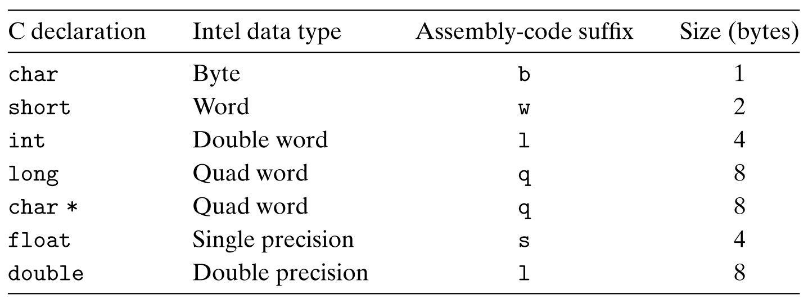
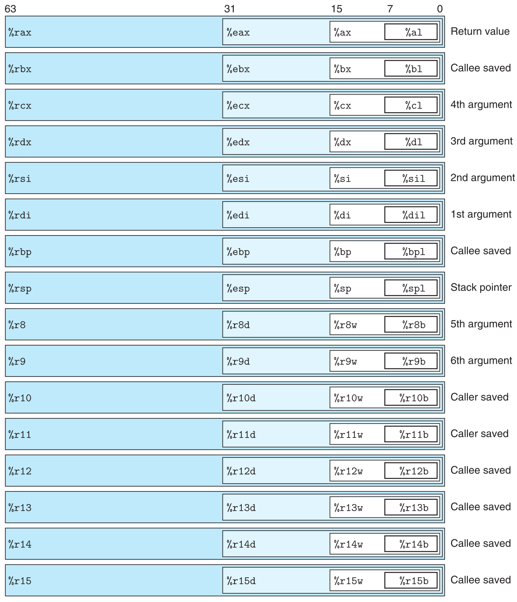
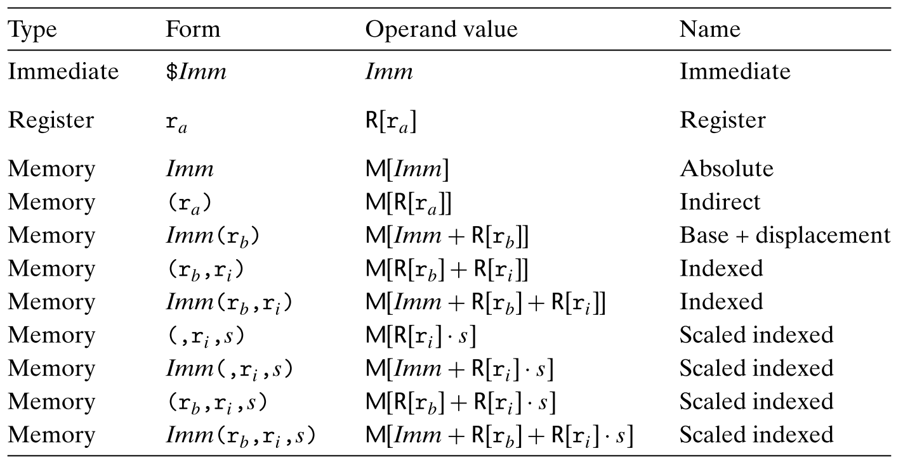
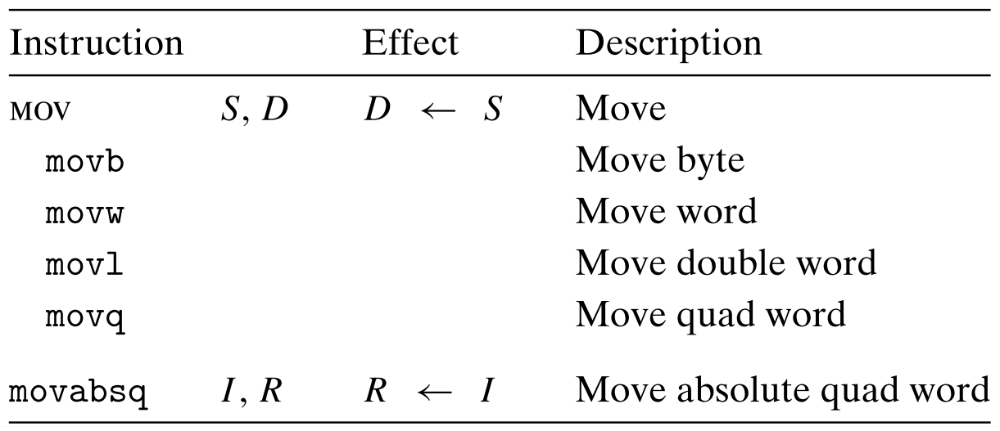
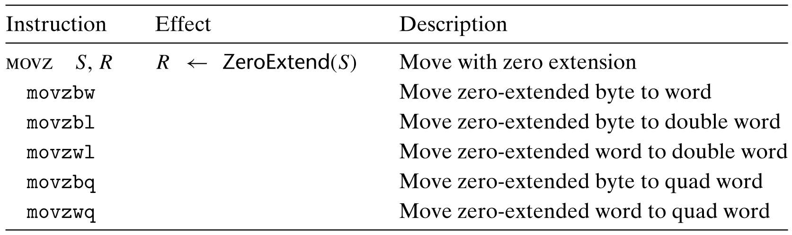
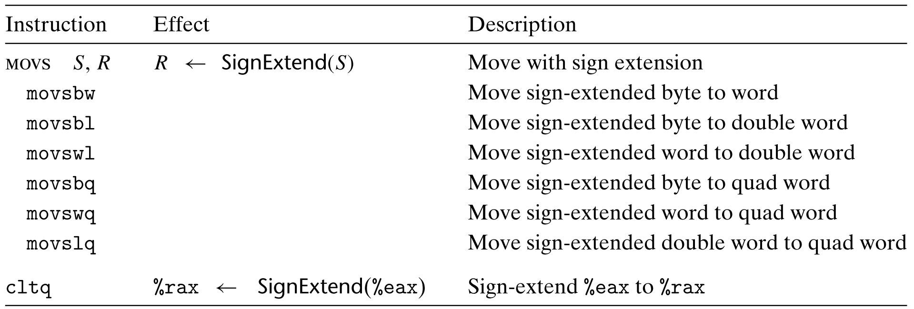
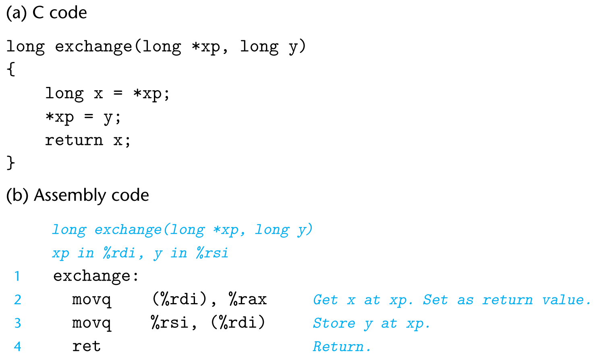
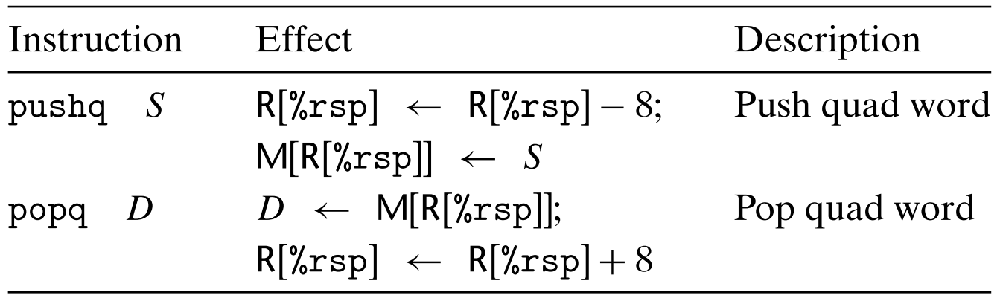
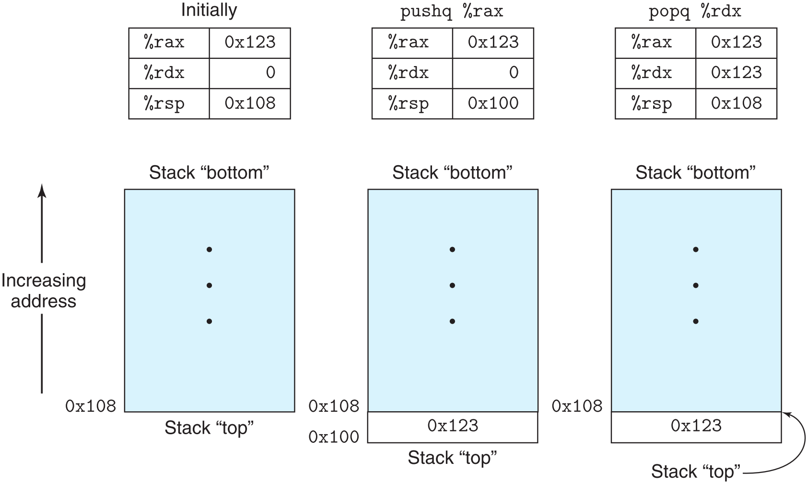
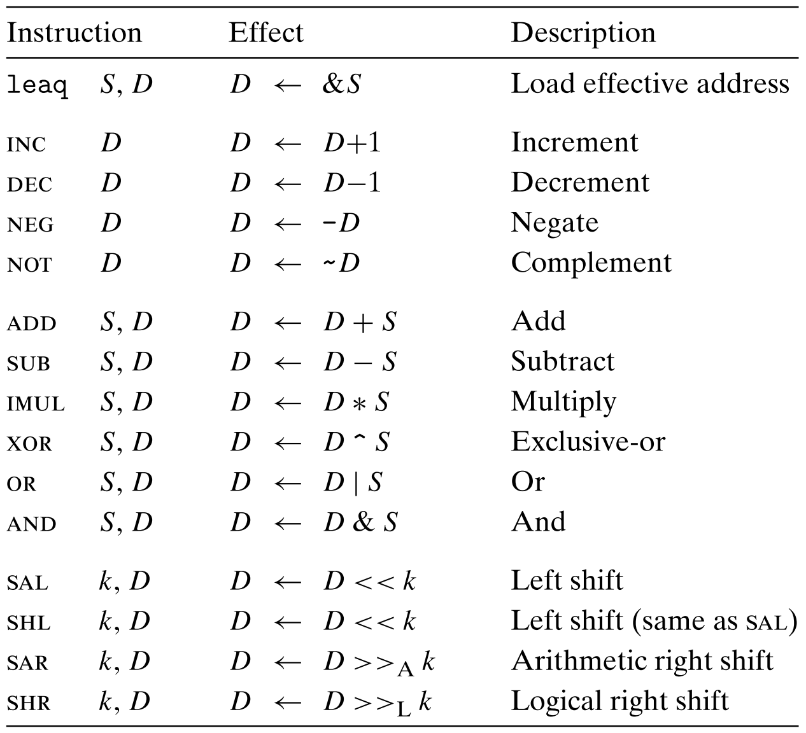

## 1 处理器和指令集

**处理器**

例如：8086、i386、Pentium(奔腾) 和 Core i7 这些芯片型号。

**指令集**

x86-64 指令集：它是现在笔记本电脑和台式机中最常见处理器的机器语言，也是驱动大型数据中心和超级计算机的最常见处理器的机器语言。这种语言的历史悠久，开始于 Intel 公司 1978 年的第一个 16 位处理器，然后扩展为 32 位，最近又扩展到 64 位。

IA32：x86-64 的 32 位前身，是 Intel 在 1985 年提出的。几十年来一直是 Intel 的机器语言之选。今天出售的大多数 x86 微处理器，以及这些机器上安装的大多数操作系统，都是为运行 x86-64 设计的。不过，它们也可以向后兼容执行 IA32 程序。所以，很多应用程序还是基于 IA32 的。除此之外，由于硬件或系统软件的限制，许多已有的系统不能执行 x86-64。IA32 仍然是一种重要的机器语言。

## 2 程序编码

**gcc 编译过程**

> 以下面的命令为例：
>
> `linux> gcc -0g -o p p1.c p2.c`
>
> 1. C 预处理器扩展源代码，插入所有用 #include 命令指定的文件，并扩展所有用 #define 声明指定的宏。
> 2. 编译器产生两个源文件的汇编代码，名字分别为 p1.s 和 p2.s。
> 3. 汇编器会将汇编代码转化成二进制目标代码文件 p1.o 和 p2.o。目标代码是机器代码的一种形式，它包含所有指令的二进制表示，但是还没有填入全局值的地址。
> 4. 链接器将两个目标代码文件与实现库函数(例如 printf) 的代码合并，并产生最终的可执行代码文件 p(由命令行指示符 -o p 指定的)。

### 2.1 机器级代码

**机器级编程的抽象**

> 1. 用 **指令集体系结构或指令集架构(Instruction Set Architecture，ISA)** 来定义机器级程序的格式和行为，它定义了处理器状态、指令的格式，以及每条指令对状态的影响。大多数 ISA，包括 x86-64，将程序的行为描述成**好像每条指令都是按顺序执行的**，一条指令结束后，下一条再开始。
> 2. 机器级程序使用的内存地址是 **虚拟地址**，提供的内容模型**看上去是一个非常大的字节数组**。

**机器代码会用到的寄存器**

- **程序计数器**：通常称为 “PC”，在 x86-64 中用 %rip 表示。程序计数器给出将要执行的下一条指令在内存中的地址。
- **整数寄存器文件**：包括 16 个命名的位置，分别存储 64 位的值。这些寄存器可以存储地址或整数数据。有的寄存器被用来记录某些重要的程序状态，而其他的寄存器用来保存临时的数据，例如过程的参数和局部变量，以及函数的返回值。
- **条件码寄存器**：保存着最近执行的算术或逻辑指令的状态信息。它们用来实现控制或数据流中的条件变化，比如说用来实现 if 和 while 语句。
- **向量寄存器**：可以存放一个或多个整数或浮点数值。

### 2.2 gcc 编译命令

**生成汇编代码**

`linux> gcc -0g -S mstore.c`

**生成二进制目标文件**

`linux> gcc -0g -c mstore.c`

**反汇编二进制目标文件**

`linux> objdump -d mstore.o`

**直接将多个源文件生成可执行文件**

`linux> gcc -0g -o prog main.c mstore.c`

**反汇编可执行文件**

`linux> objdump -d prog`

### 2.3 ATT 与 Intel 汇编代码格式

> ATT(根据 “AT&T” 命名的，AT&T 是运营贝尔实验室多年的公司) 格式的汇编代码，是 GCC、OBJDUMP 和其他一些我们使用的工具的**默认格式**。其他一些编程工具，包括 Microsoft 的工具，以及来自 Intel 的文档，其汇编代码都是 Intel 格式的。这两种格式在许多方面有所不同。
>
> GCC 可以使用下面的命令生成 Intel 格式的代码：
>
> `linux> gcc -0g -S -masm=intel mstore.c`
>
> **Intel 和 ATT 格式汇编代码的区别** (具体参考第118页)
>
> - Intel 代码省略了指示大小的后缀。
> - Intel 代码省略了寄存器名字前面的 ‘%’ 符号。
>
> - Intel 代码用不同的方式来描述内存中的位置，例如是 ’QWORD PTR [rbx]' 而不是 ‘(%rbx)’。
> - 在带有多个操作数的指令情况下，列出操作数的顺序相反。

## 3 数据格式

**Intel 数据类型对字定义**

> 由于最初的 Intel 处理器是 16 位体系结构，所以 “字” 表示 16 位数据类型。因此，称 32 位数为 “双字”，称 64 位数为 “四字”。

下图是 C 语言中的数据类型在 x86-64 中的大小

## 4 访问信息

> 一个 x86-64 的中央处理单元(CPU)包含一组 16 个存储 64 位值的通用目的寄存器。这些寄存器用来存储整数数据和指针。

下图显示了这 16 个寄存器

可以根据图中的寄存器名字来访问寄存器的一部分或整个寄存器，字节级操作可以访问最低的字节，16 位操作可以访问最低的 2 个字节，32 位操作可以访问最低的 4 个字节，而 64 位操作可以访问整个寄存器。

**生成小于 8 字节结果的指令**

> 对于生成小于 8 字节结果的指令，寄存器中剩下的字节会怎么样，对此有两条规则：
>
> - 生成 1 字节和 2 字节数字的指令会保持剩下的字节不变
> - ==生成 4 字节数字的指令会把高位 4 个字节置为 0==。这条规则是作为从 IA32 到 x86-64 的扩展的一部分而采用的。

### 4.1 操作数指示符

**三种操作数**

> 1. **立即数**：用来表示常数值。**在 ATT 格式的汇编代码中**，立即数的书写方式是 ‘\$’ 后面跟一个用标准 C 表示法表示的整数，比如，\$-577 或 \$0x1F。不同的指令运行的立即数值范围不同，汇编器会自动选择最紧凑的方式进行数值编码。
>
> 2. **寄存器**：它表示某个寄存器的内容，16 个寄存器的低 1 字节、2 字节、4 字节或 8 字节中的一个作为操作数，这些字节数分别对应于 8 位、16 位、32 位或 64 位。在下图中，我们用返回 $r_a$ 来表示任意寄存器 a，用引用 $R[r_a]$ 来表示它的值，这是将寄存器集合看出一个数字 R，用寄存器标识符作为索引。
> 3. **内存引用**：它会根据计算出来的地址(通常称为有效地址)访问某个内存位置。因为内存看成一个很大的字节数组，我们用符号 $M_b[Addr]$ 表示对存储在内存中从地址 Addr 开始的 b 个字节值的引用。为了简便，我们通常省去下标 b。

下图展示了所有的操作数格式

**内存寻址方式**

最一般的寻址方式是上图中的最后一种形式，即 Imm(r_b, r_i, s)，有效地址计算方式为：$Imm+R[r_b]+R[r_i] \centerdot s$。需要注意的是：==这里的 s 只能取 1、2、4 或 8==。

### 4.2 数据传送指令

**<u>简单数据传送指令</u>**

> 源操作数指定的值是一个**立即数**，**存储在寄存器中或内存中**。目的操作数指定一个**位置**，要么是一个**寄存器**，要么是一个**内存地址**。x86-64 加了一条限制，==传送指令的两个操作不能都指向内存位置==。将一个值从一个内存负值到另一个内存位置需要两条指令——第一条指令将源值加载到寄存器中，第二条将该寄存器值写入目的位置。
>
> 大多数情况中，MOV 指令只会更新目的操作数指定的那些寄存器字节或内存位置。唯一的例外是 movl[^1] 指令以寄存器作为目的时，它会把该寄存器的高 4 字节设置为 0。造成这个例外的原因是 ==x86-64 采用的惯例，即任何为寄存器生成 32 位值的指令都会把该寄存器的高位部分置成 0==。
>
> 上图中的最后一条指令(movabsq) 是处理 **64 位立即数**数据的。常规的 movq 指令只能以表示为 32 位补码数字的立即数作为源操作数，然后把这个值符号扩展得到 64 位的值，放到目的位置。movabsq 指令能够以**任意 64 位立即数**值作为源操作数，并且**只能以寄存器作为目的**。

**<u>零扩展数据传送指令</u>**

<u>**符号扩展数据传送指令**</u>

> 在将**较小的源值**复制到**较大的目的**时，会使用上面两张图所示的扩展数据传送指令。所有这些指令都把数据从源(在寄存器或内存中)复制到目的**寄存器**[^2]。MOVZ 类中的指令把目的中剩余的字节填充为 0，而 MOVS 类中的指令通过符号扩展来填充。
>
> 看上面两个表格会发现：没有一条明确的指令把 4 字节源值零扩展到 8 字节目的。这样的指令逻辑上应该被命名为 movzlq，但是并没有这样的指令。因为这样的数据传送可以用以寄存器为目的的 movl 指令来实现。这一技术利用的属性是，==生成 4 字节值并**以寄存器作为目的**的指令会把高 4 字节置位 0==。

### 4.3 数据传送示例

**<u>示例-exchange 函数</u>**

从上图中可以看出：参数是通过寄存器传递给函数，且寄存器 %rax 从这个函数返回一个值。

> 关于这段汇编代码有两点值得注意。首先，我们看到 C 语言中所谓的 “指针” 其实就是地址。间接引用指针就是将该指针放在一个寄存器中，然后在内存引用中使用这个寄存器。其次，**像 x 这样的局部变量通常是保存在寄存器中，而不是内存中**。访问寄存器比访问内存要快得多。

### 4.4 压入和弹出栈数据

**<u>入栈和出栈</u>**

如上图所示，pushq 和 popq 虽然只有一个指令，但是效果上产生了两个步骤，拿 pushq 指令来说，它相当于执行下图所示的两条指令：

即先将栈指针 -8，再将数据压入栈。区别在于 pushq 指令编码为 1 个字节，而上图的两条指令一共需要 8 个字节。

**<u>栈操作说明</u>**

值得注意的有三点：

1. 栈的结构是：从栈底到栈顶的方向，内存地址是在变小的。
2. 出栈操作不会改变内存中的值，而只是改变栈顶指针，例如上图中最右边的一个图所示，将 0x123 出栈后，0x123 依然在内存中，直到后面的操作将它覆盖。
3. 因为栈和程序代码以及其他形式的程序数据都是放在同一内存中，所以程序可以用标准的内存寻址方式访问栈内的任意位置。例如，假设栈顶元素是四字，指令 movq 8(%rsp)，%rdx 会将第二个四字从栈中复制到寄存器 %rdx。

## 5 算术和逻辑操作

**<u>整数运算指令</u>**

上图被空行分割为四类操作，分别是：加载有效地址类、一元类、二元类和移位类。

### 5.1 加载有效地址

> 加载有效地址(load effective address)指令 leaq 实际上是 movq 指令的变形。它的指令形式是从内存读数据到寄存器，但实际上它根本就没有引用内存。**它的第一个操作数看上去是一个内存引用，但该指令并不是从指定的位置读入数据，而是将有效地址写入到目的操作数**。
>
> 这条指令可以为后面的内存引用产生指针。另外，它还可以简洁地描述普通的算术操作。例如，如果寄存器 %rdx 的值为 x，那么指令 leaq 7(%rdx, %rdx, 4), %rax 将设置寄存器 %rax 的值为 5x + 7，**而不是将在内存地址为 5x + 7 处的值赋值给寄存器 %rax**。

### 5.2 一元和二元操作

[^1]:除了这个指令外，还有 andl，xorl 和 addl 等 xxxl 形式的指令也有这个性质。
[^2]:扩展数据传送指令只能将寄存器作为目的。

