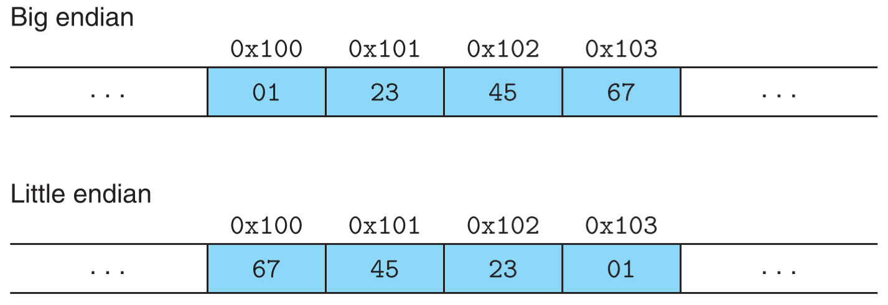
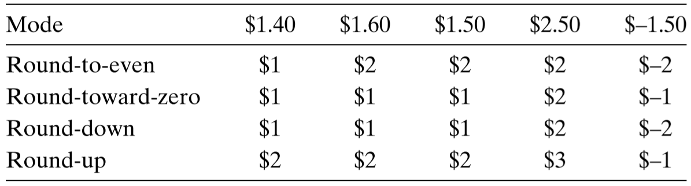

## 1 信息存储

> 大多数计算机使用 8 位的块，或者*字节*，作为最小的可寻址的内存单位，而不是访问内存中单独的位。机器级程序将内存视为一个非常大的字节数组，称为**虚拟内存**。内存的每个字节都由一个唯一的数字来标识，称为它的**地址**，所有可能地址的集合就称为**虚拟地址空间**。

### 1.1 字数据大小

> 每台计算机都有一个**字长**，指明指针数据的**标称大小**(指标准大小)。因为虚拟地址是以这样的一个字来编码的，所以字长决定的最重要的系统参数就是**虚拟地址空间的最大大小**。也就是说，对于一个长为 $w$ 位的机器而言，虚拟地址的范围为 $0\thicksim 2^w-1$，程序最多访问 $2^w$ 个字节。简而言之，就是**计算机的字长决定了寻址范围**。

**32 位程序和 64 位程序**

一个程序是 32 位还是 64 位和运行它的机器无关，区别在于该程序是如何编译的。例如，若使用下面命令编译一个 C 程序

`linux> gcc -m32 prog.c`

那么该程序可以在 32 位或 64 位机器上正确运行。若使用下面命令编译同样一个 C 程序

`linux> gcc -m64 prog.c`

那它只能在64位机器上运行。


**C 语言中的数据类型**

下图展示了 C 语言中的部分数据类型。可以看到，对于有些数据类型，在 32 位和 64 位机器上占用不同的字节数，例如 long 类型和 unsigned long 类型，还有 char* 类型，因为指针类型都是**全字长**的。


**关于 long 类型**

在 Windows 64 下，尽管将程序编译为 64 为程序，但是 long 类型仍然是 4 字节，原因如下：

> **一.c语言数据占用字节**
>
> 32位：char 1   short 2  int 4 long 4 long long 8
>
> 64位：char 1  short 2   int 4 long 8 long long 8
>
> **二.可能原因 编译器的数据模型**
>
> Datetype LP64  ILP64  LLP64  ILP32   LP32
>
> char      8      8     8       8      8
>
> short      16    16    16      16     16
>
> int        32    64    32      32     16
>
> long       64    64    32      32     32 
>
> long long   64
>
> pointer     64    64     64      32     32
>
> 一般情况下windows64位一般使用LLP64模型
>
> 64位Unix,Linux使用的是LP64模型


### 1.2 寻址和字节顺序

> 对于跨越**多个字节**的程序对象，我们必须建立两个规则：这个**对象的地址**是什么，以及在内存中**如何排列**这些字节。
>
> 在几乎所有的机器上，多字节对象都被存储为**连续的**字节序列，对象的地址为所使用字节中最小的地址。例如：有一个 int 类型的数据对象 x，它的地址为 0x100，由于 x 占用 4 个字节，所以 x 被存储在内存的 0x100、0x101、0x102 和 0x103 位置。

**大端法和小端法**

对于一个跨多个字节的对象，比如 C 中的 int 类型，占用 4 个字节，最低有效字节在最前面的方式，称为**小端法**，最高有效字节在最前面的方式，称为**大端法**。下图分别展示了使用大端法和小端法对同一个 int 类型的变量 x=0x01234567 的存储顺序。



大多数 Intel 兼容机都只用小端模式。IBM 和 Oracle 的大多数机器是按大端模式操作。许多比较新的超链接是**双端发**(bi-endian)，也就是说可以把它们配置成作为大端或小端的机器运行。然而，实际情况是：一旦选择了特定操作系统，那么字节顺序也就固定下来。比如，用于许多移动电话的 ARM 微处理器，其硬件可以按小端或大端两种模式操作，但是这些芯片上最常见的两种操作系统——Android 和 IOS——却只能运行于小端模式

**大/端法带来的问题**

1. 在大小端模式不同的机器上传输信息：比如一台大端模式的机器上产生的二进制对象数据被传输到一台小端模式的机器上就会出现问题。解决办法是：网络协议制定标准来约束二进制对象的传输顺序，比如规定必须按照大端模式来传送数据，那么发送方和接收方就知道对发送和接收的数据做必要的转换。

2. 在阅读机器级程序时，如果遇到整数，而且恰好使用的小端法。如下面代码所示，左边的机器码后面8位 43 0b 20 00 表示的是一个整数，但使用的小端法，所以需要反过来看，这会给阅读带来困难。

   `4004d3: 01 05 43 0b 20 00 		add 	%eax,0x200b43(%rip)`

3. 当编写规避正常的类型系统的程序时。在 C 语言中，可以通过使用强制类型转换或联合来允许以一种数据类型引用一个对象，而这种数据类型与创建这个对象时定义的数据类型不同。

小结：小端法用的比较多，大端法用于整数比较直观。需要注意的是，大端法和小端法针对的是一个不可拆分的对象，**但不一定是数值对象**，例如在 win64 Intel处理器环境中 C 语言的 int 变量，long int 变量，int64_t 变量，float 变量，double 变量和**指针变量**的存储都是小端法；但同样环境中的数组变量和字符串变量却不依赖于大端法和小端法，因为字符串实际上也是数组，所以只说说数组，数组中的每个元素的存储顺序都是按元素在数组中的顺序，而不是将整个数组当成一个大对象，然后按大/小端法顺序来存储字节，因为数组不是一个不可拆分的对象；但是如果数组的元素是不可拆分对象(例如 int 变量)，那么该元素会按照大/小端法来存储。具体测试看下面的代码

```c
#include <stdio.h>
#include <stdlib.h>
#include <stdint.h>
#include <string.h>

typedef unsigned char *byte_pointer;

// 打印对象的字节序列-按字节位置序列由小到大
void show_bytes(byte_pointer start, size_t len) {
	size_t i;
	for (i = 0; i < len; i++)
		printf(" %.2x", start[i]);
	printf("\n");
}

//打印整数存储序列
void show_int(int x) {
	show_bytes((byte_pointer) &x, sizeof(int));
}
//打印浮点数存储序列
void show_float(float x) {
	show_bytes((byte_pointer) &x, sizeof(float));
}
//打印长整型数存储序列
void show_long(long x) {
	show_bytes((byte_pointer) &x, sizeof(long));
}
//打印64位整型数存储序列
void show_int64(int64_t x) {
	show_bytes((byte_pointer) &x, sizeof(int64_t));
}
//打印双精度数存储序列
void show_double(double x) {
	show_bytes((byte_pointer) &x, sizeof(double));
}
//打印指针存储序列
void show_pointer(void *x) {
	show_bytes((byte_pointer) &x, sizeof(void *));
}
//打印整型数组存储序列
void show_array(int x[], int len) {
	show_bytes((byte_pointer) x, len);
}
//打印字符串存储序列
void show_string(char *x) {
	show_bytes((byte_pointer) x, strlen(x));
}

int main(void) {
	/*下面测试使用64位win10进行，使用MinGW编译为64位程序*/
	/*int 类型，4字节，按小端法存储*/
	int iVal = 0x012345;
	show_int(iVal); //  45 23 01 00

	/*float 类型，4字节，按小端法存储*/
	float fVal = 7.0f; //	0x40E00000
	show_float(fVal); // 00 00 e0 40

	/*long 类型，4字节，按小端法存储，
	 * 尽管是编译为64位程序，但是在
	 * windows系统中仍然认为 long 为 4字节，
	 * 结果是截取低4字节按小端法存储*/
	long lVal = 0x0123456789112233;
	show_long(lVal); // 33 22 11 89

	/*int64_t 类型，8字节，按小端法存储*/
	int64_t i64Val = 0x0123456789112233;
	show_int64(i64Val);//33 22 11 89 67 45 23 01

	/*double 类型，4字节，按小端法存储*/
	double dVal = 7.5;//	0x401E000000000000
	show_double(dVal);// 00 00 00 00 00 00 1e 40

	/*指针类型，8字节，注意，虽然指针不是数字类型，
	 * 但是指针的地址是值也是按小端法存储的*/
	int * p = &iVal;
	printf("pointer value = %p\n", p);//000000000064FDEC
	show_pointer(p);// ec fd 64 00 00 00 00 00

	/*数组 类型，元素占用字节*元素个数个字节，
	 * 每个元素之间按照数组中的顺序存储，
	 * 但是数组中的元素按照小端法存储*/
	int iArr[6] = { 406, 407, 408, 409, 410, 411 };	//0x00000196, ...
	show_array(iArr, sizeof(iArr));// 96 01 00 00 97 01 00 00 98 01 00 00 99 01 00 00 9a 01 00 00 9b 01 00 00

	/*字符串类型，类似数组类型，
	 * 因为本身字符串就是字符的数组，
	 * 每个元素之间也是按照数组中的顺序存储*/
	char *s = "abcdef";
	show_string(s);// 61 62 63 64 65 66

	/* 在 64位 Windows 10 中，编译为64位的程序中的 long 类型也是4字节，
	 * 但是在 Unix 和 Linux 中，编译为 32位程序的long 类型是4字节，
	 * 编译为 64 位程序的long 类型是8字节，在 AIX 上亲测过，注意 AIX 上
	 * 编译为 64 位的命令是 gcc -maix64 proc.c，而不是 gcc -m64 proc.c。
	 * 因此 long 类型的大小不仅与编译器有关，还与操作系统有关
	 */
	printf("size of long = %I64d \n", sizeof(long)); //size of long = 4
	/* 64 位程序中的指针类型都是全字长，即8字节，不管是什么操作系统 */
	printf("size of pointer = %I64d \n", sizeof(p));//size of pointer = 8
	/* 数组的大小 = 元素大小 * 元素个数 */
	printf("size of array = %I64d \n", sizeof(iArr));//size of array = 24
}

```


### 1.3 布尔代数

**符号表示**

- &：与
- |：或
- ~：非
- ^：亦或

**& 和 | 之间的分配律**

- & 对 | 有分配律：a&(b|c) = (a&b)|(a&c)
- | 对 & 也有分配律：a|(b&c) = (a|b)&(a|c)

**亦或(^)的性质**

(a\^b)\^a=b，这个性质有很多用处，比如：1) 加密解密，2) 不使用第三个变量就对两个变量的值进行交换(详细参考P38 习题2.10)。

### 1.4 位级运算

位级运算的符号和 1.3 节中的布尔代数的符号表示一模一样。

**~ 0的使用**

> 表达式 ~0 将生成一个全 1 的掩码，不管机器的字大小是多少。尽管对于一个 32 位机器来说，同样的掩码可以写成 0xFFFFFFFF，但是这样的代码不是可移植的。

### 1.5 逻辑运算

**符号表示**

- ||：或
- &&：与
- !：非
- 逻辑运算中没有亦或操作

**逻辑运算与位级运算的区别**

逻辑运算认为所有非零的参数都表示 TRUE，而参数 0 表示 FALSE。所以有

$11110000_2 \space \& \space  00001111_2 = 0_2$

但是

$11110000_2 \space  \&\& \space  00001111_2 = 1 \space  \&\& \space  1 = 1$

### 1.6 移位运算

**符号表示**

- <<：左移
- \>\>：右移

**移位性质**

- 左移总是在右端补0
- 而右移需要区分逻辑右移和算术右移，其中逻辑右移是在左端补0，而算术右移是在左端补最高有效位。

**关于逻辑右移和算术右移的选择**

> C 语言标准并没有明确定义对于有符号数应该使用哪种类型的右移——算术右移或者逻辑右移都可以。但是实际上，几乎所有的编译器/机器组合都对有符号数使用算术右移，且许多程序员也都假设机器会使用这种右移。对于无符号数，右移必须是逻辑的。
>
> 与 C 相比，Java 对于如何进行右移有明确的定义。表达式 x>>k  会将 x 算术右移 k 个位置，而 x>>>k 会对 x 做逻辑右移。

**当移位数量超过数字大小时**

考虑一个 32 位的二进制数，如果向左或向右移动 33 位。对于 C 语言来说，由于 C 标准没有说明这种情况怎么处理，所以应该保证移位数量小于 32，尽管许多机器上都只会移动 33 mod 32 = 1 位。

Java 有明确说明移位数量必须 = 33 mod 32 = 1 位，所以在 Java 中当不必担心移位数量过大的问题。

**移位运算的优先级**

移位运算的优先级低于加减法的优先级，所以下面的表达式

1<<2+3<<4

等价于 1<<5<<4，而不是 (1<<2) + (3<<4)。

**当不确定各种运算符之间的优先级顺序时，应该使用括号**。

## 2 整数表示

### 2.1 无符号数的编码

> C 和 C++ 都支持有符号(默认)和无符号数。Java 只支持有符号数。

**无符号数编码的定义**

对向量 $\vec x=[x_{w-1},x_{x-2},...,x_0]$ :

$B2U_w(\vec x) \doteq \sum\limits_{i=0}^{w-1}x_i2^i$

这里的 B2U[^1] 表示二进制位表示为无符号数值的结果，符号 “$\doteq$” 表示左边被定义为等于右边。

**无符号数编码的唯一性**

简言之，一个特定的二进制位序列只能表示一个无符号数；而一个无符号数对应的二进制位序列也是唯一的。如果 $B2U(x) = y$，那么有 $U2B(y) = x$。


### 2.2 补码编码

> 对于许多应用，我们希望表示负数值。最常见的有符号数的计算机表示方式就是补码形式。在这个定义中，将字的最高有效位解释为负权。

**补码编码的定义**

对向量 $\vec x=[x_{w-1},x_{x-2},...,x_0]$ :

$B2T_w(\vec x) \doteq -x_{w-1}2^{w-2}+\sum\limits_{i=0}^{w-1}x_i2^i$

从上面的公式可以看出，由于  $2^{w-1}$ 比 $\sum\limits_{i=0}^{w-2}2^i$，所以补码编码表示的负数的范围比整数范围大1。

**C 和 Java 对补码编码的应用**

C 语言标准并没有要求用户补码形式来表示有符号整数，但是几乎所有的机器都是这么做的。然而在 Java 标准中是非常明确的，它要求采用补码编码方式来编码整数(即有符号整数，因为 Java 中没有无符号数)。

### 2.3 有符号数和无符号数之间的转换

> 从数学的角度来说，可以想象到几种不同的规则。很明显，对于在两种形式中都能表示的值，我们是想要保持不变的。另一方面，将负数转换为无符号数可能会得到0.如果转换的无符号数太大以至于超出了补码能表示的范围，可能会得到 TMax。不过，对于大多数 C 语言的实现来说，对这个问题的回答都是从位级角度来看的，而不是数学的角度。

在 C 语言中，强制类型转换的结果保持位值不变，只是改变了解释这些位的方式。执行下面的代码：

```c
	//	有符号转无符号
	short int v = -12345;
	unsigned short uv = (unsigned short) v;
	printf("v = %d, uv = %u\n", v, uv);
	//无符号转有符号
	unsigned u = 4294967295u; // UMax
	int tu = (int) u;
	printf("u=  %u, tu = %d\n", u, tu);

```

将得到如下输出：

```
v = -12345, uv = 53191
u=  4294967295, tu = -1
```

可以看出，有符号数和无符号数的位级表示是一样的。

**转换方式**

根据上面的分析，可以得出结论，有符号数和无符号数之间的转换可以按照下面的步骤进行(以 U 转 T 为例)：

1. 先将 U 转换为二进制位 $\vec x$
2. 再将 $\vec x$ 转换为 T

**转换公式**

> **补码转换为无符号数**
>
> 对满足 $TMin_w \leqslant x \leqslant TMax_w$ 的 $x$ 有：
>
> ​			$T2U_w(x)=\left\{\begin{array} \\ x+2_w,& x<0 \\ x, & x\geqslant 0 \end{array}\right.$
>
> **无符号数转换为补码**
>
> 对满足 $0\leqslant u\leqslant UMax_w$ 的 $u$ 有：
>
> ​			$U2T_w(u)=\left\{\begin{array}\\ u, & u\leqslant TMax_w \\ u-2^w, & u \gt TMax_w \end{array}\right.$

**C 表达式中的隐式转换**

> 在 C 语言中，当执行一个运算时，如果它的一个运算树是有符号的而另一个是无符号的，那么 C 语言会隐式地将有符号参数强制类型转换为**无符号数**，并假设这两个数都是非负的，来执行这个运算。

下面的代码会打印 false

```c
	int v1 = -3;
	unsigned int uv1 = 2;
	if (v1 + uv1 > 0)
		printf("true\n");// v1 被隐式转换为无符号数，所以结果虽然是-1，但是是一个很大的无符号数
	else
		printf("false\n");
```

如果把后面4行改为如下代码，则会打印 true

```c
	if (v1 + (int) uv1 > 0)
		printf("true\n");
	else
		printf("false\n");// 强制将 uv1 转换为有符号数，所以结果也是有符号数 -1
```

### 2.4 整数的扩展

**无符号数的零扩展**

> 定义宽度为 $w$ 的向量 $\vec u=[u_{w-1},u_{w-2},...,u_0]$ 和宽度为 $w'$ 的位向量 $\vec u'=[0,...,0,u_{w-1},u_{w-2},...,u_0]$，其中 $w'>w$。则 $B2U_w(\vec u)=B2U_{w'}(\vec u')$。

也就是说，无符号数的扩展只需要简单的在最前面加0。

**补码数的符号扩展**

> 定义宽度为 $w$ 的位向量 $\vec x=[x_{w-1},x_{w-2},...,x_0]$ 和宽度为 $w'$ 的位向量 $\vec x'=[x_{w-1},...,x_{w-1},x_{w-1},x_{w-2},...,x_0]$，其中 $w'>w$。则 $B2T_w(\vec x)=B2T_{w'}(\vec x')$。

也就是说，补码数使用符号位(即最高位)来进行扩展。

**代码测试**

```c
	short sx = -12345;
	unsigned short usx = sx;
	int x = sx;//有符号数扩展
	unsigned ux = usx;//无符号数扩展

	printf("sx = %d:\t", sx);
	show_bytes((byte_pointer) &sx, sizeof(short));
	printf("usx = %u:\t", usx);
	show_bytes((byte_pointer) &usx, sizeof(unsigned short));
	printf("x = %d:\t", x);
	show_bytes((byte_pointer) &x, sizeof(int));
	printf("ux = %u:\t", ux);
	show_bytes((byte_pointer) &ux, sizeof(unsigned));
```

打印结果(小端法)

```
sx = -12345:	 c7 cf
usx = 53191:	 c7 cf
x = -12345:	 c7 cf ff ff
ux = 53191:	 c7 cf 00 00
```

可以看出无符号数前面扩展0，有符号数前面扩展符号位(这里符号位为1)。


### 2.5 整数的截断

**截断无符号数**

> 令 $\vec x$ 等于向量 $[x_{w-1},x_{w-2},...,x_0]$，而 $\vec x'$ 是将其截断为 $k$ 位的结果：$\vec x' = [x_{k-1},x_{k-2},...,x_0]$。令 $x=B2U_w(\vec x)$，$x' = B2U_k(\vec x')$。则 $x'=x\mod 2^k$

也就是说，截断是直接将高位截取，而只保留需要的位数。

**截断补码数值**

> 令 $\vec x$ 等于向量 $[x_{w-1},x_{w-2},...,x_0]$，而 $\vec x'$ 是将其截断为 $k$ 位的结果：$\vec x' = [x_{k-1},x_{k-2},...,x_0]$。令 $x=B2U_w(\vec x)$，$x' = B2U_k(\vec x')$。则 $x'= U2T_k(x\mod 2^k)$

可以看出，在位级层面上，补码数值的截断和无符号数的截断是一样的，都是直接将高位截取，当然符号位也会被截取

**代码测试**

```c
	int x = 53191;
	short sx = (short) x; // 截断
	int y = sx; // 再扩展，这时已经无法恢复截断前的值了

	printf("x = %d:\t", x);
	show_bytes((byte_pointer) &x, sizeof(int));
	printf("sx = %d:\t", sx);
	show_bytes((byte_pointer) &sx, sizeof(short));
	printf("y = %d:\t", y);
	show_bytes((byte_pointer) &y, sizeof(int));
```

输出结果

```
x = 53191:	 c7 cf 00 00
sx = -12345:	 c7 cf
y = -12345:	 c7 cf ff ff
```

可以看出，截断在位级层面总是截去高位，保留低位，且有符号数的截断是不可恢复的，尽管截去的全是0。


## 3 整数运算

### 3.1 无符号加法

**无符号加法公式**

> 对于满足 $0 \leqslant x,\space y \lt 2^w$ 的 x 和 y 有：
>
> $x+^u_wy=\left\{\begin{array} \\ x+y, & x+y \lt 2^w & 正常 \\x+y-2^w, & 2^w \leqslant x+y \lt 2^{w+1} & 溢出 \end{array} \right.$

**检测无符号数中的溢出**

> 对在范围 $0 \leqslant x, \space y \leqslant UMax_w$ 中的 x 和 y，令 $s \doteq x+^u_wy$。则对计算 s，当且仅当 $s\lt x$(或者等价地 $s \lt y$)时，发生了溢出。

对于上面括号中 $s \lt y$，是由 $s < x$ 推导出来的，因为如果 $s < x$，那么说明有溢出，即 $x + y \geqslant 2^w$，那么 $s = x + y - 2^w，y = (2^w - x) + s > s(因为 2^w - x > 0)$。

**无符号数求反**

> 对于满足 $0 \leqslant x \lt 2^w$ 的任意 x，其 w 位的无符号逆元 $-^u_w$ 由下式给出：
>
> $-^u_w=\left\{ \begin{array} \\ x, & x= 0 \\ 2^w-x, & x\gt 0 \end{array}\right.$


### 3.2 补码加法

**补码加法公式**

> 对满足 $-2^{w-1}\leqslant x,\space y\leqslant 2^{w-1}-1$ 的整数 x 和 y，有：
>
> $x+^t_wy=\left\{ \begin{array} \\ x+y-2^w, & 2^{w-1}\leqslant x+y & 正溢出 \\ x+y, & -2^{w-1}\leqslant x+y \lt 2^{w-1} & 正常 \\ x+y+2^w, & x+y<-2^{w-1} & 负溢出\end{array}\right.$

上面的公式虽然比无符号加法稍微复杂一些，但是可以先将补码数转换为无符号数，然后按照无符号数加法进行计算，再将结果转换为补码数，即有下面的公式：

$x+^t_wy = U2T_w(T2U_w(x)+^u_wT2U_w(y))$

==实际上，在位级层面，不管是无符号加法，还是补码加法，其实机器做的都是二进制加法，然后将加法结果截取低 w 位，再把这低 w 位转换为无符号数或者补码数。==

**检测补码加法中的溢出**

> 对满足 $TMin_w \leqslant x,\space y\leqslant TMax_w$ 的 $x$ 和 $y$，令 $s \doteq x+^t_wy$。当且仅当 $x > 0, \space y > 0$，但 x $\leqslant 0$ 时，计算 $s$ 发生了正溢出。当且仅当 $x < 0, \space y<0$，但 $s \geqslant 0$ 时，计算 $s$ 发生了负溢出。
>

也就是说，正数相加得到了非正数，则发生了正溢出；而负数相加得到了非负数，则发生了负溢出。

### 3.3 补码的非

> 对满足 $TMin_w \leqslant x \leqslant TMax_w$ 的 $x$，其补码的非 $-^t_wx$ 由下式给出
>
> $-^t_wx=\left\{ \begin{array} \\ TMin_w, & x=TMin_w \\-x, & x\gt TMin_w \end{array}\right.$

也就是说，对 $w$ 为的补码加法来说，$TMin_w$ 是自己的加法的逆，而对其他任何数值 $x$ 都有 $-x$ 作为其加法的逆。因为补码表示的负数区间和整数区间是不对称的，负数区间要多一个数，即 $TMin_w$，而整数区间没有一个与之对应的正数，所以 $TMin_w$ 的加法逆元是它自己，即 $TMin_w+TMin_w=0$。这在位级层面也是成立的，因为 $TMin_w$ 的位级表示为 1000...(w-1个0)，所以两个 $TMin_w$ 相加后最高位的 $1+1 = 10$，再截去高位的 1 得到结果 0。

**加法逆元位级表示**

在位级层面，计算加法逆元(包括无符号数逆元和补码逆元)有下面两个技巧：

1.  $-\vec x = \sim\vec x + 1$ ，即对所有二进制位取反再加 1。下面是举例：

   - 0101 的逆元，首先全部取反得到 1010，再加 1 得到 1011，对于补码来说 0101=5，逆元为 1011=-5，正确；对于无符号数来说 0101=5，逆元为 1011=11，正确。
   - 1000 的逆元，首先全部取反得到 0111，再加 1 得到 1000，对于补码来说 1000=-8，逆元为 1000=-8，正确；对于无符号数来说 1000=8，逆元为 1000=8，正确。

2. 假设 k 是最右边的 1 的位置，那么对 k 左边所有位取反。下面是举例：

   - 0111的逆元，k 的位置是第 4 位，将其前面的 1-3 位全部取反得到 1001，对于补码来说 0111=7，逆元为 1001=-7，正确；对于无符号数来说 0111=7，逆元为 1001=9，正确。
   - 1000 的逆元，k 的位置是第 1 位，由于其前面没有位，所以不用取反，得到原位模式 1000，对于补码来说 1000=-8，逆元为 1000=-8，正确；对于无符号数来说 1000=8，逆元为 1000=8，正确。

   

### 3.4 无符号乘法

> 对满足 $0 \leqslant x,~y\leqslant UMax_w$ 的 $x$ 和 $y$ 有：
>
> $x*^u_wy=(x\centerdot y)\mod 2^w$

这里的 $x * y$ 和 $x \centerdot y$ 的区别是：$x * y$ 是计算机中的乘法，是有位数限制的；而 $x \centerdot y$ 是数学意义上的乘法，没有位数限制。

### 3.5 补码乘法

> 对满足 $TMin_w \leqslant x,~y\leqslant TMax_w$ 的 $x$ 和 $y$ 有：
>
> $x*^t_wy=U2T((x\centerdot y)\mod 2^w)$

**位级层面的乘法**

==类似于整数加法，整数乘法，不管是无符号乘法还是补码乘法，都可以先转换为位级的乘法，然后再将位级乘法结果截取低 w 位，然后再转换回无符号数或者补码数，得到最终结果。==


### 3.6 乘以常数

> 以往，在大多数机器上，整数乘法指令相当慢，需要 10 个或者更多的时钟周期，然而其他整数运算(例如加法、减法、位级运算和移位)只需要 1 个时钟周期。即使在我们的参考机器 Intel Core i7 Haswell 上，其整数乘法也需要 3 个时钟周期。因此，==编译器==[^2]使用了一项重要的优化，试着用移位和加法运算的组合来代替乘以常数因子的乘法。首先，我们会考虑乘以 2 的幂的情况，然后再概括成乘以任意常数。

**乘以 2 的幂**

对于无符号数值或者补码数值 $x$，无符号数值 $k$，且 $0\leqslant k \lt w$，$x * 2^k$ 相当于 $x << k$。并且，不管乘法是否发生溢出，这个性质都成立。

**乘以非 2 的幂**

例如，对于 $x * 14$，利用 $14 = 2^3 + 2^2 + 2^1$，编译器会将乘法重写为 $(x<<3)+(x<<2)+(x<<1)$，同样，这个性质也不管 $x$ 是无符号数还是补码数，不管乘法会不会溢出。

有一个技巧是，编译器还可以利用属性 $14=2^4-2^1$，将乘法重写为 $(x<<4)-(x<<1)$，这时只需要两个移位和一个减法。

下面是对上面技巧的归纳

> 对于某个常数 $K$ 的表达式 $x*K$ 生成代码。编译器会将 K 的二进制表示表达为一组 0 和 1 交替的序列：
>
> ​			$[(0...0)(1...1)(0...0)...(1...1)]$
>
> 例如，14 可以写成 $[(0...0)(111)(0)]$。考虑一组从位位置 n 到位位置 m 的连续的 1($n\geqslant m$)。(对于 14 来说，我们有 n=3 和 m=1。)我们可以用下面的两种不同形式中的一种来计算这些位对乘积的影响：
>
> - 形式 A：$(x<<n) + (x<<(n-1)) + ... + (x<<m)$
> - 形式 B：$(x<<(n+1) - (x<<m))$[^3]
>
> 把每个这样的连续的 1 的结果加起来，不用做任何乘法，我们就能计算出 x * K。


### 3.7 除以 2 的幂

> 在大多数机器上，整数除法要比整数乘法更慢——需要 30 个或者更多的时钟周期。除以 2 的幂也可以用移位运算来实现，只不过我们用的是右移，而不是左移。无符号数使用逻辑移位，而补码数使用算术移位。

==整数除法总是向零舍入，即会向下舍入一个正值，而向上舍入一个负值。==

**除以 2 的幂的无符号除法**

对于无符号数值 $x$ 和 $k$，且 $0\leqslant k \lt w$，$\lfloor x / 2^k\rfloor$ 相当于 $x >> k$，这里是逻辑右移。

**除以 2 的幂的补码除法**

对于补码数值 $x$ 和 $k$，且 $0\leqslant k \lt w$，$ x / 2^k$ = 表达式 `(x<0 ? x+(1<<k)-1 : x) >> k`，这里是算术右移。由于常规的补码除法不满足向 0 舍入的性质，所以这里增加了一个偏置量：(1<<k) - 1 。

**除以常数**

> 不幸的是，使用移位来进行整数除法不能推广到除以任意常数。同乘法不同，我们不能用除以 2 的幂的除法来表示除以任意常数 K 的除法。


## 4 浮点数

### 4.1 IEEE 浮点表示

**定义**

> IEEE 浮点标准用 $V=(-1)^s\times M\times 2^E$ 的形式来表示一个数：
>
> - 符号：s 决定着数是负数 (s = 1) 还是正数 (s = 0)，而对于数值 0 的符号位解释作为特殊情况处理。
> - 尾数：M 是一个二进制小数，它的范围是 $1\sim 2-\varepsilon$ (规格化数)，或者是 $0\sim 1-\varepsilon$ (非规格化数) 。
> - 阶码：E 的作用是对浮点数加权，这个权重是 2 的 E 次幂 (可能是负数)。

**示例**

> 将浮点数的为表示分为三个字段，分别对这些值进行编码：
>
> - 一个单独的符号位 s 直接编码符号 s。
> - k 位的阶码字段 $exp=e_{k-1}...e_1e_0$ 编码阶码 E。
> - n 为小数字段 $frac = f_{n-1}...f_1f_0$ 编码尾数 M，但是编码出来的值也依赖于阶码字段的值是否等于 0。
>
> 如下图所示，单精度浮点格式中，s、exp 和 frac 字段分配为 1 位、k=8 位 和 n=23 位，得到一个 32 位的表示。在双精度浮点格式中，s、exp 和 frac 字段分别为 1 位、k=11 位 和 n=52 位，得到一个 64 位的表示。
>
> 

**浮点数值的分类**

> 给定位表示，根据 exp 的值，被编码的值可以分为三种不同的情况 (最后一种情况有两个变种)。下图说明了对单精度格式的情况。
>
> - **情况 1：规格化的值**
>
>   如下图 1 所示。这是最普遍的情况。当exp 的位模式既不全为 0 (数值 0)，也不全为 1 (单精度数值为 255，双精度数值为 2047) 时，都属于这种情况。在这种情况中，阶码字段被解释为以偏置形式表示的有符号整数。也就是说，阶码的值是 ==$E=e-Bias$==，其中 e 是无符号数，其位表示为 $e_{k-1}...e_1e_0$，而 Bias 是一个等于 $2^{k-1} - 1$ (单精度是 127，双精度是 1023) 的偏置值。由此产生指数的取值范围，对于单精度是 $-126\sim  +127$，而对于双精度是 $-1022\sim +1023$。
>
>   小数字段 frac 被解释为描述小数值 $f$，其中 $0\leqslant f\lt 1$其二进制表示为 $0.f_{n-1}...f_1f_0$，也就是二进制小数点在最高有效位的左边。位数定义为 ==$M=1+f$==。
>
> - **情况 2：非规格化的值**
>
>   如下图 2 所示。当阶码域为全 0 时，所表示的数是非规格化形式。在这种情况下，阶码值 ==$E=1-Bias$==，而位数的值是 ==$M=f$==，也就是小数字段的值，不包含隐含的开头的 1。
>
> - **情况 3：特殊值**
> - 如图 3a 和 3b 所示。最后一类数值是指当阶码全为 1 的时候出现的。当小数域全为 0 时，得到的值表示无穷，当 $s=0$ 时是 $+\infty$，或者当 $s=1$ 时是 $-\infty$。当我们把这两个非常大的数相乘，或者除以零时，无穷能表示溢出的结果。当小数域为非零时，结果值被称为 “NaN”，即 “不是一个数(Not a Number)” 的缩写。一些运算的结果不能是实数或无穷，就会返回这样的 NaN 值，比如当计算 $\sqrt{-1}$ 或 $\infty-\infty$ 时。在某些应用中，表示未初始化的数据时，它们也很有用处。
>
> 


### 4.2 数字示例

由于 Java 是遵循 IEEE 浮点标准的，所以下面先对 Java 中的 Float 和 Double 类型的浮点数的几个特殊数值进行计算，然后再和 Java API 中的定义的数值进行对比。

#### 4.2.1 Float 类型

**结构**

- 字节数：4
- 总位数：32
- 组成：
  - 符号位：1
  - 阶码：8
  - 位数：23

- Bias：$2^{8-1} - 1 = 128 - 1 = 127$

**数值计算**

注意：数值计算只计算非负值，因为浮点数的正负值是对称的。

| 数值类型         | 计算方式                                    | 计算结果                                                     |
| ---------------- | ------------------------------------------- | ------------------------------------------------------------ |
| 最小的非规格化数 | 阶码：$1-Bias = -126$<BR>尾数：$2^{-23}$    | $2^{-23}*2^{-126} = $<BR>$2^{-149}=$<BR>$1.4012984643248170709237295832899e-45$ |
| 最大的非规格化数 | 阶码：$1-Bias = -126$<BR>尾数：$1-2^{-23}$  | $2^{-126}-2^{-23}*2^{-126} = $<BR>$1.1754942106924410754870294448493e-38$ |
| 最小的规格化数   | 阶码：$1-Bias = -126$<BR>尾数：$1$          | $2^{-126}=$<BR>$1.1754943508222875079687365372222e-38$       |
| 最大的规格化数   | 阶码：$254-Bias = 127$<BR>尾数：$2-2^{-23}$ | $2^{128}-2^{104} =$<BR>$3.4028234663852885981170418348452e+38$ |


#### 4.2.2 Double 类型

**结构**

- 字节数：8
- 总位数：64
- 组成：
  - 符号位：1
  - 阶码：11
  - 位数：52

- Bias：$2^{11-1} - 1 = 1024- 1 = 1023$

**数值计算**

注意：数值计算只计算非负值，因为浮点数的正负值是对称的。

| 数值类型         | 计算方式                                      | 计算结果                                                     |
| ---------------- | --------------------------------------------- | ------------------------------------------------------------ |
| 最小的非规格化数 | 阶码：$1-Bias = -1022$<BR>尾数：$2^{-52}$     | $2^{-52}*2^{-1022} = $<BR>$2^{-1074}=$<BR>$4.9406564584124654417656879286822e-324$ |
| 最大的非规格化数 | 阶码：$1-Bias = -1022$<BR>尾数：$1-2^{-52}$   | $2^{-1022}-2^{-52}*2^{-1022} = $<BR>$2.2250738585072008890245868760859e-308$ |
| 最小的规格化数   | 阶码：$1-Bias = -1022$<BR>尾数：$1$           | $2^{-1022}=$<BR>$2.2250738585072013830902327173324e-308$     |
| 最大的规格化数   | 阶码：$2046-Bias = 1023$<BR>尾数：$2-2^{-52}$ | $2^{1024}-2^{971} =$<BR>$1.797693134862315708145274237317e+308$ |


和 Java API  对比后，这些数值完全相符。

### 和4.3 舍入

如下图所示，舍入分为下面 4 种，分别是：向偶数舍入、向 0 舍入、向下舍入和向上舍入。后面三种舍入方式都很容易理解，只有向偶数舍入比较复杂和特别，然而它却很重要，是默认的舍入方式。



**向偶数舍入**

下面着重介绍向偶数舍入。向偶数舍入也被称为==向最接近的值舍入==，当遇到==正中间==数时，向==偶数==舍入。例如在上图中(精确到整数位)：1.40 被舍入到 1，因为 1.40 更加==接近== 1，而不是 2；1.60 被舍入到 2，因为 1.60 更接近 2，而不是 1。乍一看这有点像四舍五入，但其实不是，因为当遇到正中间值 1.50 或者 2.50 时，并不总是向上舍入到 2 和 3，而是都舍入到偶数 2。

**关于正中间数**

正中间数并不是指要精确到的位的后一位，而是后面的所有位。例如将 1.2450001 精确到两位小数，这里第 3 位小数是 5，就这一位来说是正中间的数，但是这里并不是向偶数舍入到 1.24，而是舍入到 1.25，因为这里要用来舍入的数不是 0.005，而是 0.0050001，这不是正中间数，而是大于正中间的数，所以向上舍入到 1.25。

**对二进制小数向偶数舍入**

对于二进制小数，由于二进制中只有 0 和 1，所以向偶数舍入就是将要精确到的位置舍入为 0 (当然，这里是针对正中间数才做向偶数舍入，否则就向最接近的数舍入)。

**二进制小数的正中间数**

形如 XX...X.YY...Y100... 的二进制位模式的数，X 和 Y 表示任意值，且 X 可以等于 Y；最优边的 Y 是要被舍入的位置，舍入位置后必须为1，然后后面必须全为 0，这种的数在舍入时才需要向偶数舍入。

例如，考虑舍入值到最近的四分之一的问题(也就是二进制小数点右边 2 位)。对下面的数进行舍入：

- $10.00011_2$ (即 $2 \frac{3}{32}$)：不是正中间位置，且更接近 0，所以向下舍入到 $10.00_2$ (即 2)。
- $10.00110_2$ (即 $2\frac{3}{16}$)：不是正中间位置，且更接近 1 (因为舍入位后一位是1，且后面不是全 0，而是还还包含了 1)，所以向上舍入到$10.01_2$（即 $2\frac{1}{4}$)。
- $10.11100_2$ (即 $2\frac{7}{8}$)：是正中间位置，因为舍入位后一位为 1，且后面全0，所以舍入位向偶数舍入为 0，得到 $11.00_2$ (即 3)
- $10.10100_2$ (即 $2 \frac{5}{8}$)：是正中间位置，因为舍入位后一位为 1，且后面全0，所以舍入位向偶数舍入为 0，得到 $10.10_2$ (即 $2\frac{1}{2}$)

### 4.4 浮点运算

> IEEE 标准制定了一个简单的规则，来确定诸如加法和乘法这样的算术运算的结果。把浮点值 x 和 y 看成实数，而某个运算 $\odot$ 定义在实数上，计算将产生 $Round(x \odot y)$，这里的 Round 是对实际运算的精确结果进行==舍入后==的结果。

Java 中的浮点数，包括 Float 和 Double 类型的数都是遵循 IEEE 浮点标准的，所以下面的测试代码使用 Java 语言。

#### 4.4.1 IEEE 针对一些特殊值定义的规则

- $1/-0=-\infty$
- $1/+0=\infty$
- $+\infty-\infty=NaN$
- $NaN+^fx=NaN$，x 为任意的浮点数。

下面是 Java 测试代码

```java
		Float f1 = 1.0f;
		Float f2 = 0f;
		Float f3 = -0f;
		System.out.println("1/-0 = " + f1 / f2);// ∞
		System.out.println("1/-0 = " + f1 / f3);// -∞
		System.out.println("∞-∞ = +∞ + (-∞) = " + (Float.POSITIVE_INFINITY + Float.NEGATIVE_INFINITY));// NaN
		System.out.println("NaN + 任意浮点数 = " + (Float.NaN + 1.0));// NaN
```

下面是输出

```
1/-0 = Infinity
1/-0 = -Infinity
∞-∞ = +∞ + (-∞) = NaN
NaN + 任意浮点数 = NaN
```


#### 4.4.2 浮点加法

浮点加法满足交换律，但是由于舍入的原因，不满足结合律。

下面是 Java 测试代码

```java
		Float f4 = 3.14f;
		Float f5 = 1e10f;
		System.out.println("(f4 + f5) - f5 = " + ((f4 + f5) - f5)); // f4+f5被舍入为f4
		System.out.println("f4 + (f5 - f5 )= " + (f4 + (f5 - f5)));
```

下面是输出

```
(f4 + f5) - f5 = 0.0
f4 + (f5 - f5) = 3.14
```

**编译器优化**

编译器可能会尝试对浮点加法进行优化，优化过程中可能会使用加减法结合律，由于浮点加法不满足结合律，所以编译器不得不避免这一类的优化，使计算结果不受影响。

**单调属性**

> 另一方面，浮点加法满足了单调性属性：如 $a \geqslant b$，那么对于任何 a、b 以及 x 的值，处了 NaN，都有 $x + a \geqslant x + b$。无符号或补码加法不具有这个实数加法的属性。

下面是 Java 测试代码

```java
System.out.println("∞+2.0 >= ∞+1.0 : " + ((Float.POSITIVE_INFINITY + 2.0) >= (Float.POSITIVE_INFINITY + 1.0)));
```

下面是输出

```
∞+2.0 >= ∞+1.0 : true
```


#### 4.4.3 浮点乘法

浮点乘法满足交换律，但不满足结合律以及加法上的分配律。

下面是 Java 测试代码

```java
		Float f6 = 1e20f;
		Float f7 = 1e-20f;
		System.out.println("(f6 * f6) * f7 = " + ((f6 * f6) * f7)); // f6 * f6 得到 ∞，然后∞*任何数=∞
		System.out.println("f6 * (f6 * f7) = " + (f6 * (f6 * f7)));
		
		System.out.println("f6 * (f6 - f6) = " + (f6 * (f6 - f6))); 
		System.out.println("f6 * f6 - f6 * f6 = " + (f6 * f6 - f6 * f6)); // f6*f6得到∞，而∞-∞=NaN
```

下面是输出

```
(f6 * f6) * f7 = Infinity
f6 * (f6 * f7) = 1.0E20
f6 * (f6 - f6) = 0.0
f6 * f6 - f6 * f6 = NaN
```

**单调属性**

> 对于任何 a、b 和 c，并且 a、b 和 c 都不等于 NaN，浮点乘法满足下列单调性：
>
> $a \geqslant b ~且~ c \geqslant 0 ~\Rightarrow ~a*^fc\geqslant b*^f c$
>
> $a \geqslant b ~且~ c \leqslant 0 ~\Rightarrow ~a*^fc\leqslant b*^f c$
>
> 此外，我们还可以保证，只要 $a\neq NaN$，就有 $a*^fa\geqslant0$ 。像我们先前所看到的，无符号或补码的乘法没有这些单调性属性。

### 4.5 整数和浮点数间的转换

> 当在 int、float 和 double 格式之间进行强制类型转换时，程序改变数值和位模式的原则如下：
>
> - 从 int 转换成 float，数字不会溢出，但可能被舍入。
> - 从 int 或 float 转换成 double，因为 double 有更大的范围 (也就是可以表示值的范围)，也有更高的精度 (也就是有效位数)，所以能够保留精确的数值。
> - 从 double 转换成 float，因为范围要小一些，所以可能溢出成 $+\infty$ 或 $-\infty$。另外，由于精度较小，它还可能被舍入。
> - 从 float 或者 double 转换成 int，值将会向零舍入。例如，1.999 将被转换成 1，而 -1.999 将被转换成 -1.进一步来说，值可能会溢出。C 语言标准没有对这种情况指定固定的结果。与 Intel 兼容的微处理器指定位模式$[10...00]$(字长为 w 时的 $TMin_w$) 为整数不确定值。一个从浮点数到整数的转换，如果不能为该浮点数找到一个合理的整数近似值，就会产生这样一个值。因此，表达式 (int) + 1e10 会得到 -21483648，即从一个正值变成了一个负值。

下面是 Java 测试代码

```java
		int i1 = Integer.MAX_VALUE;
		// 整数转 Float
		float f8 = i1;
		// 整数转 Double
		double d1 = i1;
		// Float 转 Double
		float f9 = (float) Double.MAX_VALUE; // 绝对值的最大值 
		float f10 = (float) Double.MIN_VALUE;// 绝对值的最小值 
		// Float 转 整数 (Double 转 整数有类似结果)
		float f11 = 1.8f;
		float f12 = -1.8f;
		float f13 = Float.MAX_VALUE;
		float f14 = -Float.MAX_VALUE;
		int i2 = (int) f11;
		int i3 = (int) f12;
		// 当浮点数值超出整数值表示范围时的情况
		int i4 = (int) f13;
		int i5 = (int) f14;
		System.out.println("int value : "+i1);//2147483647，精确值
		System.out.println("int to float : "+f8);//2.14748365E9，舍入后的值
		System.out.println("int to double : "+d1);//2.147483647E9，可以精确表示 int 类型最大值
		System.out.println("double to float : "+f9);//∞，因为超出了 float 的表示范围
		System.out.println("double to float : "+f10);//0.0，因为精度超出了 float 的表示范围
		System.out.println("float to int : "+i2);//1，向0舍入
		System.out.println("float to int : "+i3);//-1，向0舍入
		System.out.println("float to int : "+i4);//2147483647，正值超出 int 类型范围，取 Integer.MAX_VALUE
		System.out.println("float to int : "+i5);//-2147483648，负值超出 int 类型范围，取 Integer.MIN_VALUE
```

下面是输出

```
int value : 2147483647
int to float : 2.14748365E9
int to double : 2.147483647E9
double to float : Infinity
double to float : 0.0
float to int : 1
float to int : -1
float to int : 2147483647
float to int : -2147483648
```


[^1]: B 表示二进制位，2 取其读音表示 to，U表示无符号数值；另外，后面介绍到的 B2T 中的 T表示补码编码的数值。
[^2]: 注意，这种优化是编译器的行为，而不是 CPU 或 操作系统的行为，即如果编译器产生的机器语言是乘法，那么 CPU 还是会执行乘法运算，而不会使用移位。
[^3]: 当 n 为最高有效位时，即 $n+1 = w$ 时，$x << (n+1) = 0$，因此得到最终结果为 $-(x<<m)$

