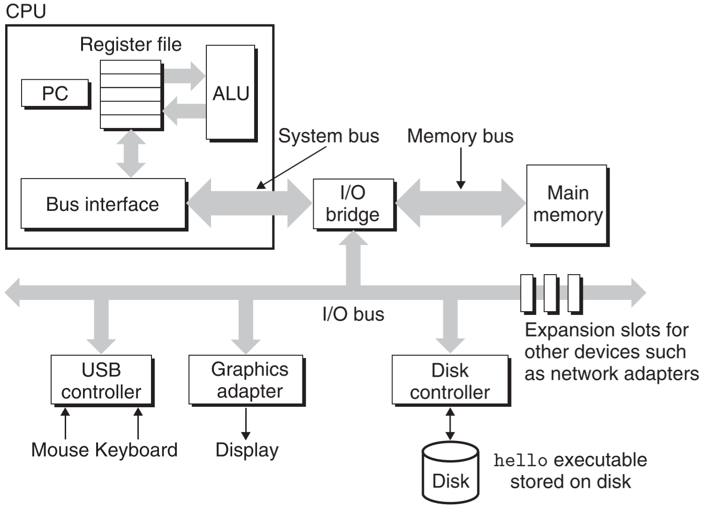
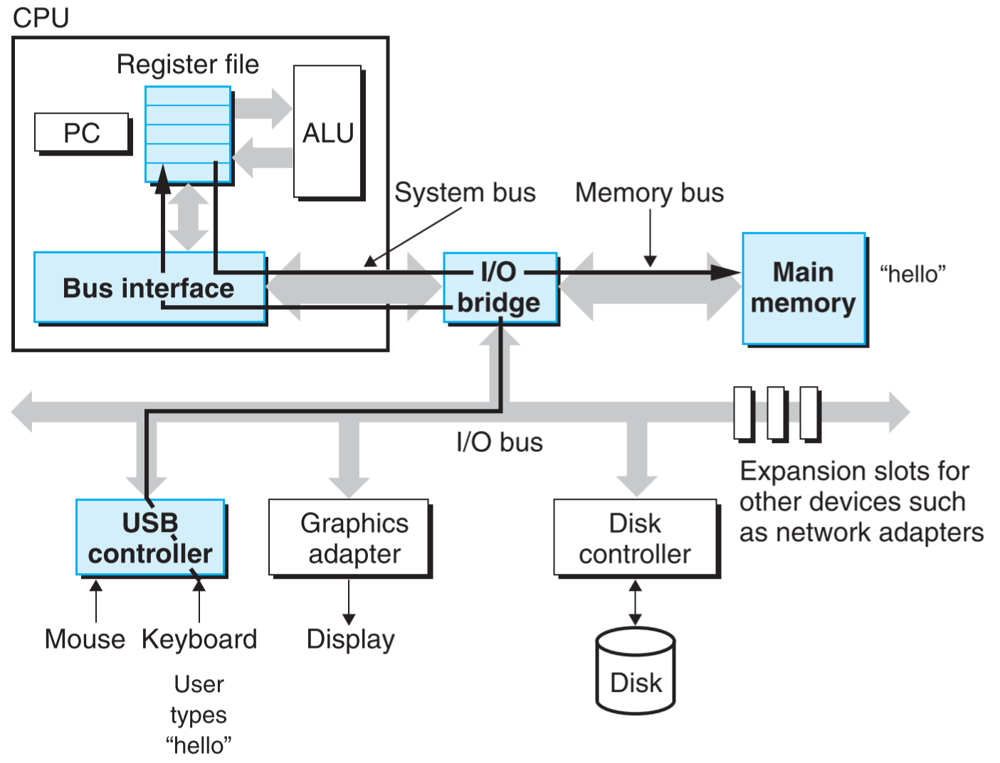
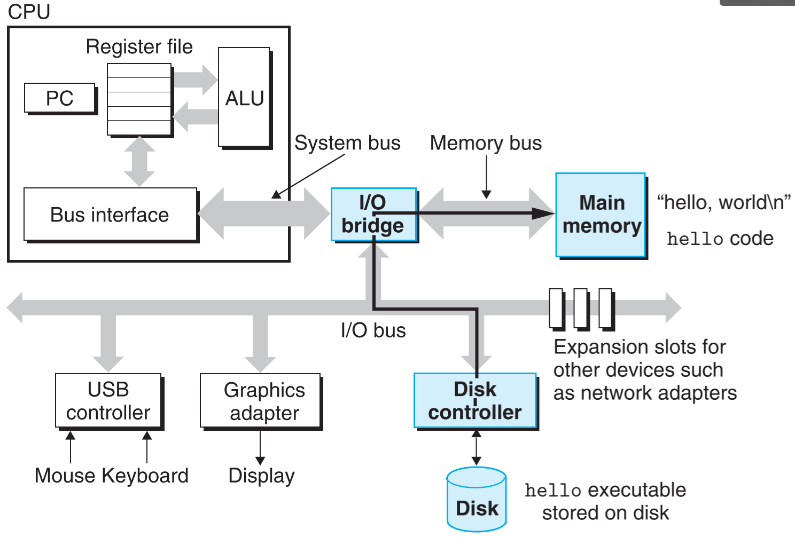
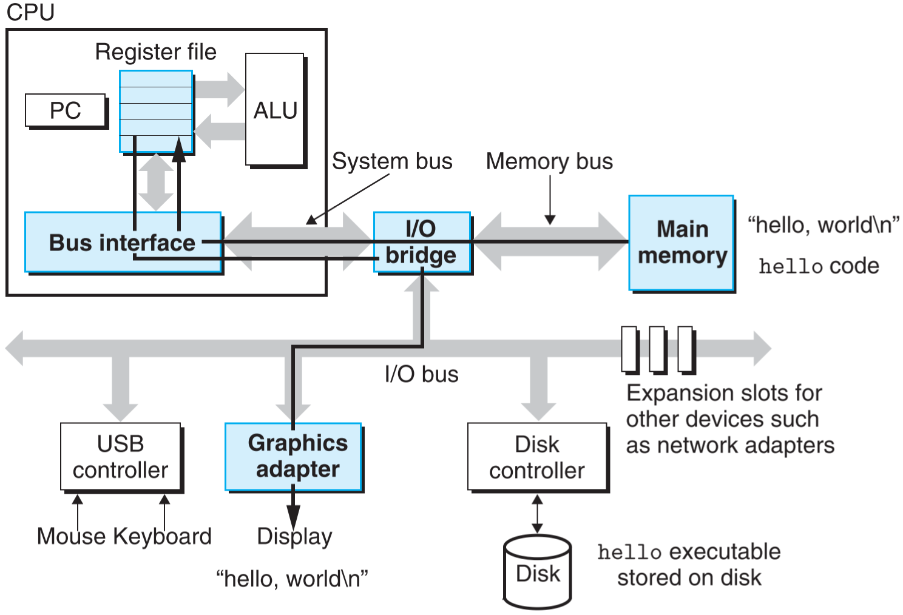
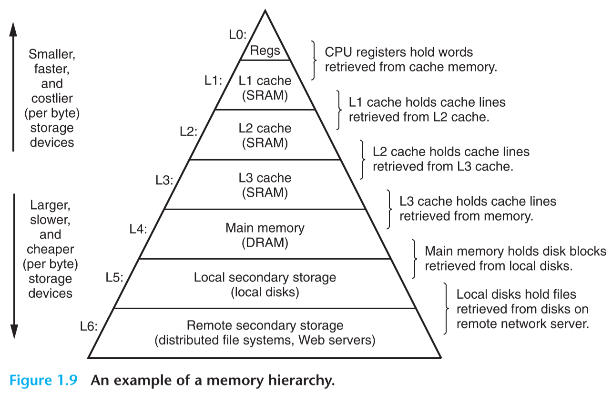
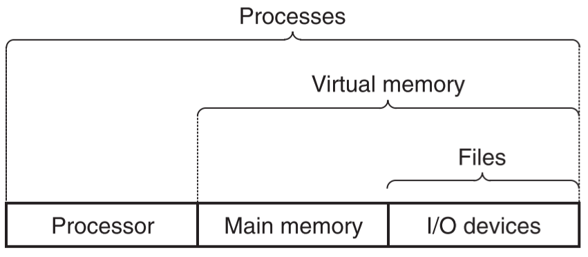

**计算机硬件组成**

下图是一个典型的计算机系统硬件组成

**运行hello程序**

1. 从键盘读取命令，并放到内存中

   

2. 从磁盘读取可执行文件，并放到主存中

   注意，这里使用了**直接内存**技术，可以不经过处理器就将数据直接从磁盘读入主存。

   

3. 将输信息输出到显示器

   

**存储层次结构**

越往上，容量越小，速度越快，单字节越贵

**操作系统的抽象表示**

**进程和线程**

> 在现代操作系统中，一个进程实际上可以由多个称为线程的执行单元组成，每个线程都运行在进程的上下文中，并共享同样的代码和全局数据。

**Amdahl 定律**

加速比 $S=\frac {1}{(1-\alpha) + \alpha/k}$，其中 $\alpha$ 为性能提升部分的占比，k为性能提升倍数。

**并行的 3 个层次**

1. **线程级并发**：指一个进程中可以同时执行多个线程。这种并发通常只是模拟出来的，是通过使一台计算机在它正在执行的进程间快速切换来实现的。
2. **指令级并行**：现代处理器可以同时执行多条指令的属性称为指令级并行。
3. **单指令、多数据并行**：在最低层次上，许多现代处理器有用特殊的硬件，允许一条指令产生多个可以执行的操作，这种方式称为单指令、多数据，即 SIMD 并行。

